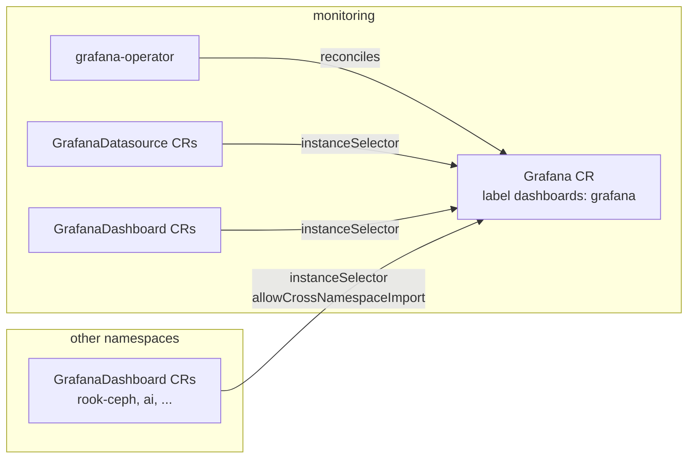

# Grafana

[Grafana](https://grafana.com/grafana/) is the visualization layer for metrics, logs and traces. It is managed by the [grafana-operator](https://grafana.github.io/grafana-operator/): the Grafana instance, its datasources and every dashboard are Kubernetes custom resources. Users sign in through Kanidm OIDC.

## Layout

`kubernetes/apps/pitower/monitoring/grafana-operator/` is a single ArgoCD application with two kustomizations, ordered by sync waves:

| Directory | Wave | Contents |
|:----------|:----:|:---------|
| `grafana-operator/` | 0 | `grafana-operator` Helm chart (`5.25.0`) with CRDs, ServiceMonitor and the operator's own dashboard |
| `instance/` | 1 | `Grafana` CR, `GrafanaDatasource` CRs, `GrafanaDashboard` CRs and their JSON, HTTPRoute, image renderer, ExternalSecrets |


```mermaid
flowchart LR
    subgraph monitoring
        OP[grafana-operator]
        G[Grafana CR\nlabel dashboards: grafana]
        DS[GrafanaDatasource CRs]
        GD[GrafanaDashboard CRs]
    end
    subgraph other namespaces
        GD2[GrafanaDashboard CRs\nrook-ceph, ai, ...]
    end
    OP -->|reconciles| G
    DS -->|instanceSelector| G
    GD -->|instanceSelector| G
    GD2 -->|instanceSelector\nallowCrossNamespaceImport| G
```

Every datasource and dashboard selects the instance with `instanceSelector.matchLabels: {dashboards: grafana}`.

## Data Sources

| Data Source | Type | URL | Default |
|:------------|:-----|:----|:--------|
| Prometheus | `prometheus` | `http://kube-prometheus-stack-prometheus.monitoring.svc.cluster.local:9090` | Yes |
| VictoriaMetrics | `prometheus` | `http://victoria-metrics-server.monitoring.svc.cluster.local:8428` | No |
| VictoriaLogs | `victoriametrics-logs-datasource` | `http://victoria-logs.monitoring.svc.cluster.local:9428` | No |
| Tempo | `tempo` | `http://tempo.monitoring.svc.cluster.local:3200` | No |
| Alertmanager | `alertmanager` | `http://alertmanager.monitoring.svc.cluster.local:9093` | No |
| GitHub | `grafana-github-datasource` | API (GitHub App credentials from the `grafana-github-app` secret) | No |

Tempo links traces to logs in VictoriaLogs and to metrics/service maps in Prometheus.

```yaml title="instance/datasources.yaml (one entry)"
apiVersion: grafana.integreatly.org/v1beta1
kind: GrafanaDatasource
metadata:
  name: victoriametrics
  namespace: monitoring
spec:
  instanceSelector:
    matchLabels:
      dashboards: grafana
  datasource:
    name: VictoriaMetrics
    uid: victoriametrics
    type: prometheus
    access: proxy
    url: http://victoria-metrics-server.monitoring.svc.cluster.local:8428
```

## Dashboards

Dashboards are `GrafanaDashboard` CRs. Each sets a `folder` and takes its JSON from one of three sources:

| Source | Example |
|:-------|:--------|
| `configMapRef` to vendored JSON | `instance/dashboards/*.json` via a `configMapGenerator`; Ceph dashboards in `rook-ceph/add-ons` |
| `grafanaCom` (`id` + `revision`) | Node Exporter Full (1860), cert-manager (20842), NVIDIA DCGM (12239) |
| `url` | dotdc Kubernetes views, External Secrets |

kube-prometheus-stack also emits its bundled dashboards as `GrafanaDashboard` CRs (`grafana.operator.dashboardsConfigMapRefEnabled: true`) into the **Kubernetes** folder.

Folders in use: AI, CI, Home Assistant, Infrastructure, Kubernetes, Networking, Observability, Status, Storage.

### Adding a dashboard

Drop the JSON next to the app, generate a ConfigMap, and point a CR at it:

```yaml
apiVersion: grafana.integreatly.org/v1beta1
kind: GrafanaDashboard
metadata:
  name: my-app
  namespace: my-namespace
  annotations:
    argocd.argoproj.io/sync-options: SkipDryRunOnMissingResource=true
spec:
  folder: Infrastructure
  allowCrossNamespaceImport: true
  instanceSelector:
    matchLabels:
      dashboards: grafana
  configMapRef:
    name: my-app-dashboard
    key: my-app.json
```

`allowCrossNamespaceImport: true` is required outside the `monitoring` namespace.

> [!WARNING]
> **No sidecar**
>
> The old Grafana Helm chart's sidecar is gone. ConfigMaps labelled `grafana_dashboard: "true"` are **not** picked up on their own; each needs a `GrafanaDashboard` CR.

## Authentication

Grafana authenticates users via Kanidm (`idm.wibrow.dev`) with OpenID Connect and auto-login. Kanidm groups map to Grafana roles:

```yaml
auth.generic_oauth:
  enabled: "true"
  name: Kanidm
  client_id: grafana
  scopes: openid profile email groups
  auth_url: https://idm.wibrow.dev/ui/oauth2
  token_url: https://idm.wibrow.dev/oauth2/token
  api_url: https://idm.wibrow.dev/oauth2/openid/grafana/userinfo
  use_pkce: "true"
  role_attribute_path: contains(groups[*], 'admins@idm.wibrow.dev') && 'Admin' || contains(groups[*], 'people@idm.wibrow.dev') && 'Viewer'
```

| Kanidm Group | Grafana Role |
|:-------------|:-------------|
| `admins` | Admin |
| `people` | Viewer |

## Secrets Management

All secrets come from Infisical through ExternalSecrets:

| Secret | Infisical path | Contents |
|:-------|:---------------|:---------|
| `grafana-admin-secret` | `/monitoring/grafana/admin-user`, `/monitoring/grafana/admin-password` | Local admin login |
| `grafana-secrets` | `/monitoring/grafana/client_secret` | `GF_AUTH_GENERIC_OAUTH_CLIENT_SECRET` |
| `grafana-image-renderer` | `/monitoring/grafana/image_renderer_token` | Renderer auth token |
| `grafana-github-app` | `/arc/github-app/{app_id,installation_id,private_key}` (shared with ARC) | GitHub App credentials |

## Plugins

Plugins are installed through `GF_INSTALL_PLUGINS` on the Grafana container:

| Plugin | Purpose |
|:-------|:--------|
| `victoriametrics-logs-datasource` | VictoriaLogs datasource |
| `grafana-github-datasource` | GitHub repository metrics |
| `grafana-clock-panel` | Clock panel |
| `netsage-sankey-panel` | Sankey diagrams |

> [!NOTE]
> The `GF_INSTALL_PLUGINS` override replaces the list the operator builds from `GrafanaDatasource.spec.plugins`, so a plugin declared on a datasource must also be added there.

## Storage and Rendering

- **Persistence**: a 5Gi `ceph-block` PVC holds Grafana's SQLite DB, so sessions and state survive pod rebuilds (the operator default is an `emptyDir`). The Deployment uses `Recreate`.
- **Image renderer**: a separate `grafana-operator-image-renderer` Deployment (`grafana/grafana-image-renderer`) serves PNG rendering.

## Access

Grafana is exposed at `https://grafana.wibrow.dev` through `envoy-external`, reachable from the internet via the [towonel tunnel](../networking/towonel-tunnel.md). Gatus checks `/api/health` through an HTTPRoute annotation.

## Configuration Reference

| Property | Value |
|:---------|:------|
| Operator chart | `oci://ghcr.io/grafana/helm-charts/grafana-operator` |
| Version | `5.25.0` |
| Namespace | `monitoring` |
| Manifest path | `kubernetes/apps/pitower/monitoring/grafana-operator/` |
