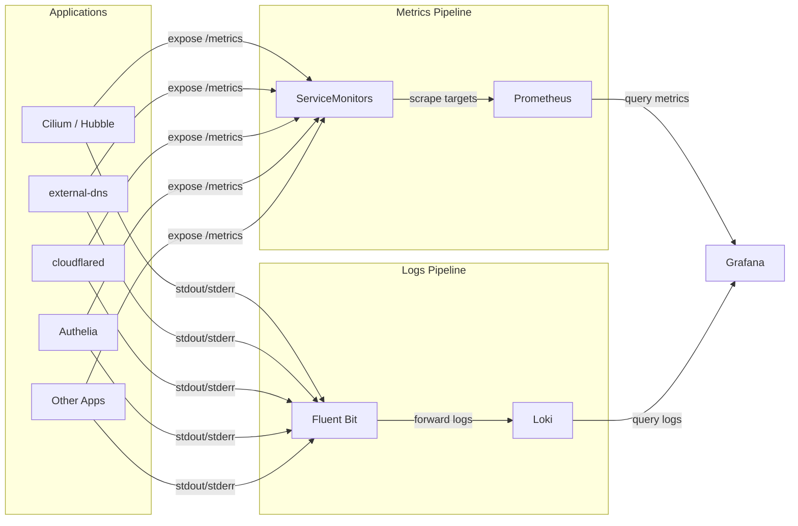

# Monitoring

The cluster uses a comprehensive observability stack built on Prometheus for metrics, Loki for logs, and Grafana for visualization. All components are deployed in the `monitoring` namespace and managed via Helm charts through ArgoCD.

## Overview



## Observability Strategy

The monitoring stack follows a pull-based model for metrics and a push-based model for logs:

- **Metrics** -- Applications expose Prometheus-compatible `/metrics` endpoints. `ServiceMonitor` resources tell Prometheus where to scrape. The kube-prometheus-stack provides built-in monitoring for Kubernetes internals (kubelet, API server, etcd, controller manager, scheduler).
- **Logs** -- Fluent Bit runs as a DaemonSet on every node, tailing container log files from `/var/log/containers/` and forwarding them to Loki. Logs are queryable via LogQL in Grafana.
- **Dashboards** -- Grafana auto-provisions dashboards from ConfigMaps labeled `grafana_dashboard: "true"` and organizes them into folders using the `grafana_folder` annotation. Additional dashboards are loaded from Grafana.com and upstream project repositories.

!!! info "No Alertmanager"
    Alertmanager is currently disabled in this cluster. Alerting can be enabled in the kube-prometheus-stack values when needed.

## Components

| Component | Helm Chart | Version | Purpose |
|:----------|:-----------|:--------|:--------|
| [kube-prometheus-stack](prometheus-stack.md) | `prometheus-community/kube-prometheus-stack` | 81.6.9 | Prometheus, node-exporter, kube-state-metrics, recording rules |
| [Grafana](grafana.md) | `grafana/grafana` | 10.5.15 | Dashboard visualization, SSO via Authelia |
| [Loki](loki.md) | `grafana/loki` | 6.51.0 | Log aggregation and storage |
| [Fluent Bit](fluent-bit.md) | `fluent/fluent-bit` | 0.55.0 | Log collection from all nodes |

## Namespace Configuration

The `monitoring` namespace runs with privileged pod security standards to accommodate node-exporter and Fluent Bit, which require host-level access:

```yaml
apiVersion: v1
kind: Namespace
metadata:
  name: monitoring
  labels:
    pod-security.kubernetes.io/audit: privileged
    pod-security.kubernetes.io/enforce: privileged
    pod-security.kubernetes.io/warn: privileged
```

## Key Endpoints

| Service | URL | Gateway |
|:--------|:----|:--------|
| Prometheus | `https://prometheus.example.com` | envoy-internal |
| Grafana | `https://grafana.example.com` | envoy-external |

## Key Design Decisions

- **Separate Grafana deployment** -- Grafana is deployed as its own Helm release rather than the one bundled in kube-prometheus-stack, allowing independent upgrades and more flexible configuration.
- **Sidecar-based dashboard discovery** -- The Grafana sidecar watches all namespaces for ConfigMaps with the `grafana_dashboard` label, so any application can ship its own dashboards.
- **SingleBinary Loki** -- Loki runs in single-binary mode with filesystem storage on OpenEBS, keeping the deployment simple for a single-cluster setup.
- **Fluent Bit over Promtail** -- Fluent Bit was chosen for log collection due to its low resource footprint and flexible filtering pipeline.
- **WAL compression** -- Prometheus uses WAL compression to reduce disk usage on the 20Gi Ceph-backed PVC.
