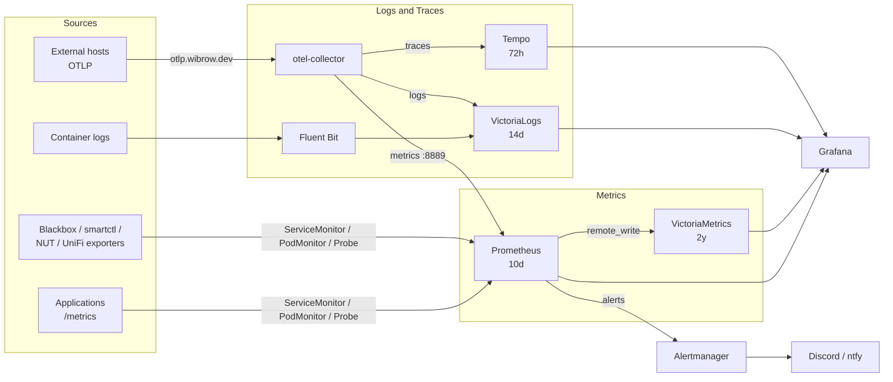

# Monitoring

The observability stack runs in the `monitoring` namespace, each component its own ArgoCD application under `kubernetes/apps/pitower/monitoring/`. Prometheus scrapes metrics and remote-writes them to VictoriaMetrics, Fluent Bit ships container logs to VictoriaLogs, Tempo stores traces, and Grafana (run by the grafana-operator) queries all of them. Alertmanager routes alerts to Discord and ntfy.

## Overview


```mermaid
flowchart LR
    subgraph Sources
        Apps[Applications\n/metrics]
        Logs[Container logs]
        Ext[External hosts\nOTLP]
        BB[Blackbox / smartctl /\nNUT / UniFi exporters]
    end

    subgraph Metrics
        Prom[Prometheus\n10d]
        VM[VictoriaMetrics\n2y]
    end

    subgraph Logs and Traces
        FB[Fluent Bit]
        VL[VictoriaLogs\n14d]
        OC[otel-collector]
        Tempo[Tempo\n72h]
    end

    AM[Alertmanager]
    Grafana[Grafana]
    Notify[Discord / ntfy]

    Apps & BB -->|ServiceMonitor / PodMonitor / Probe| Prom
    Prom -->|remote_write| VM
    Logs --> FB --> VL
    Ext -->|otlp.wibrow.dev| OC
    OC -->|traces| Tempo
    OC -->|logs| VL
    OC -->|metrics :8889| Prom
    Prom -->|alerts| AM --> Notify
    Prom & VM & VL & Tempo --> Grafana
```

## Observability Strategy

- **Metrics**: applications expose `/metrics`; ServiceMonitors, PodMonitors, Probes and ScrapeConfigs tell Prometheus what to scrape. Prometheus keeps 10 days locally and remote-writes everything to VictoriaMetrics, which keeps 2 years.
- **Logs**: Fluent Bit runs on every node, tails `/var/log/containers/`, and pushes to VictoriaLogs (14 days), queried with LogsQL.
- **Traces**: apps send OTLP to the OpenTelemetry Collector, which forwards traces to Tempo. The OpenTelemetry Operator can auto-instrument pods via the `monitoring/otel-instrumentation` Instrumentation.
- **Dashboards**: `GrafanaDashboard` CRs, in any namespace, select the Grafana instance by label.
- **Alerting**: Alertmanager sends everything to Discord; alerts labelled `notify="ntfy"` also go to ntfy as push notifications.
- **Uptime**: Gatus checks every HTTPRoute it discovers; the public status page is a Cloudflare Worker.

Prometheus, VictoriaMetrics, VictoriaLogs and Tempo run on worker-07 (the only `wibrow.dev/compute=true` node) on `openebs-hostpath-fast`, the `fast/extra` ZFS dataset.

## Components

| Component | Chart / image | Version | Purpose |
|:----------|:--------------|:--------|:--------|
| [kube-prometheus-stack](prometheus-stack.md) | `prometheus-community/kube-prometheus-stack` | 91.9.0 | Prometheus, Alertmanager, operator, node-exporter, kube-state-metrics, rules |
| VictoriaMetrics | `victoriametrics/victoria-metrics-single` | 0.48.0 | Long-term metrics (2y), `vm.wibrow.dev` |
| [Grafana](grafana.md) | `grafana-operator` | 5.25.0 | Grafana instance, datasources and dashboards as CRs |
| [VictoriaLogs](victoria-logs.md) | `victoriametrics/victoria-logs-single` | 0.13.10 | Log storage (14d) |
| [Fluent Bit](fluent-bit.md) | `fluent/fluent-bit` | 0.58.3 | Log collection from all nodes |
| [OpenTelemetry](otel-collector.md) | `open-telemetry/opentelemetry-operator` | 0.124.1 | Operator + `otel` collector, external OTLP ingest |
| Tempo | `grafana/tempo` | 1.24.4 | Trace storage (72h, 20Gi) |
| Gatus | app-template, `ghcr.io/twin/gatus` | v5.37.0 | Endpoint checks from HTTPRoute annotations, `up.wibrow.dev` |
| ntfy | app-template, `binwiederhier/ntfy` | v2.28.0 | Push notifications, `ntfy.wibrow.dev` |
| ntfy-alertmanager | app-template, `xenrox/ntfy-alertmanager` | latest | Alertmanager webhook to ntfy bridge |
| blackbox-exporter | `prometheus-community/prometheus-blackbox-exporter` | 11.19.1 | ICMP/TCP/TLS/DNS/HTTP probes |
| smartctl-exporter | `prometheus-community/prometheus-smartctl-exporter` | 0.17.1 | SMART data on every amd64 node, disk-health alerts |
| nut-exporter | app-template, `druggeri/nut_exporter` | 3.3.0 | UPS metrics from NUT |
| unpoller | app-template, `unpoller/unpoller` | v5.5.0 | UniFi metrics |
| dozzle | app-template, `amir20/dozzle` | v11.3.0 | Live container log viewer, `dozzle.wibrow.dev` |
| infra-health | PrometheusRule | -- | `infra:*` recording rules behind the [status page](status-page.md) |
| garage | ScrapeConfig + PrometheusRule | -- | Garage S3 metrics and alerts |

## Namespace Configuration

The `monitoring` namespace (created by the kube-prometheus-stack app) runs with privileged Pod Security Standards for node-exporter, Fluent Bit and smartctl-exporter, which need host access:

```yaml
apiVersion: v1
kind: Namespace
metadata:
  name: monitoring
  labels:
    pod-security.kubernetes.io/audit: privileged
    pod-security.kubernetes.io/enforce: privileged
    pod-security.kubernetes.io/warn: privileged
```

## Key Endpoints

| Service | URL | Gateway |
|:--------|:----|:--------|
| Grafana | `https://grafana.wibrow.dev` | envoy-external |
| Prometheus | `https://prometheus.wibrow.dev` | envoy-internal |
| Alertmanager | `https://alertmanager.wibrow.dev` | envoy-internal |
| VictoriaMetrics | `https://vm.wibrow.dev` | envoy-internal |
| Dozzle | `https://dozzle.wibrow.dev` | envoy-internal |
| Gatus | `https://up.wibrow.dev` | envoy-external |
| ntfy | `https://ntfy.wibrow.dev` | envoy-external |
| OTLP ingest | `https://otlp.wibrow.dev` | envoy-external (API key) |
| Status page | `https://status.wibrow.dev` | Cloudflare Worker (no origin) |

## Alert Silences

Before a cluster upgrade or other disruptive work (draining or rebooting nodes, storage/ZFS changes, gateway or CNI changes), silence Alertmanager so ntfy is not flooded, and expire the silence once the work is verified. See [Prometheus Stack → Silences](prometheus-stack.md#silences).

## Key Design Decisions

- **VictoriaMetrics for history** -- Prometheus stays small (10d) while VictoriaMetrics holds 2 years of everything Prometheus scrapes.
- **VictoriaLogs over Loki** -- single binary, LogsQL, and fed directly by Fluent Bit's HTTP output.
- **Operator-managed Grafana** -- datasources and dashboards are CRs, so any app can ship its own dashboard with a `GrafanaDashboard`.
- **Fluent Bit over Promtail** -- low resource footprint and a flexible filtering pipeline.
- **Status page outside the cluster** -- a Cloudflare Worker can still report when the cluster is down.
