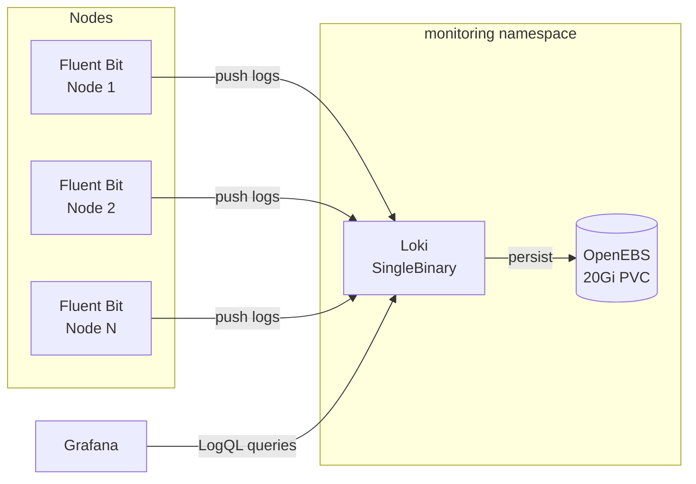

# Loki

[Loki](https://grafana.com/oss/loki/) is a horizontally scalable log aggregation system inspired by Prometheus. In the cluster, Loki runs in **SingleBinary** mode and receives logs from Fluent Bit, storing them on local disk via OpenEBS.

## Architecture



## Deployment Mode

Loki is deployed in **SingleBinary** mode with a single replica. This keeps the deployment simple and resource-efficient for a home lab environment. All Loki components (ingester, querier, compactor, ruler) run in a single process.

```yaml
deploymentMode: SingleBinary

singleBinary:
  replicas: 1
  persistence:
    enabled: true
    storageClass: openebs-hostpath
    size: 20Gi
```

!!! info "Why SingleBinary?"
    For a single-cluster home lab, the SingleBinary deployment mode avoids the operational complexity of running separate read, write, and backend components. It trades horizontal scalability for simplicity -- a good fit when log volume is moderate.

All distributed mode components are explicitly disabled:

```yaml
backend:
  replicas: 0
read:
  replicas: 0
write:
  replicas: 0
gateway:
  replicas: 0
chunksCache:
  enabled: false
resultsCache:
  enabled: false
lokiCanary:
  enabled: false
```

## Storage

Loki uses **filesystem storage** backed by an OpenEBS hostpath PVC. Logs are stored locally on the node where Loki is scheduled.

| Setting | Value |
|:--------|:------|
| Storage type | `filesystem` |
| StorageClass | `openebs-hostpath` |
| PVC size | `20Gi` |
| Schema | `v13` (TSDB index) |
| Index prefix | `loki_index_` |
| Index period | `24h` |

```yaml
loki:
  schemaConfig:
    configs:
      - from: "2024-04-01"
        store: tsdb
        index:
          prefix: loki_index_
          period: 24h
        object_store: filesystem
        schema: v13
  storage:
    type: filesystem
```

!!! warning "Single Point of Failure"
    With `openebs-hostpath` and a single replica, Loki's storage is tied to one node. If that node fails, log data is unavailable until it recovers. This is an acceptable trade-off for a home lab where logs are primarily used for debugging, not compliance.

## Retention

Loki is configured with a **14-day retention period**. The compactor runs in the background to delete expired log chunks:

```yaml
loki:
  compactor:
    working_directory: /var/loki/compactor/retention
    delete_request_store: filesystem
    retention_enabled: true
  limits_config:
    retention_period: 14d
```

## Configuration

Key Loki settings:

| Setting | Value | Purpose |
|:--------|:------|:--------|
| `auth_enabled` | `false` | No multi-tenancy -- single tenant mode |
| `replication_factor` | `1` | Single replica, no replication |
| `chunk_encoding` | `snappy` | Fast compression for log chunks |
| `retention_period` | `14d` | Logs older than 14 days are deleted |

## Querying with LogQL

Loki uses [LogQL](https://grafana.com/docs/loki/latest/query/), a log query language inspired by PromQL. Queries can be run in the Grafana Explore view with the Loki data source selected.

### Common Queries

**All logs from a specific namespace:**

```logql
{namespace="networking"}
```

**Logs from a specific pod:**

```logql
{namespace="monitoring", pod=~"loki.*"}
```

**Filter logs containing an error:**

```logql
{namespace="networking"} |= "error"
```

**Parse JSON logs and filter by field:**

```logql
{namespace="networking", job="fluent-bit"} | json | level="error"
```

**Count log lines per namespace over time:**

```logql
sum by (namespace) (rate({job="fluent-bit"}[5m]))
```

**Top 10 pods by log volume:**

```logql
topk(10, sum by (pod) (rate({job="fluent-bit"}[1h])))
```

!!! tip "Explore in Grafana"
    Open Grafana at `https://grafana.example.com`, navigate to **Explore**, select the **Loki** data source, and start querying. Use the label browser to discover available labels like `namespace`, `pod`, `container`, and `source`.

## Integration with Grafana

Loki is configured as a data source in Grafana at the cluster-internal URL:

```yaml
- name: Loki
  type: loki
  access: proxy
  url: http://loki-headless.monitoring.svc.cluster.local:3100
```

This enables:

- **Explore** -- ad-hoc log querying with LogQL
- **Dashboard panels** -- embedding log panels alongside metric panels
- **Annotations** -- overlaying log events on time-series graphs
- **Alerting** -- creating alert rules based on log patterns (when Alertmanager is enabled)

## Sidecar Rules

The Loki Helm chart includes a sidecar that watches all namespaces for recording and alerting rules:

```yaml
sidecar:
  rules:
    searchNamespace: ALL
```

This allows applications in any namespace to define Loki recording rules via ConfigMaps.

## Helm Chart Reference

| Property | Value |
|:---------|:------|
| Chart | `grafana/loki` |
| Version | `6.51.0` |
| Namespace | `monitoring` |
| Manifest path | `pitower/kubernetes/apps/monitoring/loki/` |
