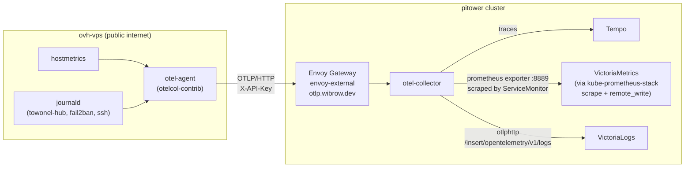

# OpenTelemetry Collector

The [OpenTelemetry Collector](https://opentelemetry.io/docs/collector/) (`otel-collector`, deployed via the OpenTelemetry Operator) is pitower's single ingest point for telemetry that doesn't come from in-cluster Prometheus scraping or Fluent Bit -- most notably, hosts that live outside the cluster entirely, like the `ovh-vps` box running [towonel](https://codeberg.org/towonel/towonel), the tunnel hub `*.wibrow.dev` traffic goes through. It fans traces, metrics, and logs out to Tempo, VictoriaMetrics, and VictoriaLogs respectively.

## Architecture



## External OTLP Ingest

Any external client -- currently just `ovh-vps` -- can push telemetry in over `https://otlp.wibrow.dev` without a VPN or private network path:

| Resource | Purpose |
|:---------|:--------|
| `HTTPRoute` (`otel-collector`, `networking` parentRef `envoy-external`) | Routes `otlp.wibrow.dev` to the collector's OTLP/HTTP port (4318) |
| `SecurityPolicy` (`otel-collector`) | Envoy Gateway `apiKeyAuth`, keyed off the `X-API-Key` header |
| `ExternalSecret` (`otel-collector-apikeys`) | Pulls the API key from Infisical (`/monitoring/opentelemetry-collector/OTLP_API_KEY`) |

A client only needs the standard OTLP env vars:

```sh
OTEL_EXPORTER_OTLP_ENDPOINT=https://otlp.wibrow.dev
OTEL_EXPORTER_OTLP_HEADERS=X-API-Key=<key>
```

The same OTLP/HTTP port serves all three signals (`/v1/traces`, `/v1/metrics`, `/v1/logs`), so adding a new signal to the collector's pipeline never requires a `HTTPRoute`/`SecurityPolicy` change -- only a pipeline change in the `OpenTelemetryCollector` config.

## Pipelines

| Signal | Receiver | Exporter | Destination |
|:-------|:---------|:---------|:-------------|
| Traces | `otlp` | `otlp/tempo` | `tempo.monitoring.svc.cluster.local:4317` |
| Metrics | `otlp` | `prometheus` (port 8889) | Scraped by a `ServiceMonitor`, then kube-prometheus-stack's Prometheus `remote_write`s to VictoriaMetrics |
| Logs | `otlp` | `otlphttp/victorialogs` | `victoria-logs.monitoring.svc.cluster.local:9428/insert/opentelemetry/v1/logs` |

!!! warning "The metrics path has an extra hop, and it's fragile"
    Metrics don't flow directly to VictoriaMetrics -- the collector only exposes them in Prometheus exposition format on port 8889. A `ServiceMonitor` has to actually scrape that port for anything to reach Prometheus (and from there, VictoriaMetrics via `remote_write`). See the gotcha below; this is exactly the link that broke.

## ovh-vps: `otel-agent`

`ovh-vps` is a public OVH VPS running [towonel-hub](../networking/towonel-tunnel.md), outside the cluster and outside the home VLAN. It ships its own telemetry in via the external OTLP ingest above, using the `otel-agent` Ansible role (`ansible/roles/otel-agent/`, applied by `just ansible deploy-ovh-vps`).

`otel-agent` runs `otelcol-contrib` as a **native systemd service** -- a pinned, checksum-verified GitHub release binary (same pattern as the `oha` role), not another `docker run`. Two receivers need the real host, not a container:

- **`hostmetrics`** -- cpu/memory/disk/filesystem/network/load, scraped every 60s.
- **`journald`** -- scoped to `towonel-hub.service`, `fail2ban.service`, and `ssh.service` rather than the whole journal firehose. `towonel-hub.service`'s unit runs `docker run --rm` in the foreground (no `-d`), so towonel + Caddy's own stdout/stderr already land in the journal under that unit -- no separate docker-log plumbing needed. The receiver execs the host's `journalctl` directly, which only works running natively.
- A loopback-only **`otlp`** receiver (`127.0.0.1:4317`/`4318`) is also wired up so any future local process can emit spans without its own collector. Nothing on the host is instrumented yet, so the traces pipeline is currently idle by design.

The service runs as a dedicated `otel-agent` system user (no shell, no home directory), added only to the `systemd-journal` group -- never as root.

## Gotchas Found Running This in Production

Two real bugs surfaced while wiring `ovh-vps` up, both worth knowing if you touch this stack again.

!!! danger "The OpenTelemetry Operator adopts and overwrites same-named ServiceMonitors"
    The operator's own reconciler claims any `ServiceMonitor` named `<collector-name>-collector` (here, `otel-collector`) to manage the collector's self-telemetry -- it added an `ownerReference` to a manually-authored `ServiceMonitor` of that name and silently rewrote its spec to target a `prometheus`-named port that doesn't exist on any of the collector's Services (the actual port is `prom-metrics`). The result: **zero scrape targets, and metrics from every external OTLP client -- not just `ovh-vps` -- were never actually reaching VictoriaMetrics**, despite the pipeline itself working end to end up to that point.

    Fixed by renaming the `ServiceMonitor` to `otel-collector-app-metrics` and pinning its selector to `operator.opentelemetry.io/collector-service-type: base` (the operator will still recreate a broken `otel-collector` ServiceMonitor targeting the nonexistent port -- that's expected and harmless, just ignore it).

!!! warning "Debian's OpenSSH unit is ssh.service, not sshd.service"
    Modern Debian ships socket-activated OpenSSH as `ssh.service` (per-connection handling shows up as `sshd-session[pid]` inside it). A `journald` receiver filtered on `sshd.service` matches nothing, silently -- `journalctl --unit sshd.service` just returns no lines, no error. Always confirm unit names with `systemctl list-units --all` on the actual host rather than assuming the RHEL/Ubuntu convention.

## Verifying Data Is Flowing

```sh
# On ovh-vps
systemctl status otel-agent
journalctl -u otel-agent -f

# In pitower: metrics
kubectl -n monitoring exec victoria-metrics-server-0 -- \
  wget -qO- 'http://127.0.0.1:8428/api/v1/label/host_name/values'

# In pitower: logs
kubectl -n monitoring port-forward victoria-logs-0 9428:9428 &
curl -s 'http://localhost:9428/select/logsql/query' -d 'query=host.name:ovh-vps | limit 5'
```

## Reference

| Property | Value |
|:---------|:------|
| Operator chart | `open-telemetry/opentelemetry-operator` |
| Manifest path | `kubernetes/apps/pitower/monitoring/opentelemetry/` |
| External endpoint | `https://otlp.wibrow.dev` |
| ovh-vps role | `ansible/roles/otel-agent/` |
| otelcol-contrib version (ovh-vps) | `0.156.0` |
