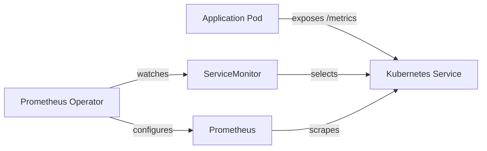

# kube-prometheus-stack

The [kube-prometheus-stack](https://github.com/prometheus-community/helm-charts/tree/main/charts/kube-prometheus-stack) Helm chart deploys a complete Prometheus monitoring pipeline. In the cluster, it provides Prometheus server, node-exporter, kube-state-metrics, and a curated set of recording and alerting rules for Kubernetes internals.

## What's Included

| Component | Purpose |
|:----------|:--------|
| **Prometheus** | Time-series database that scrapes and stores metrics |
| **node-exporter** | Exposes hardware and OS-level metrics from each node |
| **kube-state-metrics** | Generates metrics about the state of Kubernetes objects (pods, deployments, PVCs) |
| **PrometheusOperator** | Manages Prometheus instances and watches for ServiceMonitor/PodMonitor CRDs |
| **Recording Rules** | Pre-computed queries for common Kubernetes metrics |

!!! note "Grafana and Alertmanager"
    Grafana is deployed as a [separate Helm release](grafana.md) for independent lifecycle management. Alertmanager is currently disabled (`alertmanager.enabled: false`).

## Prometheus Configuration

Prometheus is configured with the following key settings:

```yaml
prometheusSpec:
  externalLabels:
    cluster: home-ops
  ruleSelectorNilUsesHelmValues: false
  serviceMonitorSelectorNilUsesHelmValues: false
  podMonitorSelectorNilUsesHelmValues: false
  probeSelectorNilUsesHelmValues: false
  scrapeConfigSelectorNilUsesHelmValues: false
  enableAdminAPI: true
  walCompression: true
  retentionSize: 15GB
  storageSpec:
    volumeClaimTemplate:
      spec:
        storageClassName: ceph-block
        resources:
          requests:
            storage: 20Gi
```

!!! tip "Selector Configuration"
    All `*SelectorNilUsesHelmValues: false` settings ensure Prometheus discovers ServiceMonitors, PodMonitors, ProbeMonitors, and recording rules from **all namespaces** -- not just those created by the Helm chart. This is essential for applications in other namespaces to be scraped.

### Storage

Prometheus stores its TSDB on a 20Gi Ceph block volume (`ceph-block` StorageClass). WAL compression is enabled to reduce write amplification and disk usage. The retention policy is size-based at 15GB, meaning Prometheus will automatically prune old data when the TSDB approaches this limit.

### Access

Prometheus is exposed internally via Envoy Gateway:

```yaml
route:
  main:
    enabled: true
    hostnames:
      - prometheus.example.com
    parentRefs:
      - name: envoy-internal
        namespace: networking
        sectionName: https
```

This makes Prometheus available at `https://prometheus.example.com` for internal/VPN users only.

## ServiceMonitor Pattern

The cluster uses `ServiceMonitor` resources extensively to define scrape targets. A ServiceMonitor tells Prometheus which services to scrape, on which port, and at which path. The Prometheus Operator watches for these CRDs and automatically configures Prometheus scrape jobs.



### Applications with ServiceMonitors

The following applications across the cluster expose ServiceMonitors:

| Application | Namespace | Metrics |
|:------------|:----------|:--------|
| Cilium Agent | `kube-system` | eBPF datapath, policy, endpoint metrics |
| Cilium Operator | `kube-system` | Operator health, IPAM allocation |
| Hubble | `kube-system` | DNS, TCP, HTTP, ICMP, flow, drop, port-distribution |
| Hubble Relay | `kube-system` | Relay connection and forwarding metrics |
| external-dns | `networking` | DNS record sync metrics |
| cloudflared | `networking` | Tunnel connection metrics |
| nginx (external) | `networking` | HTTP request metrics |
| nginx (internal) | `networking` | HTTP request metrics |
| Authelia | `security` | Authentication and authorization metrics |
| External Secrets Operator | `security` | Secret sync metrics |
| Grafana | `monitoring` | Dashboard rendering, data source query metrics |
| snapshot-controller | `system` | Volume snapshot metrics |
| metrics-server | `kube-system` | API metrics |

### Creating a ServiceMonitor

To add monitoring for a new application, create a ServiceMonitor in the application's namespace. Example for an app using the bjw-s app-template:

```yaml
# In your app's values.yaml
service:
  main:
    ports:
      http:
        port: 8080
      metrics:
        port: 9090

serviceMonitor:
  main:
    enabled: true
    endpoints:
      - port: metrics
        interval: 1m
```

For Helm charts that don't have built-in ServiceMonitor support, create one manually:

```yaml
apiVersion: monitoring.coreos.com/v1
kind: ServiceMonitor
metadata:
  name: my-app
  namespace: my-namespace
spec:
  selector:
    matchLabels:
      app.kubernetes.io/name: my-app
  endpoints:
    - port: metrics
      interval: 1m
      path: /metrics
```

## Kubernetes Component Monitoring

The kube-prometheus-stack scrapes all major Kubernetes control plane components:

| Component | Enabled | Endpoints |
|:----------|:--------|:----------|
| kubelet | Yes | Auto-discovered |
| kube-apiserver | Yes | Auto-discovered |
| kube-controller-manager | Yes | `192.168.0.201`, `192.168.0.202`, `192.168.0.203` |
| kube-scheduler | Yes | `192.168.0.201`, `192.168.0.202`, `192.168.0.203` |
| etcd | Yes | `192.168.0.201`, `192.168.0.202`, `192.168.0.203` |
| kube-proxy | No | Disabled (Cilium replaces kube-proxy via eBPF) |

!!! info "Static Endpoints"
    The controller-manager, scheduler, and etcd endpoints are statically configured to the three control plane node IPs because Talos Linux does not expose these components as Kubernetes services.

## Metric Relabeling

The stack applies metric relabeling rules to reduce cardinality and filter out unnecessary metrics. Each component has a keep-list regex that retains only the metrics that are actually used in dashboards and alerts.

For example, the kubelet ServiceMonitor keeps only metrics matching prefixes like `container_cpu`, `container_memory`, `kubelet_*`, and drops high-cardinality labels like `uid`, `id`, and `name`:

```yaml
metricRelabelings:
  - action: keep
    sourceLabels: ["__name__"]
    regex: (container_cpu|container_memory|kubelet_*|...)_(.+)
  - action: labeldrop
    regex: (uid)
  - action: labeldrop
    regex: (id|name)
```

This keeps storage costs down and query performance high on the 20Gi PVC.

## kube-state-metrics

kube-state-metrics is configured to expose all labels on key resource types, which enables label-based filtering in Grafana dashboards:

```yaml
kube-state-metrics:
  metricLabelsAllowlist:
    - "deployments=[*]"
    - "persistentvolumeclaims=[*]"
    - "pods=[*]"
```

A relabeling rule also adds the `kubernetes_node` label to every metric, derived from the pod's node name, enabling per-node breakdowns in dashboards.

## Helm Chart Reference

| Property | Value |
|:---------|:------|
| Chart | `prometheus-community/kube-prometheus-stack` |
| Version | `81.6.9` |
| Namespace | `monitoring` |
| Manifest path | `pitower/kubernetes/apps/monitoring/kube-prometheus-stack/` |
