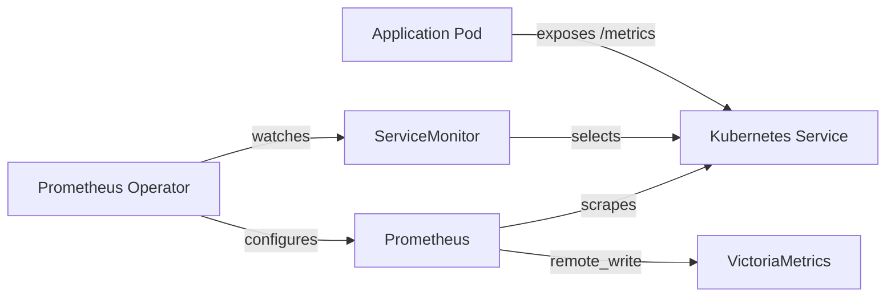

# kube-prometheus-stack

The [kube-prometheus-stack](https://github.com/prometheus-community/helm-charts/tree/main/charts/kube-prometheus-stack) Helm chart deploys the metrics and alerting core: Prometheus, Alertmanager, the Prometheus Operator, node-exporter, kube-state-metrics, and the stock Kubernetes recording and alerting rules. Prometheus keeps 10 days locally and remote-writes everything to VictoriaMetrics for long-term retention.

## What's Included

| Component | Purpose |
|:----------|:--------|
| **Prometheus** | Scrapes and stores metrics (10d / 40GB), remote-writes to VictoriaMetrics |
| **Alertmanager** | Routes alerts to Discord and ntfy |
| **Prometheus Operator** | Turns ServiceMonitor/PodMonitor/Probe/ScrapeConfig/PrometheusRule CRs into config |
| **node-exporter** | Hardware and OS metrics on every node (tolerates all `NoSchedule` taints) |
| **kube-state-metrics** | Kubernetes object state, plus custom-resource metrics for the llmkube CRs |
| **Rules** | Stock Kubernetes rules, minus `KubeJobFailed` and `KubeClientCertificateExpiration` (replaced by local rules) |

> [!NOTE]
> **Grafana**
>
> The chart's Grafana is disabled (`grafana.enabled: false`). Grafana is run by the [grafana-operator](grafana.md); the chart still emits its bundled dashboards as `GrafanaDashboard` CRs into the **Kubernetes** folder (`grafana.operator.dashboardsConfigMapRefEnabled: true`).

## Prometheus Configuration

```yaml title="values.yaml (abridged)"
prometheus:
  prometheusSpec:
    nodeSelector:
      wibrow.dev/compute: "true"
    externalUrl: https://prometheus.wibrow.dev
    externalLabels:
      cluster: pitower
    ruleSelectorNilUsesHelmValues: false
    serviceMonitorSelectorNilUsesHelmValues: false
    podMonitorSelectorNilUsesHelmValues: false
    probeSelectorNilUsesHelmValues: false
    scrapeConfigSelectorNilUsesHelmValues: false
    enableAdminAPI: true
    walCompression: true
    retention: 10d
    retentionSize: 40GB
    remoteWrite:
      - url: http://victoria-metrics-server.monitoring.svc.cluster.local:8428/api/v1/write
    storageSpec:
      volumeClaimTemplate:
        spec:
          storageClassName: openebs-hostpath-fast
          resources:
            requests:
              storage: 50Gi
```

> [!TIP]
> **Selector Configuration**
>
> All `*SelectorNilUsesHelmValues: false` settings make Prometheus pick up ServiceMonitors, PodMonitors, Probes, ScrapeConfigs and PrometheusRules from **all namespaces**, not just those created by the chart.

### Storage

Prometheus runs on worker-07 (the only `wibrow.dev/compute=true` node) with a 50Gi `openebs-hostpath-fast` volume on the `fast/extra` ZFS dataset. That class does not enforce PVC sizes, so `retentionSize: 40GB` is what keeps the TSDB from spilling into its neighbours; the gap leaves room for the WAL and compaction.

### The `cluster` label

A default `scrapeClass` stamps `cluster=pitower` as a **target** label (only when the target has no `cluster` of its own, so Rook keeps `cluster=rook-ceph`). Setting it as a target label is what puts it on the synthetic `up` series; many dashboards drive a hidden `$cluster` variable from `up`.

### Access

Prometheus is exposed on the internal gateway at `https://prometheus.wibrow.dev` (`envoy-internal`), reachable from the LAN or Tailscale only.

## Long-term Storage: VictoriaMetrics

`monitoring/victoria-metrics` runs the `victoria-metrics-single` chart (`0.48.0`):

| Setting | Value |
|:--------|:------|
| Retention | 2 years |
| Storage | 150Gi on `openebs-hostpath-fast` (worker-07) |
| Ingest | Prometheus `remote_write` to `:8428/api/v1/write` |
| UI | `https://vm.wibrow.dev` (`envoy-internal`) |
| Grafana datasource | **VictoriaMetrics** (uid `victoriametrics`) |

Use the VictoriaMetrics datasource for anything older than Prometheus' 10 days.

## Scrape Targets

The cluster leans on Prometheus Operator CRs rather than static config:

| Kind | Examples |
|:-----|:---------|
| `ServiceMonitor` | Most charts (`serviceMonitor.enabled: true`): Cilium, external-dns, cert-manager, Rook Ceph, kopiur, VictoriaLogs/Metrics, Tempo, Grafana |
| `PodMonitor` | Envoy Gateway and proxies, CNPG clusters, ARC runners, llmkube inference, Reloader |
| `Probe` | Blackbox probes (ICMP, TCP, TLS, DNS, HTTP) from `monitoring/blackbox-exporter` |
| `ScrapeConfig` | Garage metrics (`monitoring/garage`, bearer token) |
| `additionalScrapeConfigs` | Talos etcd on `10.20.10.1-3:2381` (job `kube-etcd`) |


```mermaid
flowchart LR
    App[Application Pod] -->|exposes /metrics| Svc[Kubernetes Service]
    SM[ServiceMonitor] -->|selects| Svc
    PO[Prometheus Operator] -->|watches| SM
    PO -->|configures| Prom[Prometheus]
    Prom -->|scrapes| Svc
    Prom -->|remote_write| VM[VictoriaMetrics]
```

### Creating a ServiceMonitor

With the bjw-s app-template (see `monitoring/gatus` or `monitoring/unpoller`); `serviceName` is the rendered Service name:

```yaml title="values.yaml"
service:
  app:
    ports:
      http:
        port: 8080

serviceMonitor:
  app:
    serviceName: my-app
    endpoints:
      - port: http
        path: /metrics
        interval: 1m
```

For charts without built-in support, create one manually:

```yaml
apiVersion: monitoring.coreos.com/v1
kind: ServiceMonitor
metadata:
  name: my-app
  namespace: my-namespace
spec:
  selector:
    matchLabels:
      app.kubernetes.io/name: my-app
  endpoints:
    - port: metrics
      interval: 1m
      path: /metrics
```

## Kubernetes Component Monitoring

| Component | Enabled | Discovery |
|:----------|:--------|:----------|
| kubelet | Yes | Auto-discovered |
| kube-apiserver | Yes | Auto-discovered |
| kube-controller-manager | Yes | Selector on the Talos static pods (`component: kube-controller-manager`) |
| kube-scheduler | Yes | Selector on the Talos static pods (`component: kube-scheduler`) |
| etcd | Yes | Static `additionalScrapeConfigs` job `kube-etcd` (`10.20.10.1-3:2381`) |
| kube-proxy | No | Cilium replaces kube-proxy |

> [!NOTE]
> **Talos specifics**
>
> Talos binds the scheduler and controller-manager metrics to `0.0.0.0` and exposes etcd metrics on `:2381` via `talos/pitower/control-plane/01-cluster.yaml`. etcd is scraped through a static job because ArgoCD excludes `Endpoints`/`EndpointSlice`, so the chart's selector-less Endpoints object would never apply.

## Metric Relabeling

Each control-plane ServiceMonitor keeps only the metric prefixes that dashboards and alerts use and drops high-cardinality histogram buckets. For example, the kubelet keeps `container_*`, `kubelet_*` and friends and drops the `uid`, `id` and `name` labels:

```yaml
metricRelabelings:
  - action: keep
    sourceLabels: ["__name__"]
    regex: (container_cpu|container_memory|kubelet_*|...)_(.+)
  - action: labeldrop
    regex: (uid)
  - action: labeldrop
    regex: (id|name)
```

node-exporter drops the operator-added `pod` label, so DaemonSet restarts do not mint new series (which would break `predict_linear()` rules).

## kube-state-metrics

```yaml
kube-state-metrics:
  metricLabelsAllowlist:
    - "deployments=[*]"
    - "persistentvolumeclaims=[*]"
    - "pods=[*]"
    - "nodes=[kubevirt.io/schedulable]"
  customResourceState:
    enabled: true   # llmkube InferenceService / Model metrics for the LLM dashboard
```

A relabeling rule adds a `kubernetes_node` label derived from the pod's node name.

## Alerting

Alertmanager is enabled, exposed at `https://alertmanager.wibrow.dev` (`envoy-internal`). Its config is rendered by the `alertmanager-config` ExternalSecret so the Discord webhook URL (Infisical `/monitoring/alertmanager/DISCORD_WEBHOOK_URL`) can be injected inline; message templates come from the `alertmanager-templates` ConfigMap.

| Route | Receiver |
|:------|:---------|
| Default | Discord |
| `Watchdog`, `InfoInhibitor` | `null` |
| `notify="ntfy"` | ntfy, through `ntfy-alertmanager` (and still Discord, `continue: true`) |

`notify="ntfy"` is set by Prometheus for `KubeNodeNotReady`, `KubeNodeUnreachable` and `KubeletDown`, and by the Garage and smartctl rules. `repeat_interval` is 720h, so each alert notifies once. Inhibit rules mute `warning`/`info` under a matching `critical`, and collapse kopiur's per-snapshot failures under `KopiurLastBackupFailed`.

### Silences

Before disruptive work, silence alerts with amtool inside the Alertmanager pod and expire the silence when done:

```sh
am() { kubectl -n monitoring exec alertmanager-kube-prometheus-stack-0 -c alertmanager -- amtool --alertmanager.url=http://localhost:9093 "$@"; }
am silence add 'node="worker-07"' --duration=2h --author=me --comment="<what and why>"
am silence query
am silence expire <id>
```

## Helm Chart Reference

| Property | Value |
|:---------|:------|
| Chart | `prometheus-community/kube-prometheus-stack` |
| Version | `91.9.0` |
| Namespace | `monitoring` |
| Manifest path | `kubernetes/apps/pitower/monitoring/kube-prometheus-stack/` |
