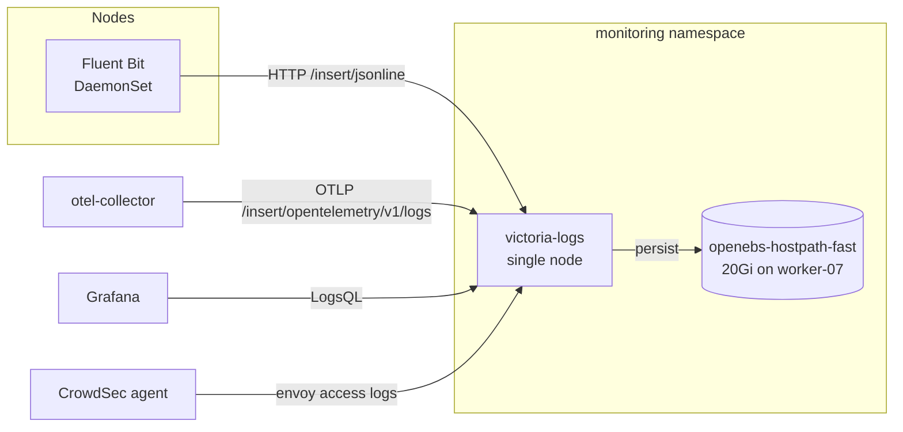

# VictoriaLogs

[VictoriaLogs](https://docs.victoriametrics.com/victorialogs/) is the cluster's log store. It replaced Loki. A single-node instance in the `monitoring` namespace receives container logs from [Fluent Bit](fluent-bit.md) and OTLP logs from the [OpenTelemetry Collector](otel-collector.md), and Grafana queries it with LogsQL.

## Architecture



## Deployment

Deployed with the `victoria-logs-single` Helm chart (`0.13.10`) from `kubernetes/apps/pitower/monitoring/victoria-logs/`:

```yaml title="values.yaml (abridged)"
server:
  replicaCount: 1
  nodeSelector:
    wibrow.dev/compute: "true"
  retentionPeriod: 14d
  persistentVolume:
    enabled: true
    storageClassName: openebs-hostpath-fast
    size: 20Gi
  service:
    servicePort: 9428
  serviceMonitor:
    enabled: true
  resources:
    limits:
      memory: 8Gi
```

| Setting | Value | Notes |
|:--------|:------|:------|
| Node | worker-07 (only node labelled `wibrow.dev/compute=true`) | Shares `fast/extra` with Prometheus, VictoriaMetrics and Tempo |
| Retention | 14 days | |
| Storage | 20Gi on `openebs-hostpath-fast` | Size is not enforced on ZFS; the dataset quota bounds it |
| Endpoint | `http://victoria-logs.monitoring.svc.cluster.local:9428` | In-cluster only, no HTTPRoute |

> [!NOTE]
> **Memory limit sizes the cache**
>
> The 8Gi limit is deliberate. VictoriaLogs sizes its caches off the cgroup limit, and at 1Gi every background merge re-read parts from disk, starving the ceph-mon on the same node.

The chart's Vector dashboard is patched out in `kustomization.yaml` since logs are shipped by Fluent Bit.

## Ingestion

| Source | Path | Stream fields |
|:-------|:-----|:--------------|
| Fluent Bit (container logs) | `/insert/jsonline` | `kubernetes_namespace_name`, `kubernetes_pod_name`, `kubernetes_container_name` |
| OpenTelemetry Collector (OTLP logs, e.g. `ovh-vps` journald) | `/insert/opentelemetry/v1/logs` | OTLP resource attributes |

Fluent Bit sets `_time_field=@timestamp` and `_msg_field=log`, so the application's log line becomes `_msg` and JSON logs are already merged into top-level fields.

## Querying with LogsQL

Grafana has a **VictoriaLogs** datasource (`victoriametrics-logs-datasource` plugin, uid `victorialogs`). Examples:

```logsql
# Everything from one namespace in the last 15 minutes
_time:15m kubernetes_namespace_name:networking

# Errors from one app
kubernetes_namespace_name:media kubernetes_container_name:app error

# Logs from the external VPS (OTLP)
host.name:ovh-vps
```

From a workstation, without Grafana:

```sh
kubectl -n monitoring port-forward victoria-logs-0 9428:9428 &
curl -s http://localhost:9428/select/logsql/query -d 'query=_time:5m kubernetes_namespace_name:monitoring | limit 10'
```

The built-in web UI is at `http://localhost:9428/select/vmui/` while the port-forward runs.

## Consumers

| Consumer | Purpose |
|:---------|:--------|
| Grafana | Explore, the **VictoriaLogs - Overview** and **Envoy Gateway - Access Logs** dashboards, Tempo trace-to-logs |
| CrowdSec (`security/crowdsec`) | Reads envoy-external access logs out of VictoriaLogs |
| ToolHive `victorialogs` MCP server (`ai/toolhive`) | Read-only LogsQL for agents |

## Dashboards

Two dashboards ship from the app directory as `GrafanaDashboard` CRs in the **Observability** folder: **VictoriaLogs - Overview** (log volume, noisiest pods, top error/warn sources) and the chart's **VictoriaLogs - single-node** operational dashboard.

## Reference

| Property | Value |
|:---------|:------|
| Chart | `victoriametrics/victoria-logs-single` |
| Version | `0.13.10` |
| Namespace | `monitoring` |
| Manifest path | `kubernetes/apps/pitower/monitoring/victoria-logs/` |
