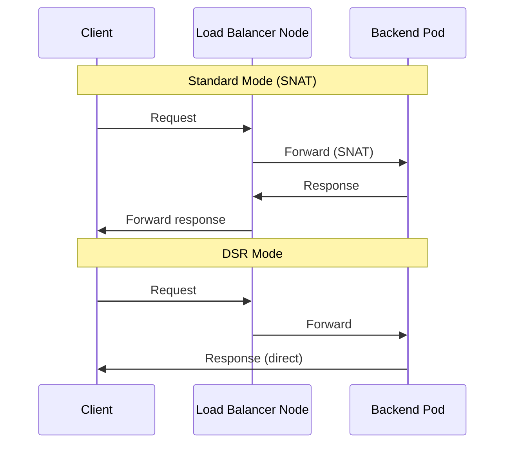

# Cilium CNI

Cilium is the Container Network Interface (CNI) for the cluster, replacing both kube-proxy and MetalLB. It uses eBPF for high-performance packet processing and provides L2 announcements for LoadBalancer IP allocation, Direct Server Return (DSR) for optimized traffic flow, and Maglev consistent hashing for load balancing.

## Why Cilium

Traditional Kubernetes networking stacks involve multiple components: a CNI plugin (Flannel, Calico), kube-proxy for service routing, and MetalLB for LoadBalancer IPs. Cilium consolidates all of these into a single eBPF-powered component:

| Concern | Traditional Stack | Cilium |
|:--------|:-----------------|:-------|
| CNI | Flannel / Calico | Cilium (eBPF) |
| Service proxy | kube-proxy (iptables) | Cilium (eBPF, DSR) |
| LoadBalancer IPs | MetalLB (L2/BGP) | Cilium L2 Announcements + LBIPAM |
| Network observability | Third-party tools | Hubble (built-in) |
| Network policy | CNI-specific | Cilium NetworkPolicy + CiliumNetworkPolicy |

## Helm Values

The full Cilium Helm values used in this cluster:

```yaml title="pitower/kubernetes/apps/kube-system/cilium/operator/values.yaml"
hubble:
  enabled: true
  metrics:
    enabled:
      - dns:query;ignoreAAAA
      - drop
      - tcp
      - flow
      - port-distribution
      - icmp
      - http
  relay:
    enabled: true
    rollOutPods: true
    prometheus:
      serviceMonitor:
        enabled: true
  ui:
    enabled: true
    rollOutPods: true
    ingress:
      enabled: false
  serviceMonitor:
    enabled: true
  dashboards:
    enabled: true
    annotations:
      grafana_folder: Cilium

operator:
  prometheus:
    enabled: true
    serviceMonitor:
      enabled: true
  dashboards:
    enabled: true
    annotations:
      grafana_folder: Cilium
  replicas: 2
  rollOutPods: true

cluster:
  name: home-ops
  id: 1

cgroup:
  autoMount:
    enabled: false
  hostRoot: /sys/fs/cgroup

autoDirectNodeRoutes: true

bpf:
  masquerade: true

endpointRoutes:
  enabled: true

ipam:
  mode: kubernetes
ipv4NativeRoutingCIDR: 10.244.0.0/16
k8sServiceHost: 127.0.0.1
k8sServicePort: 7445
kubeProxyReplacement: true
kubeProxyReplacementHealthzBindAddr: 0.0.0.0:10256

l2announcements:
  enabled: true

loadBalancer:
  algorithm: maglev
  mode: dsr

localRedirectPolicy: true

routingMode: native

rollOutCiliumPods: true
```

## Kube-Proxy Replacement

Cilium fully replaces kube-proxy in this cluster. The key settings:

```yaml
kubeProxyReplacement: true
kubeProxyReplacementHealthzBindAddr: 0.0.0.0:10256
k8sServiceHost: 127.0.0.1
k8sServicePort: 7445
```

!!! info "Talos Linux Integration"
    On Talos Linux, kube-proxy is disabled at bootstrap time. The `k8sServiceHost: 127.0.0.1` and `k8sServicePort: 7445` point to Talos's built-in API server proxy, allowing Cilium to operate without kube-proxy from the very first boot.

With kube-proxy replacement, all ClusterIP, NodePort, and LoadBalancer service handling is done in eBPF -- no iptables rules are created for service routing.

## L2 Announcements

Instead of MetalLB, Cilium's L2 announcement mode responds to ARP requests for LoadBalancer service IPs. This is configured with two resources:

### CiliumL2AnnouncementPolicy

Tells Cilium to respond to ARP requests for LoadBalancer IPs on all Linux nodes:

```yaml title="pitower/kubernetes/apps/kube-system/cilium/config/cilium-l2.yaml"
apiVersion: cilium.io/v2alpha1
kind: CiliumL2AnnouncementPolicy
metadata:
  name: policy
spec:
  loadBalancerIPs: true
  nodeSelector:
    matchLabels:
      kubernetes.io/os: linux
```

### CiliumLoadBalancerIPPool (LBIPAM)

Defines the pool of IPs that Cilium can assign to LoadBalancer services:

```yaml title="pitower/kubernetes/apps/kube-system/cilium/config/cilium-l2.yaml"
apiVersion: cilium.io/v2alpha1
kind: CiliumLoadBalancerIPPool
metadata:
  name: pool
spec:
  allowFirstLastIPs: "Yes"
  blocks:
    - start: 192.168.0.220
      stop: 192.168.0.239
```

!!! tip "IP Allocation"
    The pool covers `192.168.0.220` through `192.168.0.239` -- a 20-IP range. Services can request a specific IP from this pool using the `lbipam.cilium.io/ips` annotation on their Service resource. See the [Load Balancers](load-balancers.md) page for the full allocation table.

## DSR Mode (Direct Server Return)

DSR mode allows response traffic to bypass the load balancer node and go directly from the backend pod to the client. This reduces latency and cuts the load balancer's bandwidth usage in half.

```yaml
loadBalancer:
  mode: dsr
```



!!! warning "DSR and Source IP"
    DSR mode preserves the client's source IP address at the backend pod. However, the `externalTrafficPolicy` on the gateway services is set to `Cluster` (not `Local`), which means any node can handle the traffic -- the eBPF program handles the DSR encapsulation.

## Maglev Load Balancing

Maglev is Google's consistent hashing algorithm for load balancing. It provides better distribution than standard hashing and maintains connection affinity even when backends change.

```yaml
loadBalancer:
  algorithm: maglev
```

Benefits over the default random algorithm:

- **Consistent hashing**: The same client IP maps to the same backend, providing session affinity without cookies
- **Minimal disruption**: Adding or removing backends only remaps a small fraction of connections
- **Even distribution**: Maglev's permutation-based hashing produces very uniform load distribution

## Native Routing

The cluster uses native routing mode (instead of encapsulation/overlay):

```yaml
routingMode: native
ipv4NativeRoutingCIDR: 10.244.0.0/16
autoDirectNodeRoutes: true
endpointRoutes: true
```

This means pod-to-pod traffic is routed directly at the kernel level without VXLAN or Geneve encapsulation, reducing overhead and improving performance. The `autoDirectNodeRoutes` setting automatically inserts routes to other nodes' pod CIDRs, and `endpointRoutes` creates per-endpoint routes for more precise routing.

## Hubble Observability

Hubble is Cilium's built-in observability platform, providing deep visibility into network flows, DNS queries, and HTTP requests.

### Components

| Component | Purpose |
|:----------|:--------|
| Hubble Agent | Runs on every node, captures eBPF events |
| Hubble Relay | Aggregates flows from all agents |
| Hubble UI | Web dashboard for flow visualization |

### Enabled Metrics

```yaml
hubble:
  metrics:
    enabled:
      - dns:query;ignoreAAAA
      - drop
      - tcp
      - flow
      - port-distribution
      - icmp
      - http
```

The `dns:query;ignoreAAAA` filter captures DNS query metrics while ignoring AAAA (IPv6) lookups, which reduces noise in an IPv4-only cluster.

### Accessing Hubble UI

Hubble UI is exposed on the `envoy-internal` gateway:

```yaml title="pitower/kubernetes/apps/kube-system/cilium/operator/httproute-hubble.yaml"
apiVersion: gateway.networking.k8s.io/v1
kind: HTTPRoute
metadata:
  name: hubble-ui
  namespace: kube-system
spec:
  hostnames:
    - hubble.example.com
  parentRefs:
    - name: envoy-internal
      namespace: networking
      sectionName: https
  rules:
    - backendRefs:
        - name: hubble-ui
          port: 80
```

Access it at `https://hubble.example.com` from the LAN or via Tailscale.

### Grafana Dashboards

Hubble, Cilium agent, and Cilium operator all export Prometheus metrics with Grafana dashboards auto-provisioned into the `Cilium` folder:

```yaml
dashboards:
  enabled: true
  annotations:
    grafana_folder: Cilium
```

## BPF Masquerade

```yaml
bpf:
  masquerade: true
```

BPF masquerade performs SNAT in eBPF instead of iptables. This is required for native routing mode to work correctly -- outbound traffic from pods to external destinations is masqueraded to the node's IP address using eBPF programs rather than iptables MASQUERADE rules.

## Troubleshooting

### Check Cilium Status

```bash
kubectl -n kube-system exec ds/cilium -- cilium status --brief
```

### Verify L2 Announcements

```bash
# Check if the L2 announcement policy is active
kubectl get ciliuml2announcementpolicies

# Check IP pool allocation
kubectl get ciliumloadbalancerippools
kubectl get services -A -o wide | grep LoadBalancer
```

### Verify kube-proxy Replacement

```bash
# Should show kube-proxy replacement is active
kubectl -n kube-system exec ds/cilium -- cilium status | grep KubeProxyReplacement

# Verify no iptables rules for services
kubectl -n kube-system exec ds/cilium -- cilium service list
```

### Hubble CLI

```bash
# Observe live flows
kubectl -n kube-system exec ds/cilium -- hubble observe --follow

# Filter by namespace
kubectl -n kube-system exec ds/cilium -- hubble observe --namespace networking

# DNS queries
kubectl -n kube-system exec ds/cilium -- hubble observe --protocol dns
```
