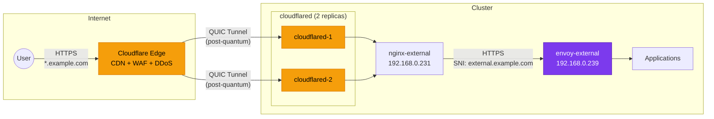

# Cloudflare Tunnel

The cluster uses a [Cloudflare Tunnel](https://developers.cloudflare.com/cloudflare-one/connections/connect-networks/) (via `cloudflared`) to securely expose services to the internet without opening any inbound ports on the router. Traffic flows from Cloudflare's edge network through an encrypted QUIC tunnel to the cluster, then through nginx to the `envoy-external` gateway.

## Architecture



### Traffic Flow

1. **User** requests `https://myapp.example.com`
2. **Cloudflare DNS** resolves `myapp.example.com` to a Cloudflare edge IP (proxied/orange cloud)
3. **Cloudflare Edge** terminates TLS, applies WAF rules, caches if applicable
4. **Cloudflare Tunnel** sends the request over QUIC to `cloudflared` in the cluster
5. **cloudflared** forwards to `nginx-external` (the tunnel ingress config target)
6. **nginx-external** terminates TLS (using `originServerName: external.example.com`) and forwards to `envoy-external`
7. **envoy-external** routes to the application based on the HTTPRoute hostname match

!!! note "Why nginx Between Tunnel and Envoy?"
    The Cloudflare tunnel needs a single origin server to connect to. nginx-external serves as this single endpoint, handling TLS termination and routing all tunnel traffic to the envoy-external gateway. This avoids having to configure individual tunnel ingress rules per application.

## Deployment Configuration

cloudflared runs as 2 replicas with topology spread constraints for high availability:

```yaml title="pitower/kubernetes/apps/networking/cloudflared/values.yaml"
controllers:
  cloudflared:
    replicas: 2
    strategy: RollingUpdate

    annotations:
      reloader.stakater.com/auto: "true"

    pod:
      topologySpreadConstraints:
        - maxSkew: 1
          topologyKey: kubernetes.io/hostname
          whenUnsatisfiable: DoNotSchedule
          labelSelector:
            matchLabels:
              app.kubernetes.io/name: cloudflared

    containers:
      app:
        image:
          repository: docker.io/cloudflare/cloudflared
          tag: 2026.1.2
        args:
          - tunnel
          - --config
          - /etc/cloudflared/config/config.yaml
          - run
          - "$(TUNNEL_ID)"
        env:
          NO_AUTOUPDATE: "true"
          TUNNEL_CRED_FILE: /etc/cloudflared/creds/credentials.json
          TUNNEL_METRICS: 0.0.0.0:8080
          TUNNEL_ORIGIN_ENABLE_HTTP2: true
          TUNNEL_POST_QUANTUM: true
          TUNNEL_TRANSPORT_PROTOCOL: quic
          TUNNEL_ID:
            valueFrom:
              secretKeyRef:
                name: cloudflared-secret
                key: TUNNEL_ID
        probes:
          liveness:
            enabled: true
            custom: true
            spec:
              httpGet:
                path: /ready
                port: 8080
          readiness:
            enabled: true
            custom: true
            spec:
              httpGet:
                path: /ready
                port: 8080
          startup:
            enabled: true
            custom: true
            spec:
              httpGet:
                path: /ready
                port: 8080
              failureThreshold: 30
              periodSeconds: 10
        resources:
          requests:
            cpu: 6m
            memory: 105Mi
          limits:
            memory: 105Mi
```

### Key Environment Variables

| Variable | Value | Purpose |
|:---------|:------|:--------|
| `TUNNEL_TRANSPORT_PROTOCOL` | `quic` | Use QUIC instead of HTTP/2 for the tunnel connection |
| `TUNNEL_POST_QUANTUM` | `true` | Enable post-quantum cryptography for tunnel encryption |
| `TUNNEL_ORIGIN_ENABLE_HTTP2` | `true` | Use HTTP/2 when connecting to the origin (nginx) |
| `TUNNEL_METRICS` | `0.0.0.0:8080` | Expose Prometheus metrics on port 8080 |
| `NO_AUTOUPDATE` | `true` | Disable auto-update (managed by Renovate instead) |

!!! info "Post-Quantum Encryption"
    The `TUNNEL_POST_QUANTUM: true` setting enables post-quantum key exchange (using ML-KEM/Kyber) for the tunnel connection. This protects against "harvest now, decrypt later" attacks by quantum computers. The QUIC transport protocol is required for post-quantum support.

### Topology Spread

The topology spread constraint ensures the two cloudflared replicas run on different physical nodes:

```yaml
topologySpreadConstraints:
  - maxSkew: 1
    topologyKey: kubernetes.io/hostname
    whenUnsatisfiable: DoNotSchedule
```

This provides resilience against single-node failures -- if one node goes down, the other replica continues serving tunnel traffic.

## Tunnel Configuration

The tunnel ingress rules define how cloudflared routes incoming requests:

```yaml title="pitower/kubernetes/apps/networking/cloudflared/configs/config.yaml"
originRequest:
  http2Origin: true

ingress:
  - hostname: "example.com"
    service: https://nginx-external-controller.networking.svc.cluster.local:443
    originRequest:
      originServerName: "external.example.com"
  - hostname: "*.example.com"
    service: https://nginx-external-controller.networking.svc.cluster.local:443
    originRequest:
      originServerName: "external.example.com"
  - service: http_status:404
```

### Ingress Rules Explained

| Rule | Hostname | Target | Purpose |
|:-----|:---------|:-------|:--------|
| 1 | `example.com` | nginx-external:443 | Bare domain traffic |
| 2 | `*.example.com` | nginx-external:443 | All subdomain traffic |
| 3 | (catch-all) | `http_status:404` | Return 404 for unmatched requests |

The `originServerName: "external.example.com"` setting tells cloudflared to set the TLS SNI (Server Name Indication) to `external.example.com` when connecting to nginx. This allows nginx to match the request to the correct server block.

!!! tip "All Traffic Through One nginx"
    Rather than configuring individual tunnel ingress rules per application, all traffic goes to a single nginx-external instance. This means adding a new application only requires creating an HTTPRoute on the `envoy-external` gateway -- no tunnel config changes needed.

## DNSEndpoint for Tunnel CNAME

For the tunnel to work, Cloudflare DNS must have a CNAME record pointing `external.example.com` to the tunnel's hostname:

```yaml title="pitower/kubernetes/apps/networking/cloudflared/dnsendpoint.yaml"
apiVersion: externaldns.k8s.io/v1alpha1
kind: DNSEndpoint
metadata:
  name: cloudflared
  namespace: networking
spec:
  endpoints:
    - dnsName: "external.example.com"
      recordType: CNAME
      targets: ["7ee9277a-e2f3-45ae-a0ac-4e85d39fc334.cfargotunnel.com"]
```

This creates: `external.example.com` -> `7ee9277a-e2f3-45ae-a0ac-4e85d39fc334.cfargotunnel.com`

When Cloudflare receives a request for `myapp.example.com`, it resolves the CNAME chain:

1. `myapp.example.com` -> `external.example.com` (CNAME from external-dns)
2. `external.example.com` -> `<tunnel-id>.cfargotunnel.com` (CNAME from DNSEndpoint)
3. Cloudflare recognizes `.cfargotunnel.com` and routes through the tunnel

## Secrets

The tunnel requires two secrets stored in `cloudflared-secret` (managed via External Secrets from 1Password):

| Key | Purpose |
|:----|:--------|
| `TUNNEL_ID` | The Cloudflare tunnel UUID |
| `credentials.json` | Tunnel credentials file (contains the tunnel secret) |

These are mounted into the cloudflared pods:

```yaml
persistence:
  config:
    type: configMap
    name: cloudflared-configmap
    globalMounts:
      - path: /etc/cloudflared/config/config.yaml
        subPath: config.yaml
        readOnly: true
  creds:
    type: secret
    name: cloudflared-secret
    globalMounts:
      - path: /etc/cloudflared/creds/credentials.json
        subPath: credentials.json
        readOnly: true
```

## Monitoring

cloudflared exposes Prometheus metrics on port 8080, scraped by a ServiceMonitor:

```yaml
service:
  app:
    controller: cloudflared
    ports:
      http:
        port: 8080

serviceMonitor:
  app:
    serviceName: cloudflared
    endpoints:
      - port: http
        scheme: http
        path: /metrics
        interval: 1m
        scrapeTimeout: 30s
```

Key metrics to monitor:

| Metric | Description |
|:-------|:------------|
| `cloudflared_tunnel_total_requests` | Total requests through the tunnel |
| `cloudflared_tunnel_request_errors` | Request errors |
| `cloudflared_tunnel_response_by_code` | Response status code distribution |
| `cloudflared_tunnel_concurrent_requests_per_tunnel` | Active connections |

## Troubleshooting

### Check Tunnel Status

```bash
# Check if cloudflared pods are running
kubectl get pods -n networking -l app.kubernetes.io/name=cloudflared

# Check readiness
kubectl get pods -n networking -l app.kubernetes.io/name=cloudflared -o wide

# View logs
kubectl logs -n networking -l app.kubernetes.io/name=cloudflared --tail=50
```

### Verify Tunnel Connectivity

```bash
# Check the /ready endpoint
kubectl port-forward -n networking svc/cloudflared 8080:8080 &
curl http://localhost:8080/ready

# Check metrics
curl http://localhost:8080/metrics | grep cloudflared_tunnel
```

### Test End-to-End

```bash
# From outside the network, test a proxied service
curl -v https://myapp.example.com

# Check the cf-ray header (confirms traffic went through Cloudflare)
curl -sI https://myapp.example.com | grep cf-ray
```

### Common Issues

!!! warning "Tunnel Disconnects"
    If both cloudflared replicas lose connection to Cloudflare, all proxied services become unreachable. Check:

    - Node network connectivity
    - Cloudflare status page
    - cloudflared logs for reconnection attempts

!!! warning "Origin Certificate Errors"
    If cloudflared cannot connect to nginx, check:

    - The `originServerName` matches the TLS certificate on nginx
    - The `wildcard-production-tls` secret exists in the networking namespace
    - The certificate is not expired (`kubectl get certificate -n networking`)
