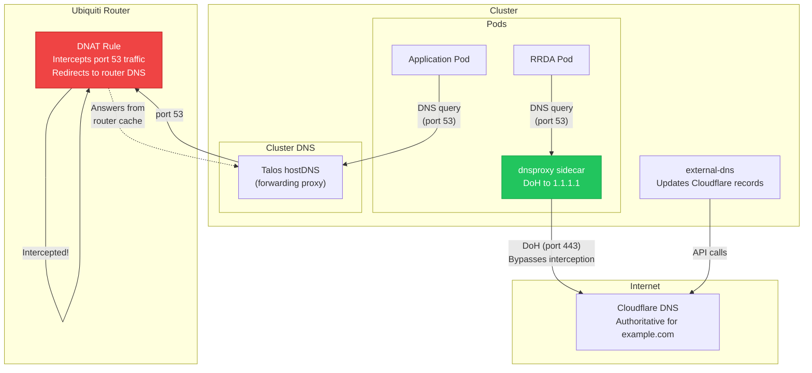
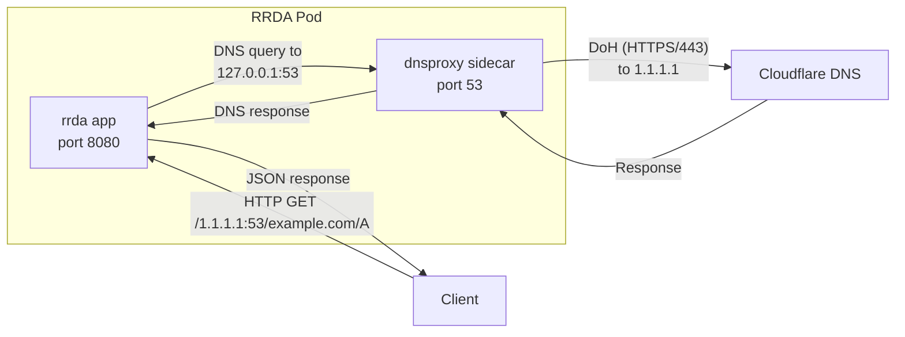

# DNS Management

DNS in the cluster involves several layers: Cloudflare as the authoritative DNS provider, Talos Linux's built-in host DNS forwarding (CoreDNS is disabled), and a critical workaround for the Ubiquiti router's DNS interception behavior. This page covers the full DNS architecture and the solutions developed to handle each challenge.

## DNS Architecture



## Cloudflare as Authoritative DNS

The domain `example.com` is managed by Cloudflare. All DNS records are created and updated automatically by [external-dns](external-dns.md), which runs in the cluster and uses the Cloudflare API.

Key DNS records:

| Record | Type | Target | Proxied |
|:-------|:-----|:-------|:--------|
| `external.example.com` | CNAME | `<tunnel-id>.cfargotunnel.com` | No (tunnel routing) |
| `*.example.com` (external apps) | CNAME | `external.example.com` | Yes |

## Cluster DNS: Talos hostDNS

The cluster does **not** run CoreDNS. Instead, Talos Linux provides a built-in host DNS forwarding proxy that handles cluster DNS resolution. This is configured at the Talos machine config level and forwards queries to upstream resolvers.

!!! info "Why Not CoreDNS?"
    While CoreDNS is deployed (at `192.168.0.220`), it serves as a fallback. The primary cluster DNS is Talos's built-in `hostDNS` feature, which provides a lightweight forwarding DNS proxy directly on each node. This avoids the overhead of running CoreDNS pods and reduces single-point-of-failure risk.

## The DNS Interception Problem

!!! danger "Critical Gotcha: Ubiquiti Router Intercepts Port 53"
    The Ubiquiti router performs transparent DNS interception (DNAT) on **all** outbound traffic to port 53. This means any DNS query from the cluster that exits the node toward an external DNS server (like `1.1.1.1` or `8.8.8.8`) gets intercepted and answered by the router's own DNS resolver instead.

    This has several consequences:

    1. **Stale records**: The router's DNS cache may serve outdated records for `example.com` subdomains
    2. **Incorrect answers**: The router resolves against its own upstream, which may not reflect recent Cloudflare changes
    3. **Verification impossible**: You cannot verify Cloudflare DNS records from within the network using standard `dig` commands

### How to Verify Actual Cloudflare Records

Since standard DNS queries on port 53 get intercepted, you must use DNS-over-HTTPS (DoH) to verify what Cloudflare actually returns:

```bash
# Verify a record via Cloudflare DoH (bypasses router interception)
curl -s "https://1.1.1.1/dns-query?name=app.example.com&type=A" \
  -H "Accept: application/dns-json" | jq .

# Compare with what the router returns (intercepted)
dig app.example.com @1.1.1.1 +short

# These may return DIFFERENT results!
```

!!! tip "Quick DoH Check"
    ```bash
    # One-liner to check if a CNAME exists on Cloudflare
    curl -s "https://1.1.1.1/dns-query?name=myapp.example.com&type=CNAME" \
      -H "Accept: application/dns-json" | jq '.Answer[].data'
    ```

## The DoH Sidecar Solution

For applications that **must** resolve DNS records accurately against Cloudflare (not the router's intercepted version), a DNS-over-HTTPS sidecar is deployed alongside the application.

### RRDA + dnsproxy

The [RRDA](https://github.com/swibrow/rrda) application is a REST API for DNS lookups. It needs to query actual authoritative DNS servers to return correct results. Since standard port 53 queries get intercepted by the Ubiquiti router, RRDA runs a `dnsproxy` sidecar that provides a local DNS server (on port 53 within the pod) that forwards all queries via DoH.

```yaml title="pitower/kubernetes/apps/selfhosted/rrda/values.yaml"
controllers:
  rrda:
    strategy: RollingUpdate
    containers:
      app:
        image:
          repository: ghcr.io/swibrow/rrda
          tag: 1.4.1
        probes:
          liveness: &probes
            enabled: true
            custom: true
            spec:
              httpGet:
                path: /127.0.0.1:53/example.com/A
                port: &port 8080
              initialDelaySeconds: 5
              periodSeconds: 30
              timeoutSeconds: 5
          readiness: *probes
      dns-over-https:
        image:
          repository: docker.io/adguard/dnsproxy
          tag: v0.78.2
        args:
          - --listen=0.0.0.0
          - --port=53
          - --upstream=https://1.1.1.1/dns-query
          - --upstream=https://1.0.0.1/dns-query
          - --bootstrap=9.9.9.9:53
```

### How It Works



1. RRDA receives an HTTP request asking for a DNS record
2. RRDA performs a standard DNS query to `127.0.0.1:53` (the pod's localhost)
3. The `dnsproxy` sidecar receives the query on port 53
4. `dnsproxy` forwards the query via DNS-over-HTTPS to `https://1.1.1.1/dns-query` (port 443)
5. Since the query goes over HTTPS (port 443), the Ubiquiti router does **not** intercept it
6. The actual Cloudflare response comes back through the DoH tunnel

### dnsproxy Configuration

| Flag | Purpose |
|:-----|:--------|
| `--listen=0.0.0.0` | Listen on all interfaces within the pod |
| `--port=53` | Standard DNS port |
| `--upstream=https://1.1.1.1/dns-query` | Primary DoH upstream (Cloudflare) |
| `--upstream=https://1.0.0.1/dns-query` | Secondary DoH upstream (Cloudflare backup) |
| `--bootstrap=9.9.9.9:53` | Bootstrap DNS to resolve the DoH upstream hostnames |

!!! note "Bootstrap DNS"
    The `--bootstrap` flag is needed because `dnsproxy` needs to resolve `1.1.1.1` and `1.0.0.1` before it can use DoH. Since these are IP addresses (not hostnames), the bootstrap is technically only needed if DoH upstreams were specified as hostnames. It is included as a safety net using Quad9 (`9.9.9.9`).

### Why Not Use DoH Cluster-Wide?

Running DoH for the entire cluster would bypass the router's DNS entirely, which is actually desirable in some cases. However:

1. **Performance**: DoH adds latency compared to plain DNS for every query
2. **Complexity**: Would require changing Talos's hostDNS configuration on all nodes
3. **Scope**: Only RRDA actually needs authoritative Cloudflare results -- most apps just need standard resolution
4. **Router features**: The Ubiquiti router provides useful features like local DNS entries and DHCP-based hostname resolution that would be lost

The sidecar approach solves the problem surgically for the apps that need it.

## Troubleshooting

### Check What the Router Returns vs. Cloudflare

```bash
# What the router returns (after interception)
dig +short myapp.example.com

# What Cloudflare actually has
curl -s "https://1.1.1.1/dns-query?name=myapp.example.com&type=CNAME" \
  -H "Accept: application/dns-json" | jq .

# If these differ, the router's DNS cache is stale
```

### Flush Router DNS Cache

If the Ubiquiti router is serving stale DNS records, you may need to flush its cache. Refer to your Ubiquiti documentation for the specific command, as it varies by firmware version.

### Check RRDA's DNS Resolution

```bash
# Test RRDA's DNS resolution (uses the DoH sidecar)
curl -s https://rrda.example.com/1.1.1.1:53/example.com/A | jq .

# Test a example.com domain through RRDA
curl -s https://rrda.example.com/1.1.1.1:53/myapp.example.com/CNAME | jq .
```

### Verify dnsproxy Sidecar Is Running

```bash
# Check pod containers
kubectl get pods -n selfhosted -l app.kubernetes.io/name=rrda -o jsonpath='{.items[*].spec.containers[*].name}'
# Should output: app dns-over-https

# Check dnsproxy logs
kubectl logs -n selfhosted -l app.kubernetes.io/name=rrda -c dns-over-https
```

### Test DoH Directly

```bash
# Test DNS-over-HTTPS from your workstation
curl -s "https://1.1.1.1/dns-query?name=example.com&type=A" \
  -H "Accept: application/dns-json"

# Test with a specific record type
curl -s "https://1.1.1.1/dns-query?name=example.com&type=TXT" \
  -H "Accept: application/dns-json" | jq '.Answer'
```
