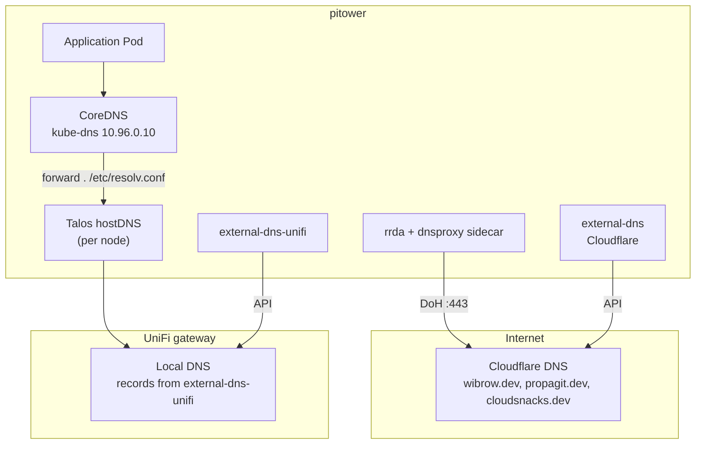

# DNS Management

DNS has three layers: Cloudflare as the authoritative public DNS, the UniFi gateway as the LAN resolver (with records published from the cluster), and CoreDNS plus Talos hostDNS inside the cluster. On top of that, the router intercepts outbound port 53, which needs a workaround for anything that must see real Cloudflare answers.

## DNS Architecture


```mermaid
flowchart TB
    subgraph Internet
        CF[Cloudflare DNS<br/>wibrow.dev, propagit.dev, cloudsnacks.dev]
    end

    subgraph Router["UniFi gateway"]
        UDNS["Local DNS<br/>records from external-dns-unifi"]
    end

    subgraph Cluster["pitower"]
        App[Application Pod]
        CoreDNS["CoreDNS<br/>kube-dns 10.96.0.10"]
        HostDNS["Talos hostDNS<br/>(per node)"]
        RRDA["rrda + dnsproxy sidecar"]
        EDNS[external-dns<br/>Cloudflare]
        EDNSU[external-dns-unifi]
    end

    App --> CoreDNS -->|"forward . /etc/resolv.conf"| HostDNS --> UDNS
    RRDA -->|"DoH :443"| CF
    EDNS -->|API| CF
    EDNSU -->|API| UDNS
```

## Public DNS: Cloudflare

Cloudflare is authoritative for `wibrow.dev`, `propagit.dev` and `cloudsnacks.dev`. Records are created by [external-dns](external-dns.md) from HTTPRoutes and DNSEndpoints:

| Record | Type | Target | Proxied |
|:-------|:-----|:-------|:--------|
| `wibrow.dev` | AAAA | `100::` (Cloudflare Worker placeholder) | Yes |
| `status.wibrow.dev` | AAAA | `100::` (Cloudflare Worker placeholder) | Yes |
| `external.wibrow.dev`, `*.wibrow.dev` | CNAME | `tunnel.wibrow.dev` (towonel hub) | No |
| `internal.wibrow.dev` | A | `10.20.10.238` | No |
| `<app>.wibrow.dev` on `envoy-external` | CNAME | `external.wibrow.dev` | No |
| `<app>.wibrow.dev` on `envoy-internal` | CNAME | `internal.wibrow.dev` | No |

Only the two Worker placeholders are proxied; everything on the tunnel must stay unproxied for SNI passthrough. See [Towonel Tunnel](towonel-tunnel.md#dns).

## LAN DNS: UniFi

`external-dns-unifi` publishes `wibrow.dev` records into the UniFi gateway through the [UniFi webhook provider](external-dns.md#unifi-instance). LAN clients therefore resolve app hostnames straight to the gateway LoadBalancer IPs (`10.20.10.238`/`.239`) without leaving the network or going through the tunnel.

## Cluster DNS: CoreDNS and Talos hostDNS

CoreDNS (`kubernetes/apps/pitower/kube-system/coredns/`) runs 2 replicas on the control-plane nodes behind the `kube-dns` Service:

| Setting | Value |
|:--------|:------|
| ClusterIPs | `10.96.0.10`, `fd10:96::a` (`PreferDualStack`) |
| `cluster.local` | Served by the `kubernetes` plugin |
| Everything else | `forward . /etc/resolv.conf` (the node resolver), cached 30s |

Talos puts the 10th address of each Service subnet into every pod's `resolv.conf`, so the IPv6 ClusterIP must exist or lookups that reach it time out.

Talos `hostDNS` is enabled on every node (`talos/pitower/all/01-general.yaml`) with `forwardKubeDNSToHost: false`, so pods use CoreDNS and only CoreDNS's upstream queries go through the node's host DNS cache.

## The DNS Interception Problem

> [!CAUTION]
> **The router intercepts port 53**
>
> The UniFi router answers outbound DNS on port 53 itself, regardless of the destination (`1.1.1.1`, `8.8.8.8`, ...). Plain `dig` from inside the network can therefore return the router's view instead of what Cloudflare actually has.

Use DNS-over-HTTPS to check what Cloudflare really returns:

```bash
curl -s "https://1.1.1.1/dns-query?name=app.wibrow.dev&type=CNAME" \
  -H "Accept: application/dns-json" | jq '.Answer'
```

cert-manager uses DoH resolvers for its DNS-01 propagation checks for the same reason (see [cert-manager](../security/cert-manager.md)).

## The DoH Sidecar: RRDA

[RRDA](https://github.com/swibrow/rrda) (`kubernetes/apps/pitower/selfhosted/rrda/`) is a REST API for DNS lookups at `rrda.wibrow.dev`. It needs real answers, so it runs a `dnsproxy` sidecar that listens on port 53 inside the pod and forwards everything over DoH:

```yaml title="kubernetes/apps/pitower/selfhosted/rrda/values.yaml (excerpt)"
dns-over-https:
  image:
    repository: docker.io/adguard/dnsproxy
    tag: v0.86.0
  args:
    - --listen=0.0.0.0
    - --port=53
    - --upstream=https://1.1.1.1/dns-query
    - --upstream=https://1.0.0.1/dns-query
    - --bootstrap=9.9.9.9:53
```

RRDA queries `127.0.0.1:53`, `dnsproxy` sends it to Cloudflare over HTTPS on port 443, and the router does not touch it. Its liveness and readiness probes resolve `example.com` through the sidecar.

## Troubleshooting

```bash
# Router view vs. Cloudflare's
dig +short myapp.wibrow.dev
curl -s "https://1.1.1.1/dns-query?name=myapp.wibrow.dev&type=CNAME" \
  -H "Accept: application/dns-json" | jq .

# Through RRDA
curl -s https://rrda.wibrow.dev/1.1.1.1:53/myapp.wibrow.dev/CNAME | jq .

# CoreDNS
kubectl -n kube-system get pods -l app.kubernetes.io/instance=coredns
kubectl -n kube-system logs -l app.kubernetes.io/instance=coredns
```
