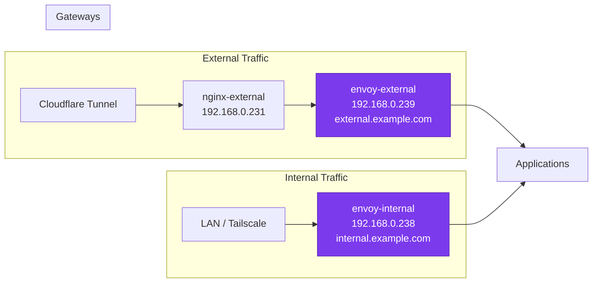

# Envoy Gateway

The cluster uses [Envoy Gateway](https://gateway.envoyproxy.io/) as its primary ingress controller, implementing the Kubernetes Gateway API. The architecture deploys two separate Gateway resources -- `envoy-external` and `envoy-internal` -- each serving a distinct traffic path with its own IP address, DNS target, and access policy.

## Architecture Overview



## Gateway Comparison

| Property | envoy-external | envoy-internal |
|:---------|:---------------|:---------------|
| **IP Address** | 192.168.0.239 | 192.168.0.238 |
| **DNS Target** | external.example.com | internal.example.com |
| **Traffic Source** | Cloudflare tunnel (via nginx) | LAN / Tailscale VPN |
| **Cloudflare Proxied** | Yes (via tunnel) | N/A |
| **external-dns Label** | `enabled: "true"` | Not set |
| **DNS Records Created** | Yes | No |
| **Listeners** | HTTP (80), HTTPS (443) | HTTP (80), HTTPS (443) |
| **Allowed Namespaces (HTTPS)** | All | All |
| **Allowed Namespaces (HTTP)** | Same (redirect only) | Same (redirect only) |
| **Use Case** | Public web apps | Admin dashboards, internal tools |

## Shared Configuration

Both gateways share a common `GatewayClass`, `EnvoyProxy`, `BackendTrafficPolicy`, and `ClientTrafficPolicy`.

### EnvoyProxy

Defines the Envoy data plane configuration -- replicas, resources, shutdown behavior, and Prometheus telemetry:

```yaml title="pitower/kubernetes/apps/networking/envoy-gateway/envoy.yaml"
apiVersion: gateway.envoyproxy.io/v1alpha1
kind: EnvoyProxy
metadata:
  name: envoy
spec:
  logging:
    level:
      default: info
  provider:
    type: Kubernetes
    kubernetes:
      envoyDeployment:
        replicas: 2
        container:
          image: mirror.gcr.io/envoyproxy/envoy:v1.35.3
          resources:
            requests:
              cpu: 100m
            limits:
              memory: 1Gi
      envoyService:
        externalTrafficPolicy: Cluster
  shutdown:
    drainTimeout: 180s
  telemetry:
    metrics:
      prometheus:
        compression:
          type: Gzip
```

!!! note "Replicas and Drain Timeout"
    Each gateway gets 2 Envoy replicas with a 180-second drain timeout. This ensures zero-downtime during rolling updates -- existing connections have 3 minutes to complete before the old pod is terminated.

### GatewayClass

Links the `envoy` GatewayClass to the EnvoyProxy configuration:

```yaml title="pitower/kubernetes/apps/networking/envoy-gateway/envoy.yaml"
apiVersion: gateway.networking.k8s.io/v1
kind: GatewayClass
metadata:
  name: envoy
spec:
  controllerName: gateway.envoyproxy.io/gatewayclass-controller
  parametersRef:
    group: gateway.envoyproxy.io
    kind: EnvoyProxy
    name: envoy
    namespace: networking
```

### BackendTrafficPolicy (Compression)

Enables Brotli and Gzip response compression across all gateways:

```yaml title="pitower/kubernetes/apps/networking/envoy-gateway/envoy.yaml"
apiVersion: gateway.envoyproxy.io/v1alpha1
kind: BackendTrafficPolicy
metadata:
  name: envoy
spec:
  targetSelectors:
    - group: gateway.networking.k8s.io
      kind: Gateway
  compression:
    - type: Brotli
    - type: Gzip
```

### ClientTrafficPolicy (HTTP/3, TLS)

Configures HTTP/3 support, TLS settings, and client IP detection:

```yaml title="pitower/kubernetes/apps/networking/envoy-gateway/envoy.yaml"
apiVersion: gateway.envoyproxy.io/v1alpha1
kind: ClientTrafficPolicy
metadata:
  name: envoy
spec:
  clientIPDetection:
    xForwardedFor:
      numTrustedHops: 1
  http3: {}
  targetSelectors:
    - group: gateway.networking.k8s.io
      kind: Gateway
  tls:
    minVersion: "1.2"
    alpnProtocols:
      - h2
      - http/1.1
```

!!! info "HTTP/3 Support"
    The empty `http3: {}` block enables HTTP/3 (QUIC) on all HTTPS listeners. Clients that support it will automatically upgrade to HTTP/3 via the `Alt-Svc` header. The `alpnProtocols` list ensures h2 and http/1.1 fallback for clients that do not support HTTP/3.

!!! tip "Client IP Detection"
    `numTrustedHops: 1` tells Envoy to trust the rightmost IP in the `X-Forwarded-For` header (from the immediate upstream proxy, such as Cloudflare via nginx).

### TLS Certificate

All gateways share a wildcard certificate from Let's Encrypt:

```yaml title="pitower/kubernetes/apps/networking/envoy-gateway/certificate.yaml"
apiVersion: cert-manager.io/v1
kind: Certificate
metadata:
  name: "wildcard-production"
  namespace: networking
spec:
  secretName: "wildcard-production-tls"
  issuerRef:
    name: letsencrypt-production
    kind: ClusterIssuer
  commonName: "example.com"
  dnsNames:
    - "example.com"
    - "*.example.com"
```

The certificate covers both `example.com` and `*.example.com`, issued via DNS-01 challenge through Cloudflare.

## Gateway Definitions

### envoy-external

Receives all Cloudflare-proxied traffic. The `external-dns.alpha.kubernetes.io/enabled: "true"` label tells external-dns to create DNS records for routes attached to this gateway.

```yaml title="pitower/kubernetes/apps/networking/envoy-gateway/external.yaml"
apiVersion: gateway.networking.k8s.io/v1
kind: Gateway
metadata:
  name: envoy-external
  labels:
    external-dns.alpha.kubernetes.io/enabled: "true"
  annotations:
    external-dns.alpha.kubernetes.io/target: &hostname external.example.com
spec:
  gatewayClassName: envoy
  infrastructure:
    annotations:
      external-dns.alpha.kubernetes.io/hostname: *hostname
      lbipam.cilium.io/ips: "192.168.0.239"
  listeners:
    - name: http
      protocol: HTTP
      port: 80
      allowedRoutes:
        namespaces:
          from: Same
    - name: https
      protocol: HTTPS
      port: 443
      allowedRoutes:
        namespaces:
          from: All
      tls:
        certificateRefs:
          - group: ''
            kind: Secret
            name: wildcard-production-tls
```

!!! warning "HTTP Listener Scope"
    The HTTP listener (port 80) uses `from: Same` -- only routes in the `networking` namespace can attach to it. This is because port 80 is only used for the HTTP-to-HTTPS redirect route, not for application traffic.

### envoy-internal

Internal-only gateway. Notice it has **no** `external-dns.alpha.kubernetes.io/enabled` label, so external-dns ignores it entirely.

```yaml title="pitower/kubernetes/apps/networking/envoy-gateway/internal.yaml"
apiVersion: gateway.networking.k8s.io/v1
kind: Gateway
metadata:
  name: envoy-internal
  annotations:
    external-dns.alpha.kubernetes.io/target: &hostname internal.example.com
spec:
  gatewayClassName: envoy
  infrastructure:
    annotations:
      external-dns.alpha.kubernetes.io/hostname: *hostname
      lbipam.cilium.io/ips: "192.168.0.238"
  listeners:
    - name: http
      protocol: HTTP
      port: 80
      allowedRoutes:
        namespaces:
          from: Same
    - name: https
      protocol: HTTPS
      port: 443
      allowedRoutes:
        namespaces:
          from: All
      tls:
        certificateRefs:
          - group: ''
            kind: Secret
            name: wildcard-production-tls
```

!!! tip "Accessing Internal Services"
    Internal services are accessible when your DNS resolves `*.example.com` to `192.168.0.238`. This happens automatically on the LAN (via split DNS) or through Tailscale (which advertises the `192.168.0.0/24` subnet).

## HTTP-to-HTTPS Redirect

Each gateway has an accompanying HTTPRoute that redirects all HTTP traffic to HTTPS with a 301 status code:

```yaml
apiVersion: gateway.networking.k8s.io/v1
kind: HTTPRoute
metadata:
  name: envoy-external
  annotations:
    external-dns.alpha.kubernetes.io/controller: none  # (1)!
spec:
  parentRefs:
    - group: gateway.networking.k8s.io
      kind: Gateway
      name: envoy-external
      namespace: networking
      sectionName: http  # (2)!
  rules:
    - filters:
        - requestRedirect:
            scheme: https
            statusCode: 301
          type: RequestRedirect
      matches:
        - path:
            type: PathPrefix
            value: /
```

1. The `controller: none` annotation prevents external-dns from creating DNS records for this redirect route.
2. `sectionName: http` attaches this route only to the HTTP (port 80) listener.

## How Apps Attach to Gateways

Applications create HTTPRoute resources that reference a gateway via `parentRefs`. Example from the RRDA application:

```yaml
route:
  app:
    enabled: true
    hostnames:
      - rrda.example.com
    parentRefs:
      - name: envoy-external      # (1)!
        namespace: networking
        sectionName: https         # (2)!
```

1. Choose which gateway to attach to: `envoy-external` or `envoy-internal`.
2. Always attach to the `https` section for application traffic.

!!! tip "Moving an App Between Gateways"
    To move an app from external to internal access (or vice versa), change the `parentRefs` to reference the desired gateway.

## Envoy Gateway Helm Values

The Envoy Gateway controller itself is deployed with minimal configuration:

```yaml title="pitower/kubernetes/apps/networking/envoy-gateway/values.yaml"
global:
  imageRegistry: mirror.gcr.io

certgen:
  job:
    args:
      - certgen
      - --disable-topology-injector

config:
  envoyGateway:
    provider:
      type: Kubernetes
      kubernetes:
        deploy:
          type: GatewayNamespace
```

The `GatewayNamespace` deploy type means Envoy proxy pods are created in the same namespace as the Gateway resource (the `networking` namespace).

## Troubleshooting

### Check Gateway Status

```bash
# List all gateways and their conditions
kubectl get gateways -n networking

# Detailed status of a specific gateway
kubectl describe gateway envoy-external -n networking
```

### Check Envoy Proxy Pods

```bash
# List Envoy proxy pods (one deployment per gateway)
kubectl get pods -n networking -l gateway.envoyproxy.io/owning-gateway-name

# Check logs for a specific gateway's Envoy pods
kubectl logs -n networking -l gateway.envoyproxy.io/owning-gateway-name=envoy-external
```

### Verify HTTPRoutes

```bash
# List all HTTPRoutes across all namespaces
kubectl get httproutes -A

# Check if a route is accepted by its gateway
kubectl describe httproute <route-name> -n <namespace>
```

### Test Connectivity

```bash
# Test external gateway (via Cloudflare)
curl -v https://app.example.com

# Test internal gateway (from LAN)
curl -v --resolve app.example.com:443:192.168.0.238 https://app.example.com
```
