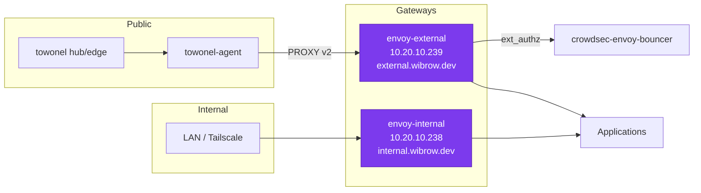

# Envoy Gateway

[Envoy Gateway](https://gateway.envoyproxy.io/) (Helm chart `gateway-helm` `1.9.2`) is the ingress controller, implementing the Kubernetes Gateway API. Two Gateways, `envoy-external` and `envoy-internal`, share one GatewayClass and EnvoyProxy, and each gets its own LoadBalancer IP, DNS target and client policy.

Everything lives in `kubernetes/apps/pitower/networking/envoy-gateway/`.

## Architecture Overview


```mermaid
flowchart LR
    subgraph Public
        Hub[towonel hub/edge] --> TA[towonel-agent]
    end

    subgraph Internal
        LAN[LAN / Tailscale]
    end

    TA -->|"PROXY v2"| EE
    LAN --> EI

    subgraph Gateways
        EE[envoy-external<br/>10.20.10.239<br/>external.wibrow.dev]
        EI[envoy-internal<br/>10.20.10.238<br/>internal.wibrow.dev]
    end

    EE -->|ext_authz| CS[crowdsec-envoy-bouncer]
    EE --> Apps[Applications]
    EI --> Apps

    classDef gw fill:#7c3aed,stroke:#5b21b6,color:#fff
    class EE,EI gw
```

## Gateway Comparison

| Property | envoy-external | envoy-internal |
|:---------|:---------------|:---------------|
| **IP Address** | `10.20.10.239` | `10.20.10.238` |
| **DNS Target** | `external.wibrow.dev` (CNAME to `tunnel.wibrow.dev`) | `internal.wibrow.dev` (A `10.20.10.238`, unproxied) |
| **Traffic Source** | towonel tunnel (and LAN via UniFi DNS) | LAN / Tailscale |
| **Listeners** | HTTP 80, HTTPS 443 | HTTP 80, HTTPS 443 (+ HTTP/3), TCP 389 `ldap` |
| **Certificates** | `wibrow.dev`, `propagit.dev`, `*.apps.cloudsnacks.dev`, `pitwall.cloudsnacks.dev` | `wibrow.dev` |
| **Client IP** | PROXY protocol (optional) | `X-Forwarded-For`, 1 trusted hop |
| **CrowdSec bouncer** | Yes | No |
| **Fallback 404** | `*.wibrow.dev`, `*.apps.cloudsnacks.dev` | No |
| **Use Case** | Public apps | Admin dashboards, internal tools |

Both Gateways carry the `external-dns.alpha.kubernetes.io/enabled: "true"` label, so [external-dns](external-dns.md) publishes records for routes on either. On both, the HTTP listener only accepts routes from `networking` (the redirect route), and HTTPS accepts routes from all namespaces.

> [!NOTE]
> **ldap listener**
>
> `envoy-internal` has a TCP listener on port 389 for `TCPRoute`s, but no TCPRoute is currently attached to it.

## Shared Configuration (`envoy.yaml`)

### EnvoyProxy

```yaml
apiVersion: gateway.envoyproxy.io/v1alpha1
kind: EnvoyProxy
metadata:
  name: envoy
spec:
  provider:
    type: Kubernetes
    kubernetes:
      envoyDeployment:
        replicas: 2
        container:
          image: mirror.gcr.io/envoyproxy/envoy:v1.39.3
          resources:
            requests:
              cpu: 29m
              memory: 96Mi
            limits:
              memory: 1Gi
      envoyService:
        externalTrafficPolicy: Cluster
  shutdown:
    drainTimeout: 180s
```

Each Gateway gets its own 2-replica Envoy deployment with a 180s drain timeout. Access logs are JSON on stdout (including `client_ip`, `sni` and `route_name`); CrowdSec reads the `envoy-external` ones from VictoriaLogs.

### BackendTrafficPolicy `envoy`

Targets every Gateway:

- **Compression**: Brotli and Gzip.
- **Error pages**: a `responseOverride` replaces 502/503/504 responses with an inline HTML page that retries every 30s. Routes with their own BackendTrafficPolicy do not inherit it.

> [!WARNING]
> **Inline bodies are format strings**
>
> Envoy parses inline response bodies as substitution format strings. A literal `%` is read as a command operator and makes Envoy reject the whole xDS snapshot, freezing config for the gateway. Escape it as `%%`.

### ClientTrafficPolicies

One policy per Gateway, because HTTP/3 and PROXY protocol cannot share one: Envoy Gateway puts the `proxy_protocol` listener filter on the QUIC listener too, and Envoy rejects it ([envoyproxy/gateway#9798](https://github.com/envoyproxy/gateway/issues/9798)).

```yaml
# envoy-external: the tunnel sends PROXY v2; no XFF trust, so clients cannot
# choose the IP CrowdSec sees
spec:
  proxyProtocol:
    optional: true
  tls:
    minVersion: "1.2"
    alpnProtocols: [h2, http/1.1]
---
# envoy-internal
spec:
  clientIPDetection:
    xForwardedFor:
      numTrustedHops: 1
  http3: {}
  tls:
    minVersion: "1.2"
    alpnProtocols: [h2, http/1.1]
```

### CrowdSec SecurityPolicy

`securitypolicy.yaml` attaches ext_authz (gRPC, `failOpen: true`) to `envoy-external`, pointing at `security/crowdsec-envoy-bouncer:8080`. See [CrowdSec](../security/crowdsec.md).

> [!WARNING]
> **Route-level SecurityPolicies**
>
> A route on `envoy-external` with its own SecurityPolicy must set `mergeType: StrategicMerge`, otherwise it replaces the gateway policy and the route skips the bouncer.

## Certificates (`certificate.yaml`)

| Certificate | Names |
|:------------|:------|
| `wibrow-dev-production` | `wibrow.dev`, `*.wibrow.dev` |
| `propagit-dev-production` | `propagit.dev`, `*.propagit.dev` |
| `cloudsnacks-apps-production` | `*.apps.cloudsnacks.dev`, `api.pantry.cloudsnacks.dev` |
| `pitwall-cloudsnacks-dev-production` | `pitwall.cloudsnacks.dev` |

All are issued by the `letsencrypt-production` ClusterIssuer via DNS-01 (see [cert-manager](../security/cert-manager.md)). They all hang off the single `https` listener on `envoy-external`; Envoy picks one by SNI.

## Gateway Definitions

```yaml title="external.yaml (excerpt)"
apiVersion: gateway.networking.k8s.io/v1
kind: Gateway
metadata:
  name: envoy-external
  labels:
    external-dns.alpha.kubernetes.io/enabled: "true"
  annotations:
    external-dns.alpha.kubernetes.io/target: &hostname external.wibrow.dev
spec:
  gatewayClassName: envoy
  infrastructure:
    annotations:
      external-dns.alpha.kubernetes.io/hostname: *hostname
      lbipam.cilium.io/ips: "10.20.10.239"
```

`envoy-internal` (`internal.yaml`) is the same shape with target `internal.wibrow.dev`, `cloudflare-proxied: "false"` and IP `10.20.10.238`. Because the external-dns Cloudflare instance only reads HTTPRoute hostnames, `internal-dnsendpoint.yaml` publishes the `internal.wibrow.dev` A record itself; `external.wibrow.dev` comes from the towonel DNSEndpoint.

Both Gateways also carry a `gatus.home-operations.com/endpoint` annotation that labels every child route's Gatus check (`exposure: public` or `internal`). Changing it needs a `kubectl -n monitoring rollout restart deploy/gatus` to take effect.

### HTTP-to-HTTPS Redirect

Each Gateway has an HTTPRoute on its `http` section that 301-redirects to HTTPS, annotated `external-dns.alpha.kubernetes.io/controller: none` so no DNS record is created for it.

### Fallback 404 (`fallback.yaml`)

An HTTPRoute on `envoy-external` for `*.wibrow.dev` and `*.apps.cloudsnacks.dev` returns a custom 404 page through an `HTTPRouteFilter`. Specific hostnames always win over the wildcard, so it only serves subdomains with no app.

## How Apps Attach

```yaml
route:
  app:
    hostnames:
      - myapp.wibrow.dev
    parentRefs:
      - name: envoy-internal   # or envoy-external
        namespace: networking
        sectionName: https
```

Moving an app between gateways is a `parentRefs` change. A public app on a new zone or a deeper subdomain also needs a [towonel](towonel-tunnel.md) hostname entry and a certificate.

## Controller Values

```yaml title="values.yaml"
global:
  imageRegistry: mirror.gcr.io
config:
  envoyGateway:
    extensionApis:
      enableBackend: true
    provider:
      type: Kubernetes
      kubernetes:
        deploy:
          type: GatewayNamespace
```

`GatewayNamespace` puts the Envoy pods in the Gateway's namespace (`networking`). `enableBackend` allows the `Backend` extension API. PodMonitors scrape both the Envoy proxies and the controller.

## Troubleshooting

```bash
kubectl get gateways -n networking
kubectl describe gateway envoy-external -n networking

# Envoy pods per gateway
kubectl get pods -n networking -l gateway.envoyproxy.io/owning-gateway-name
kubectl logs -n networking -l gateway.envoyproxy.io/owning-gateway-name=envoy-external -c envoy

# Route and policy status
kubectl get httproutes -A
kubectl get securitypolicies,clienttrafficpolicies,backendtrafficpolicies -A

# Test the internal gateway directly
curl -v --resolve app.wibrow.dev:443:10.20.10.238 https://app.wibrow.dev
```
