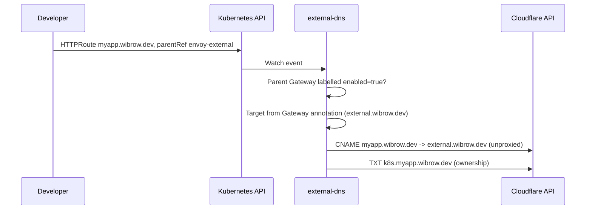

# External DNS

[external-dns](https://github.com/kubernetes-sigs/external-dns) (Helm chart `1.23.0`) runs as two instances in `networking`:

| Instance | Provider | Zones | Sources |
|:---------|:---------|:------|:--------|
| `external-dns` | Cloudflare | `wibrow.dev`, `propagit.dev`, `cloudsnacks.dev` | `crd`, `gateway-httproute` |
| `external-dns-unifi` | UniFi gateway (webhook) | `wibrow.dev` | `gateway-httproute`, `gateway-udproute`, `service` |

Both use `policy: sync`, `txtPrefix: k8s.` and `txtOwnerId: default`.

## Cloudflare Instance

```yaml title="kubernetes/apps/pitower/networking/external-dns/values.yaml (excerpt)"
provider: cloudflare
env:
  - name: CF_API_TOKEN
    valueFrom:
      secretKeyRef:
        name: external-dns-secret
        key: api-token
extraArgs:
  - --ingress-class=external
  - --crd-source-apiversion=externaldns.k8s.io/v1alpha1
  - --crd-source-kind=DNSEndpoint
  - --gateway-label-filter=external-dns.alpha.kubernetes.io/enabled=true
  - --annotation-prefix=external-dns.alpha.kubernetes.io/
policy: sync
sources:
  - crd
  - gateway-httproute
domainFilters: ["wibrow.dev", "propagit.dev", "cloudsnacks.dev"]
```

| Setting | Purpose |
|:--------|:--------|
| `--gateway-label-filter` | Only HTTPRoutes on Gateways labelled `external-dns.alpha.kubernetes.io/enabled: "true"` are published (both `envoy-external` and `envoy-internal` carry it) |
| `--annotation-prefix` | external-dns v0.22.0 dropped the `alpha` prefix with no fallback; without this flag the `controller`, `target` and `cloudflare-proxied` annotations are ignored |
| `crd` source | DNSEndpoint resources for records not tied to a route |
| `policy: sync` | Deletes records whose Kubernetes source is gone |

There is no `--cloudflare-proxied` flag, so records are unproxied unless a resource sets `cloudflare-proxied: "true"`. The Cloudflare token comes from Infisical (`infisical-networking-external-dns` store). The pod is pinned to control-plane nodes.

### DNSEndpoints

| DNSEndpoint | Records |
|:------------|:--------|
| `networking/towonel-agent` | `external.wibrow.dev`, `*.wibrow.dev`, `propagit.dev`, `*.propagit.dev`: CNAME `tunnel.wibrow.dev`, unproxied |
| `networking/envoy-internal` | `internal.wibrow.dev`: A `10.20.10.238`, unproxied |
| `networking/apex` | `wibrow.dev`: AAAA `100::`, proxied (Cloudflare Worker route) |
| `networking/status` | `status.wibrow.dev`: AAAA `100::`, proxied (Cloudflare Worker) |
| `pantry-system/pantry` | `*.apps.cloudsnacks.dev`, `api.pantry.cloudsnacks.dev`: CNAME `tunnel.wibrow.dev`, unproxied |

## UniFi Instance

`external-dns-unifi` writes the same hostnames into the UniFi gateway's local DNS, so LAN clients resolve them to the gateway LoadBalancer IPs directly:

```yaml title="kubernetes/apps/pitower/networking/external-dns-unifi/values.yaml (excerpt)"
domainFilters:
  - wibrow.dev
provider:
  name: webhook
  webhook:
    image:
      repository: ghcr.io/home-operations/external-dns-unifi-webhook
    env:
      - name: UNIFI_HOST
        value: https://192.168.0.1
      - name: UNIFI_API_KEY
        valueFrom:
          secretKeyRef:
            name: external-dns-unifi-secret
            key: api-key
extraArgs:
  - --annotation-prefix=external-dns.alpha.kubernetes.io/
sources:
  - gateway-httproute
  - gateway-udproute
  - service
triggerLoopOnEvent: true
```

It has no gateway label filter. The `service` source publishes the Gateway Services' `external-dns.alpha.kubernetes.io/hostname` (`external.wibrow.dev`, `internal.wibrow.dev`) as A records to their LoadBalancer IPs, which is what the route CNAMEs resolve to on the LAN. The API key comes from Infisical at `/networking/external-dns-unifi/api-key`.

> [!CAUTION]
> **The annotation prefix matters here too**
>
> Without `--annotation-prefix`, the fallback-404 route's `controller: none` opt-out is ignored and `*.wibrow.dev` gets published to UniFi, hijacking hostnames such as `s3.wibrow.dev`.

## Annotation Patterns

### On Gateways

| Annotation / label | Placement | Purpose |
|:-------------------|:----------|:--------|
| `external-dns.alpha.kubernetes.io/enabled` | `.metadata.labels` | Opts the Gateway's routes in (label, not annotation) |
| `external-dns.alpha.kubernetes.io/target` | `.metadata.annotations` | CNAME target for every attached route |
| `external-dns.alpha.kubernetes.io/cloudflare-proxied` | `.metadata.annotations` | Default proxy status for attached routes |
| `external-dns.alpha.kubernetes.io/hostname` | `.spec.infrastructure.annotations` | Hostname for the generated LoadBalancer Service |
| `lbipam.cilium.io/ips` | `.spec.infrastructure.annotations` | Pins the Service IP (Cilium) |

### On HTTPRoutes

| Annotation | Purpose |
|:-----------|:--------|
| `external-dns.alpha.kubernetes.io/controller: none` | Skip this route (redirect and fallback routes) |
| `external-dns.alpha.kubernetes.io/cloudflare-proxied` | Override proxy status for this route |

> [!CAUTION]
> **Target only works on Gateways**
>
> The `target` annotation is read from the parent Gateway, not from the HTTPRoute.

## Record Creation Flow


```mermaid
sequenceDiagram
    participant Dev as Developer
    participant K8s as Kubernetes API
    participant EDNS as external-dns
    participant CF as Cloudflare API

    Dev->>K8s: HTTPRoute myapp.wibrow.dev, parentRef envoy-external
    K8s->>EDNS: Watch event
    EDNS->>EDNS: Parent Gateway labelled enabled=true?
    EDNS->>EDNS: Target from Gateway annotation (external.wibrow.dev)
    EDNS->>CF: CNAME myapp.wibrow.dev -> external.wibrow.dev (unproxied)
    EDNS->>CF: TXT k8s.myapp.wibrow.dev (ownership)
```

## Gotchas

> [!WARNING]
> **Sync policy deletes records**
>
> Removing an HTTPRoute, Gateway or DNSEndpoint removes its records on the next sync.

> [!NOTE]
> **TXT ownership records**
>
> Every managed record has a `k8s.`-prefixed TXT record. external-dns will not touch records without one.

## Troubleshooting

```bash
kubectl logs -n networking deploy/external-dns --tail=100
kubectl logs -n networking deploy/external-dns-unifi -c external-dns --tail=100

kubectl get dnsendpoints -A
kubectl get gateway -n networking envoy-external -o jsonpath='{.metadata.labels}'

# What Cloudflare actually has (bypasses router DNS interception)
curl -s "https://1.1.1.1/dns-query?name=myapp.wibrow.dev&type=CNAME" \
  -H "Accept: application/dns-json" | jq '.Answer'

# Force a sync
kubectl rollout restart deploy/external-dns -n networking
```
