# External DNS

[external-dns](https://github.com/kubernetes-sigs/external-dns) automatically creates and manages Cloudflare DNS records based on Kubernetes resources. It watches Gateway API HTTPRoutes, Ingress resources, and custom DNSEndpoint CRDs, then synchronizes the corresponding DNS records in Cloudflare.

## Configuration

```yaml title="pitower/kubernetes/apps/networking/external-dns/values.yaml"
fullnameOverride: external-dns
provider: cloudflare
env:
  - name: CF_API_TOKEN
    valueFrom:
      secretKeyRef:
        name: external-dns-secret
        key: api-token
extraArgs:
  - --ingress-class=external
  - --cloudflare-proxied
  - --crd-source-apiversion=externaldns.k8s.io/v1alpha1
  - --crd-source-kind=DNSEndpoint
  - --gateway-label-filter=external-dns.alpha.kubernetes.io/enabled=true
policy: sync
sources:
  - crd
  - ingress
  - gateway-httproute
txtPrefix: k8s.
txtOwnerId: default
domainFilters: ["example.com"]
serviceMonitor:
  enabled: true
podAnnotations:
  secret.reloader.stakater.com/reload: external-dns-secret
```

### Configuration Breakdown

| Setting | Value | Purpose |
|:--------|:------|:--------|
| `provider` | `cloudflare` | Use the Cloudflare DNS API |
| `--ingress-class=external` | Only process Ingress resources with class `external` |
| `--cloudflare-proxied` | Default to Cloudflare-proxied (orange cloud) for records |
| `--crd-source-apiversion` | `externaldns.k8s.io/v1alpha1` | Enable the DNSEndpoint CRD source |
| `--crd-source-kind` | `DNSEndpoint` | Watch DNSEndpoint resources |
| `--gateway-label-filter` | `external-dns.alpha.kubernetes.io/enabled=true` | Only process gateways with this label |
| `policy` | `sync` | Delete records that are no longer in Kubernetes (vs. `upsert-only`) |
| `sources` | `crd`, `ingress`, `gateway-httproute` | Watch these three resource types |
| `txtPrefix` | `k8s.` | Prefix for TXT ownership records |
| `txtOwnerId` | `default` | Identifies this external-dns instance's records |
| `domainFilters` | `["example.com"]` | Only manage records under `example.com` |

## The Gateway Label Filter Pattern

The most important configuration detail is `--gateway-label-filter`. This controls which gateways external-dns considers when creating DNS records from HTTPRoutes.

### How It Works


Only gateways with the label `external-dns.alpha.kubernetes.io/enabled: "true"` are processed:

- **envoy-external**: Has the label -- DNS records are created for its HTTPRoutes
- **envoy-internal**: Does NOT have the label -- completely ignored by external-dns

## Annotation Patterns

Understanding which annotations go on which resource is critical and a frequent source of confusion.

### Annotations on Gateway Resources

| Annotation | Placement | Purpose |
|:-----------|:----------|:--------|
| `external-dns.alpha.kubernetes.io/target` | Gateway `.metadata.annotations` | Sets the CNAME/A target for DNS records |
| `external-dns.alpha.kubernetes.io/hostname` | Gateway `.spec.infrastructure.annotations` | Sets the hostname for the LoadBalancer Service |
| `external-dns.alpha.kubernetes.io/enabled` | Gateway `.metadata.labels` | Enables external-dns processing (label, not annotation) |
| `external-dns.alpha.kubernetes.io/cloudflare-proxied` | Gateway `.metadata.annotations` | Controls Cloudflare proxy status (orange/grey cloud) |
| `lbipam.cilium.io/ips` | Gateway `.spec.infrastructure.annotations` | Requests a specific IP from Cilium LBIPAM |

### Annotations on HTTPRoute Resources

| Annotation | Placement | Purpose |
|:-----------|:----------|:--------|
| `external-dns.alpha.kubernetes.io/controller` | HTTPRoute `.metadata.annotations` | Set to `none` to prevent DNS record creation |
| `external-dns.alpha.kubernetes.io/cloudflare-proxied` | HTTPRoute `.metadata.annotations` | Override Cloudflare proxy status for this route |

### Example: External Gateway

```yaml
# Gateway definition
apiVersion: gateway.networking.k8s.io/v1
kind: Gateway
metadata:
  name: envoy-external
  labels:
    external-dns.alpha.kubernetes.io/enabled: "true"    # (1)!
  annotations:
    external-dns.alpha.kubernetes.io/target: external.example.com  # (2)!
spec:
  infrastructure:
    annotations:
      lbipam.cilium.io/ips: "192.168.0.239"             # (3)!
```

1. Label (not annotation) that enables external-dns for this gateway.
2. All HTTPRoutes attached to this gateway will create CNAME records pointing to `external.example.com`.
3. Requests IP `192.168.0.239` from Cilium LBIPAM for the underlying Service.

### Example: HTTP Redirect Route

```yaml
# This route must NOT create DNS records
apiVersion: gateway.networking.k8s.io/v1
kind: HTTPRoute
metadata:
  name: envoy-external
  annotations:
    external-dns.alpha.kubernetes.io/controller: none    # (1)!
spec:
  parentRefs:
    - name: envoy-external
      sectionName: http
```

1. `controller: none` tells external-dns to completely ignore this route. Without this, external-dns would create a DNS record for the redirect route.

## CRD Source: DNSEndpoint

The `crd` source allows creating DNS records that are not tied to any Ingress or HTTPRoute. This is used for the Cloudflare tunnel CNAME:

```yaml title="pitower/kubernetes/apps/networking/cloudflared/dnsendpoint.yaml"
apiVersion: externaldns.k8s.io/v1alpha1
kind: DNSEndpoint
metadata:
  name: cloudflared
  namespace: networking
spec:
  endpoints:
    - dnsName: "external.example.com"
      recordType: CNAME
      targets: ["7ee9277a-e2f3-45ae-a0ac-4e85d39fc334.cfargotunnel.com"]
```

This creates a CNAME record: `external.example.com` -> `<tunnel-id>.cfargotunnel.com`.

Without this, Cloudflare would not know how to route traffic for `external.example.com` to the tunnel.

## Record Creation Flow

Here is how a DNS record gets created when you deploy an app:

```mermaid
sequenceDiagram
    participant Dev as Developer
    participant K8s as Kubernetes API
    participant EDNS as external-dns
    participant CF as Cloudflare API

    Dev->>K8s: Create HTTPRoute<br/>(hostname: myapp.example.com,<br/>parentRef: envoy-external)
    K8s->>EDNS: Watch event: new HTTPRoute
    EDNS->>EDNS: Check parent Gateway label<br/>(enabled=true? Yes)
    EDNS->>EDNS: Get target from Gateway annotation<br/>(external.example.com)
    EDNS->>EDNS: Check cloudflare-proxied<br/>(default: true)
    EDNS->>CF: Create CNAME record<br/>myapp.example.com → external.example.com<br/>(proxied: true)
    EDNS->>CF: Create TXT record<br/>k8s.myapp.example.com<br/>(ownership record)
    CF-->>EDNS: Records created
```



## Gotchas

!!! danger "Target Annotation Only Works on Gateways"
    The `external-dns.alpha.kubernetes.io/target` annotation is only read from **Gateway** resources, not from HTTPRoutes. If you add this annotation to an HTTPRoute, it will be ignored.

    ```yaml
    # WRONG - target on HTTPRoute is ignored
    apiVersion: gateway.networking.k8s.io/v1
    kind: HTTPRoute
    metadata:
      annotations:
        external-dns.alpha.kubernetes.io/target: external.example.com  # Ignored!
    ```

!!! danger "Cloudflare-Proxied Annotation on Routes"
    The `cloudflare-proxied` annotation is read from **Route** resources to override the default proxy behavior. On the Gateway, it sets the default for all routes attached to that gateway.

    ```yaml
    # On Gateway: sets default for all attached routes
    metadata:
      annotations:
        external-dns.alpha.kubernetes.io/cloudflare-proxied: "false"

    # On HTTPRoute: overrides per-route
    metadata:
      annotations:
        external-dns.alpha.kubernetes.io/cloudflare-proxied: "false"
    ```

!!! warning "Always Add `controller: none` to Redirect Routes"
    The HTTP-to-HTTPS redirect HTTPRoutes must have `external-dns.alpha.kubernetes.io/controller: none`. Otherwise, external-dns will create DNS records for the redirect route, which is not desired since the HTTPS route already creates the record.

!!! warning "Sync Policy Deletes Records"
    The `policy: sync` setting means external-dns will **delete** DNS records from Cloudflare when the corresponding Kubernetes resource is removed. Be careful when deleting HTTPRoutes or Gateways -- the DNS records will be removed within the sync interval.

!!! info "TXT Ownership Records"
    Every DNS record created by external-dns has an accompanying TXT record (prefixed with `k8s.`) that marks ownership. This prevents external-dns from modifying records it did not create. If you see `k8s.myapp.example.com` TXT records in Cloudflare, those are ownership markers.

## Scheduling

external-dns runs on control plane nodes with tolerations for the master taint:

```yaml
nodeAffinity:
  requiredDuringSchedulingIgnoredDuringExecution:
    nodeSelectorTerms:
      - matchExpressions:
          - key: node-role.kubernetes.io/master
            operator: Exists
tolerations:
  - effect: NoSchedule
    key: node-role.kubernetes.io/master
    operator: Exists
```

## Troubleshooting

### Check external-dns Logs

```bash
# View recent logs
kubectl logs -n networking deploy/external-dns --tail=100

# Follow logs for real-time record creation
kubectl logs -n networking deploy/external-dns -f

# Filter for specific domain
kubectl logs -n networking deploy/external-dns | grep "myapp.example.com"
```

### Check What Records external-dns Sees

```bash
# List all DNS records external-dns manages (via Cloudflare API)
# Look for "CREATE", "UPDATE", or "DELETE" log entries
kubectl logs -n networking deploy/external-dns | grep -E "(CREATE|UPDATE|DELETE)"
```

### Verify Gateway Label

```bash
# Check if a gateway has the external-dns label
kubectl get gateway -n networking envoy-external -o jsonpath='{.metadata.labels}'

# Should include: external-dns.alpha.kubernetes.io/enabled: "true"
```

### Check DNSEndpoint Resources

```bash
# List all DNSEndpoint CRDs
kubectl get dnsendpoints -A

# Inspect the cloudflared tunnel CNAME
kubectl describe dnsendpoint cloudflared -n networking
```

### Verify Records in Cloudflare via DoH

```bash
# Check the actual Cloudflare record (bypasses router DNS interception)
curl -s "https://1.1.1.1/dns-query?name=myapp.example.com&type=CNAME" \
  -H "Accept: application/dns-json" | jq '.Answer'

# Check TXT ownership record
curl -s "https://1.1.1.1/dns-query?name=k8s.myapp.example.com&type=TXT" \
  -H "Accept: application/dns-json" | jq '.Answer'
```

### Force external-dns Sync

external-dns syncs periodically (default: every 1 minute). To force a sync, restart the pod:

```bash
kubectl rollout restart deploy/external-dns -n networking
```
