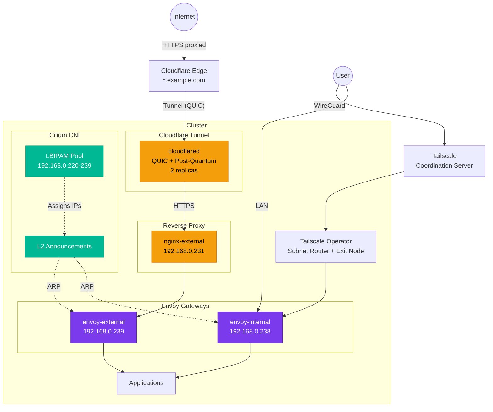

# Networking

The cluster implements a multi-gateway networking architecture built on **Cilium** as the CNI, **Envoy Gateway** for ingress, **Cloudflare** for DNS and tunnel-based external access, and **Tailscale** for VPN connectivity. This design separates traffic into two distinct paths -- external (proxied through Cloudflare) and internal (LAN/VPN only).

## Network Topology



## Traffic Paths

### External (Cloudflare-Proxied)

Most public-facing services use this path. Traffic flows through Cloudflare's CDN and WAF, through a QUIC tunnel to the cluster, then via nginx to the `envoy-external` gateway.

```
User --> Cloudflare CDN --> cloudflared tunnel --> nginx-external --> envoy-external --> App
```

### Internal (LAN / VPN)

Internal-only services are accessible via the LAN or through Tailscale VPN. The `envoy-internal` gateway has no external-dns label, so no public DNS records are created.

```
User --> LAN/Tailscale --> envoy-internal --> App
```

## Component Overview

| Component | Purpose | Key Detail |
|:----------|:--------|:-----------|
| [Cilium CNI](cilium-cni.md) | Container networking, L2 announcements, load balancing | DSR mode, Maglev, kube-proxy replacement |
| [Envoy Gateway](envoy-gateway.md) | Two-gateway ingress architecture | HTTP/3, TLS 1.2+, Brotli + Gzip compression |
| [DNS Management](dns-management.md) | DNS resolution and the port 53 interception problem | Talos hostDNS, DoH sidecar workaround |
| [External DNS](external-dns.md) | Automated Cloudflare DNS record management | Gateway label filter pattern |
| [Cloudflare Tunnel](cloudflare-tunnel.md) | Secure external access without port forwarding | QUIC transport, post-quantum encryption |
| [Tailscale](tailscale.md) | VPN access to internal services | Subnet router, exit node, API server proxy |
| [Load Balancers](load-balancers.md) | IP allocation and Cilium LBIPAM | 20-IP pool: 192.168.0.220-239 |

## Key Design Decisions

- **Cilium over MetalLB**: Cilium's L2 announcement mode replaces MetalLB entirely, reducing the number of components while gaining eBPF-powered networking, Hubble observability, and native kube-proxy replacement.
- **Two gateways over one**: Separating external and internal traffic allows different security policies, DNS behavior, and protocol support per path.
- **Cloudflare tunnel over port forwarding**: No inbound firewall rules needed. Cloudflare handles DDoS protection, CDN caching, and WAF.
- **Envoy Gateway over nginx-only**: Envoy Gateway provides native Gateway API support with HTTP/3, automatic compression, and fine-grained traffic policies. Nginx is retained only as the Cloudflare tunnel termination point.
- **Tailscale over traditional VPN**: Zero-config mesh networking with SSO integration, no VPN server to maintain, and built-in NAT traversal.
