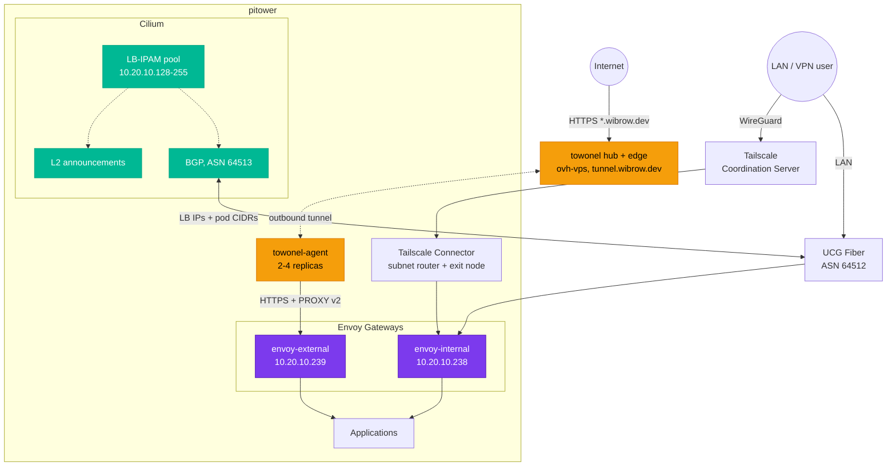

# Networking

The cluster runs **Cilium** as the CNI (kube-proxy replacement, LoadBalancer IPs via L2 and BGP), **Envoy Gateway** for ingress, **towonel** for tunnel-based public access, **external-dns** for Cloudflare and UniFi DNS records, and **Tailscale** for remote access. Traffic is split into two paths: public (through the towonel tunnel to `envoy-external`) and internal (LAN/VPN to `envoy-internal`).

## Network Topology


```mermaid
flowchart TB
    Internet((Internet))
    Hub[towonel hub + edge<br/>ovh-vps, tunnel.wibrow.dev]
    UCG[UCG Fiber<br/>ASN 64512]
    TSCloud[Tailscale<br/>Coordination Server]

    subgraph Cluster["pitower"]
        direction TB
        TA[towonel-agent<br/>2-4 replicas]

        subgraph Gateways["Envoy Gateways"]
            EE[envoy-external<br/>10.20.10.239]
            EI[envoy-internal<br/>10.20.10.238]
        end

        subgraph Cilium["Cilium"]
            LBIPAM[LB-IPAM pool<br/>10.20.10.128-255]
            BGP[BGP, ASN 64513]
            L2[L2 announcements]
        end

        TS[Tailscale Connector<br/>subnet router + exit node]
        Apps[Applications]
    end

    User((LAN / VPN user))

    Internet -->|"HTTPS *.wibrow.dev"| Hub
    Hub <-.->|"outbound tunnel"| TA
    TA -->|"HTTPS + PROXY v2"| EE
    EE --> Apps

    User -->|"WireGuard"| TSCloud --> TS --> EI
    User -->|"LAN"| UCG --> EI
    EI --> Apps

    LBIPAM -.-> L2 & BGP
    BGP <-->|"LB IPs + pod CIDRs"| UCG

    classDef gateway fill:#7c3aed,stroke:#5b21b6,color:#fff
    classDef tunnel fill:#f59e0b,stroke:#d97706,color:#000
    classDef cilium fill:#00b894,stroke:#00a381,color:#fff
    class EE,EI gateway
    class Hub,TA tunnel
    class LBIPAM,BGP,L2 cilium
```

## Addressing

| Range | Use |
|:------|:----|
| `10.20.0.0/16` (VLAN 20, `servers`) | Nodes (`10.20.10.1`-`11`), API VIP `10.20.10.0`; static up to `10.20.199.255`, DHCP `10.20.200.1`-`10.20.255.254` |
| `10.20.10.128`-`255` | Cilium LB-IPAM pool (IPv4) |
| `2a02:16a:2a0a:3::/112` | Cilium LB-IPAM pool (IPv6, BGP only) |
| `10.244.0.0/16`, `fd10:244::/56` | Pod CIDRs (routable from the LAN via BGP) |
| `10.96.0.0/12`, `fd10:96::/112` | Service CIDRs |
| `192.168.0.0/24` | Untagged default LAN |

## Traffic Paths

### Public (towonel tunnel)

Public hostnames are unproxied Cloudflare CNAMEs to the hub on the VPS. The hub SNI-routes the connection into the tunnel the in-cluster agent dialled out to, and the agent proxies it to `envoy-external`. TLS is terminated in the cluster.

```
User --> towonel hub/edge (VPS) --> towonel-agent --> envoy-external --> App
```

### Internal (LAN / VPN)

`external-dns-unifi` publishes route hostnames into the UniFi gateway's DNS, so LAN clients resolve them straight to the gateway LoadBalancer IPs. `envoy-internal` routes also get a Cloudflare CNAME to `internal.wibrow.dev` (an A record for the private `10.20.10.238`), so they only work from the LAN or over Tailscale.

```
User --> LAN/Tailscale --> envoy-internal --> App
```

## Component Overview

| Component | Purpose | Key Detail |
|:----------|:--------|:-----------|
| [Cilium CNI](cilium-cni.md) | Container networking, kube-proxy replacement, LoadBalancer IPs | Native routing, dual-stack, BGP + L2, Multus alongside |
| [Envoy Gateway](envoy-gateway.md) | Two-gateway ingress | PROXY protocol + CrowdSec on external, HTTP/3 on internal |
| [DNS Management](dns-management.md) | In-cluster and LAN DNS | CoreDNS, Talos hostDNS, DoH sidecar |
| [External DNS](external-dns.md) | Cloudflare and UniFi record management | Two instances, gateway label filter |
| [Towonel Tunnel](towonel-tunnel.md) | Public access without port forwarding | Self-hosted hub on a VPS, SNI passthrough |
| [Tailscale](tailscale.md) | VPN access to internal services | Subnet router, exit node, API server proxy |
| [Load Balancers](load-balancers.md) | IP allocation with Cilium LB-IPAM | Pool `10.20.10.128`-`255` |

## Key Design Decisions

- **Cilium over MetalLB**: LB-IPAM, L2 announcements and the BGP control plane cover what MetalLB did, with eBPF service handling and Hubble in the same component.
- **L2 and BGP together**: the pool sits inside VLAN 20, so on-VLAN clients still need ARP; BGP gives other VLANs ECMP routes via the gateway and withdraws a failed node within the 9s hold time.
- **Two gateways**: public and internal traffic get different policies (PROXY protocol and CrowdSec on `envoy-external`, HTTP/3 on `envoy-internal`).
- **Self-hosted tunnel over port forwarding**: no inbound firewall rules and the home IP stays unpublished. Cloudflare is authoritative DNS only and is not in the data path.
- **Tailscale over a traditional VPN**: no VPN server to maintain, NAT traversal built in.
