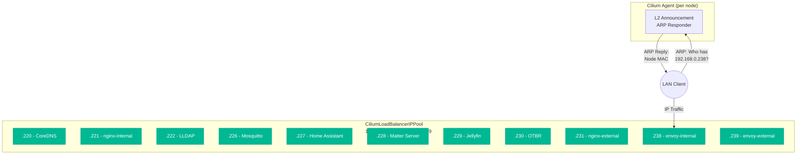

# Load Balancers

Load balancing in the cluster is handled entirely by Cilium's LoadBalancer IP Address Management (LBIPAM). There is no MetalLB -- Cilium's L2 announcements provide the same functionality with fewer components and tighter integration with the CNI.

## How Cilium LBIPAM Works

When a Kubernetes Service of type `LoadBalancer` is created, Cilium assigns it an IP address from the configured pool and responds to ARP requests for that IP on all Linux nodes. This allows clients on the LAN to reach the service at the assigned IP.



### IP Assignment Methods

There are two ways a Service gets an IP from the pool:

**Automatic assignment**: If no specific IP is requested, Cilium picks the next available IP from the pool.

**Explicit assignment**: Services can request a specific IP using the `lbipam.cilium.io/ips` annotation:

```yaml
apiVersion: v1
kind: Service
metadata:
  annotations:
    lbipam.cilium.io/ips: "192.168.0.238"
spec:
  type: LoadBalancer
```

!!! tip "Gateway Infrastructure Annotations"
    For Envoy Gateway, the `lbipam.cilium.io/ips` annotation is placed in the Gateway's `spec.infrastructure.annotations` block (not on the Gateway metadata). Envoy Gateway copies these annotations to the Service it creates.

    ```yaml
    apiVersion: gateway.networking.k8s.io/v1
    kind: Gateway
    metadata:
      name: envoy-internal
    spec:
      infrastructure:
        annotations:
          lbipam.cilium.io/ips: "192.168.0.238"
    ```

## IP Pool Configuration

The LBIPAM pool is defined by two Cilium CRDs:

```yaml title="pitower/kubernetes/apps/kube-system/cilium/config/cilium-l2.yaml"
apiVersion: cilium.io/v2alpha1
kind: CiliumL2AnnouncementPolicy
metadata:
  name: policy
spec:
  loadBalancerIPs: true
  nodeSelector:
    matchLabels:
      kubernetes.io/os: linux
---
apiVersion: cilium.io/v2alpha1
kind: CiliumLoadBalancerIPPool
metadata:
  name: pool
spec:
  allowFirstLastIPs: "Yes"
  blocks:
    - start: 192.168.0.220
      stop: 192.168.0.239
```

| Setting | Value | Purpose |
|:--------|:------|:--------|
| `loadBalancerIPs` | `true` | Announce LoadBalancer IPs via L2 (ARP) |
| `nodeSelector` | `kubernetes.io/os: linux` | All Linux nodes participate in L2 announcements |
| `allowFirstLastIPs` | `Yes` | Allow `.220` and `.239` to be used (not reserved) |
| `blocks` | `.220` - `.239` | 20 IP addresses available |

## IP Allocation Table

Current LoadBalancer IP assignments across the cluster:

| IP Address | Service | Namespace | Type | Notes |
|:-----------|:--------|:----------|:-----|:------|
| `192.168.0.220` | CoreDNS | kube-system | ClusterDNS | Fallback DNS |
| `192.168.0.221` | nginx-internal | networking | Ingress Controller | Internal ingress (legacy) |
| `192.168.0.222` | LLDAP | security | LDAP Service | LDAP on port 389 |
| `192.168.0.223` | -- | -- | -- | Available |
| `192.168.0.224` | -- | -- | -- | Available |
| `192.168.0.225` | -- | -- | -- | Available |
| `192.168.0.226` | Mosquitto | home-automation | MQTT Broker | MQTT on port 1883 |
| `192.168.0.227` | Home Assistant | home-automation | Home Automation | HTTP on port 8123 |
| `192.168.0.228` | Matter Server | home-automation | Matter Protocol | Matter on port 5580 |
| `192.168.0.229` | Jellyfin | media | Media Server | HTTP on port 8096 |
| `192.168.0.230` | OTBR | home-automation | Thread Border Router | Thread/mDNS services |
| `192.168.0.231` | nginx-external | networking | Ingress Controller | Cloudflare tunnel target |
| `192.168.0.232` | -- | -- | -- | Available |
| `192.168.0.233` | -- | -- | -- | Available |
| `192.168.0.234` | -- | -- | -- | Available |
| `192.168.0.235` | -- | -- | -- | Available |
| `192.168.0.236` | -- | -- | -- | Available |
| `192.168.0.237` | -- | -- | -- | Available |
| `192.168.0.238` | envoy-internal | networking | Gateway | Internal services |
| `192.168.0.239` | envoy-external | networking | Gateway | Cloudflare tunnel ingress |

!!! info "IP Assignment Convention"
    Networking infrastructure uses the upper end of the pool (`.238-.239`), home automation services cluster around `.226-.230`, and utility services use the lower end (`.220-.222`). The middle range (`.232-.237`) is available for future services.

## Why Certain Services Need LoadBalancer IPs

Not all services need a dedicated LoadBalancer IP. Most applications use HTTPRoute/Ingress and are accessible through the Envoy gateways. However, some services require their own IP because:

| Reason | Services | Explanation |
|:-------|:---------|:------------|
| **Non-HTTP protocols** | Mosquitto, LLDAP, Home Assistant, Matter Server | MQTT, LDAP, and Matter use TCP protocols that cannot be routed through HTTP gateways |
| **mDNS / discovery** | OTBR, Home Assistant | Need to be directly reachable on the LAN for device discovery |
| **Media streaming** | Jellyfin | Benefits from direct access for DLNA and client apps |
| **Gateway infrastructure** | envoy-external/internal, nginx-external/internal | These ARE the gateways -- they need stable IPs |
| **Cluster DNS** | CoreDNS | Must have a known, stable IP for DNS resolution |

## Adding a New LoadBalancer Service

To assign a specific IP to a new LoadBalancer service:

### For a Standard Service

```yaml
apiVersion: v1
kind: Service
metadata:
  name: my-service
  annotations:
    lbipam.cilium.io/ips: "192.168.0.223"  # Pick an available IP
spec:
  type: LoadBalancer
  ports:
    - port: 8080
      targetPort: 8080
```

### For an Envoy Gateway

```yaml
apiVersion: gateway.networking.k8s.io/v1
kind: Gateway
metadata:
  name: my-gateway
spec:
  gatewayClassName: envoy
  infrastructure:
    annotations:
      lbipam.cilium.io/ips: "192.168.0.223"
  listeners:
    - name: https
      protocol: HTTPS
      port: 443
```

### For an App-Template (bjw-s) Service

```yaml
service:
  app:
    controller: my-app
    type: LoadBalancer
    annotations:
      lbipam.cilium.io/ips: "192.168.0.223"
    ports:
      http:
        port: 8080
```

## Troubleshooting

### Check IP Pool Status

```bash
# View the IP pool and available IPs
kubectl get ciliumloadbalancerippools

# Check detailed pool status
kubectl describe ciliumloadbalancerippool pool
```

### List All LoadBalancer Services

```bash
# List all LoadBalancer services with their external IPs
kubectl get svc -A --field-selector spec.type=LoadBalancer
```

### Check L2 Announcement Status

```bash
# Verify the L2 announcement policy
kubectl get ciliuml2announcementpolicies

# Check which node is announcing a specific IP
kubectl get leases -n kube-system | grep cilium-l2
```

### IP Conflict Troubleshooting

!!! warning "IP Conflicts"
    If two services try to use the same IP, Cilium will assign it to whichever service was created first. The second service will remain in `Pending` state. Check for conflicts:

    ```bash
    # Find services stuck in Pending
    kubectl get svc -A --field-selector spec.type=LoadBalancer | grep Pending

    # Check events for IP allocation issues
    kubectl events -A --field-selector reason=IPAllocationFailed
    ```

### Verify ARP Responses

```bash
# From a LAN machine, check ARP for a LoadBalancer IP
arp -n 192.168.0.238

# Or use arping to test
arping -c 3 192.168.0.238
```
