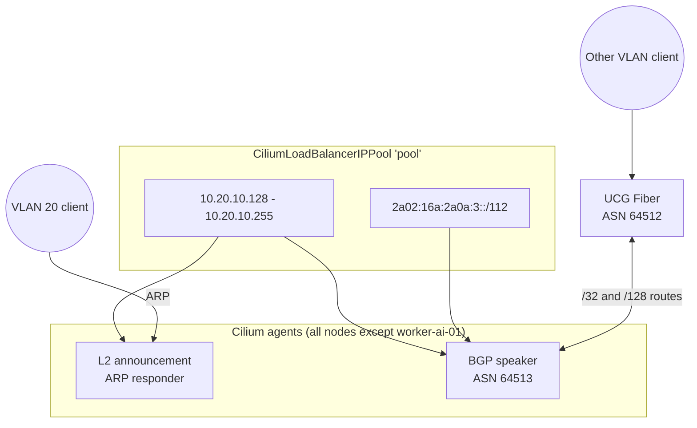

# Load Balancers

LoadBalancer Services get their IPs from Cilium's LoadBalancer IP Address Management (LB-IPAM). There is no MetalLB: Cilium announces each IP two ways at once, over L2 (ARP) and over BGP to the UniFi gateway.

## How It Works


```mermaid
flowchart TB
    subgraph Pool["CiliumLoadBalancerIPPool 'pool'"]
        V4["10.20.10.128 - 10.20.10.255"]
        V6["2a02:16a:2a0a:3::/112"]
    end

    subgraph Cilium["Cilium agents (all nodes except worker-ai-01)"]
        L2[L2 announcement<br/>ARP responder]
        BGP[BGP speaker<br/>ASN 64513]
    end

    V4 --> L2 & BGP
    V6 --> BGP

    VLAN20((VLAN 20 client)) -->|"ARP"| L2
    UCG[UCG Fiber<br/>ASN 64512] <-->|"/32 and /128 routes"| BGP
    Other((Other VLAN client)) --> UCG
```

- **L2**: needed because the IPv4 pool is inside VLAN 20 (`10.20.0.0/16`), so clients on that VLAN ARP for the VIP directly. One node holds a lease per IP.
- **BGP**: every peering node advertises every LoadBalancer IP, so clients on other VLANs get ECMP routes via the gateway, and a failed node is withdrawn within the 9s hold time instead of waiting out an L2 lease.
- **IPv6**: the `2a02:16a:2a0a:3::/112` block is assigned to no network, so it is reachable only through the BGP `/128`s. Only Services that request dual-stack with `ipFamilyPolicy` get an address from it.

See [Cilium CNI](cilium-cni.md#bgp) for the BGP configuration.

## Requesting an IP

Pin an address with the `lbipam.cilium.io/ips` annotation; without it, Cilium picks the next free one.

### App-template (bjw-s) Service

```yaml
service:
  app:
    controller: my-app
    type: LoadBalancer
    annotations:
      lbipam.cilium.io/ips: "10.20.10.236"
    ports:
      http:
        port: 8080
```

### Envoy Gateway

On a Gateway the annotation goes in `spec.infrastructure.annotations`; Envoy Gateway copies it to the Service it creates:

```yaml
spec:
  infrastructure:
    annotations:
      lbipam.cilium.io/ips: "10.20.10.238"
```

## IP Allocation

Current pinned assignments:

| IP Address | Service | Namespace | Ports |
|:-----------|:--------|:----------|:------|
| `10.20.10.229` | jellyfin | media | 8096/TCP |
| `10.20.10.230` | forgejo-ssh | dev | 22/TCP |
| `10.20.10.231` | dev-desktop | dev | Moonlight/Sunshine streaming (TCP + UDP) |
| `10.20.10.232` | herdr-app | dev | 22/TCP |
| `10.20.10.233` | omarchy | vms | 22/TCP, Moonlight/Sunshine streaming |
| `10.20.10.234` | dev | vms | 22/TCP |
| `10.20.10.235` | frigate-webrtc-udp | home-automation | 8555/UDP |
| `10.20.10.238` | envoy-internal | networking | 80/TCP, 443/TCP, 443/UDP, 389/TCP |
| `10.20.10.239` | envoy-external | networking | 80/TCP, 443/TCP |

Find the current list (and a free address) with:

```bash
kubectl get svc -A --field-selector spec.type=LoadBalancer
```

> [!TIP]
> **Why a Service gets its own IP**
>
> Most apps are reached through the Envoy gateways with an HTTPRoute. A dedicated IP is only for non-HTTP protocols (SSH, WebRTC UDP, game/desktop streaming) or clients that need a direct address (Jellyfin apps), and for the gateways themselves.

## Troubleshooting

```bash
# Pool status (IPS AVAILABLE, CONFLICTING)
kubectl get ciliumloadbalancerippools
kubectl describe ciliumloadbalancerippool pool

# Which node holds the L2 lease for each Service
kubectl get leases -n kube-system | grep cilium-l2

# Routes advertised to the gateway
kubectl -n kube-system exec ds/cilium -c cilium-agent -- cilium bgp routes advertised ipv4 unicast
```

> [!WARNING]
> **IP conflicts**
>
> If two Services request the same IP, the second one stays `<pending>`. Check `kubectl describe svc` for the LB-IPAM condition.
