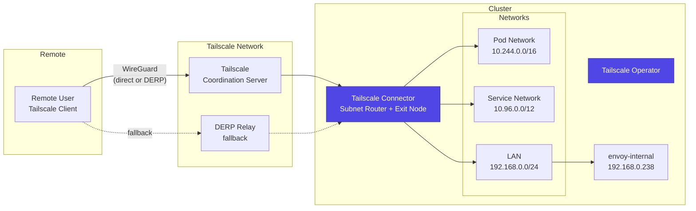

# Tailscale

[Tailscale](https://tailscale.com/) provides secure remote access to the cluster through a WireGuard-based mesh VPN. The Tailscale operator runs in the cluster and acts as a subnet router (exposing cluster and LAN networks) and an exit node (allowing all traffic to route through the cluster).

## Architecture



## Operator Configuration

The Tailscale operator is deployed via Helm with API server proxy mode enabled:

```yaml title="pitower/kubernetes/apps/networking/tailscale/operator/values.yaml"
operatorConfig:
  hostname: tailscale-operator
apiServerProxyConfig:
  mode: "true"
```

### API Server Proxy

With `apiServerProxyConfig.mode: "true"`, the Tailscale operator acts as a proxy for the Kubernetes API server. This allows you to access `kubectl` commands remotely through Tailscale without exposing the API server publicly.

```bash
# From a remote machine connected to Tailscale
kubectl --server=https://tailscale-operator:443 get pods -A
```

!!! tip "kubectl via Tailscale"
    Configure your kubeconfig to use the Tailscale operator as the API server endpoint. This provides authenticated, encrypted access to the cluster API from anywhere in your Tailscale network.

## Connector (Subnet Router + Exit Node)

The Tailscale Connector resource configures the subnet router and exit node:

```yaml title="pitower/kubernetes/apps/networking/tailscale/connectors/connector.yaml"
apiVersion: tailscale.com/v1alpha1
kind: Connector
metadata:
  name: home-ops
spec:
  hostname: home-ops
  subnetRouter:
    advertiseRoutes:
      - 10.244.0.0/16
      - 10.96.0.0/12
      - 192.168.0.0/24
  exitNode: true
```

### Advertised Routes

| CIDR | Network | Purpose |
|:-----|:--------|:--------|
| `10.244.0.0/16` | Pod network | Direct access to pod IPs from remote machines |
| `10.96.0.0/12` | Service network | Access ClusterIP services by their service IP |
| `192.168.0.0/24` | LAN | Access LAN devices including LoadBalancer IPs (192.168.0.220-239) |

!!! info "LAN Access"
    The `192.168.0.0/24` route is the most important for daily use. It allows remote access to:

    - **envoy-internal** (`192.168.0.238`) -- internal-only web services
    - **envoy-external** (`192.168.0.239`) -- external services without going through Cloudflare
    - Any other LAN device (NAS, router admin, etc.)

### Exit Node

The `exitNode: true` setting allows Tailscale clients to route **all** their internet traffic through the cluster. This is useful for:

- Accessing services that are geo-restricted to the cluster's location
- Using the cluster's DNS configuration for all queries
- Routing all traffic through the home network when traveling

!!! warning "Exit Node Bandwidth"
    When using the exit node, all internet traffic from your device passes through the cluster's internet connection. Be mindful of bandwidth constraints, especially on residential connections.

## Secrets

The Tailscale operator requires authentication credentials stored in a secret (managed via External Secrets from 1Password):

- **Client ID and Secret**: OAuth client credentials for the Tailscale API
- **Auth Key**: Pre-authentication key for automatic device registration

## Typical Usage

### Access Internal Services Remotely

1. Connect to Tailscale on your device
2. Navigate to `https://hubble.example.com` (or any internal service)
3. Traffic routes: Device -> Tailscale -> the subnet router -> 192.168.0.238 -> envoy-internal -> app

### Access Kubernetes API

```bash
# Configure kubectl to use Tailscale proxy
export KUBERNETES_SERVICE_HOST=tailscale-operator
export KUBERNETES_SERVICE_PORT=443

# Or use --server flag
kubectl --server=https://tailscale-operator:443 get nodes
```

### Use as Exit Node

1. Enable exit node on your Tailscale client
2. Select the exit node
3. All traffic now routes through the cluster

## Troubleshooting

### Check Tailscale Operator Status

```bash
# Check operator pod
kubectl get pods -n networking -l app.kubernetes.io/name=tailscale-operator

# Check operator logs
kubectl logs -n networking -l app.kubernetes.io/name=tailscale-operator --tail=50
```

### Check Connector Status

```bash
# Check connector resource
kubectl get connectors

# Describe for detailed status
kubectl describe connector home-ops
```

### Verify Subnet Routes

From the Tailscale admin console (`https://login.tailscale.com/admin/machines`):

1. Find the the device
2. Check that subnet routes `10.244.0.0/16`, `10.96.0.0/12`, and `192.168.0.0/24` are approved
3. Verify exit node is enabled

!!! warning "Route Approval Required"
    Subnet routes and exit node must be **approved** in the Tailscale admin console after the connector registers. If routes are advertised but not approved, remote clients will not be able to reach the cluster networks.

### Test Connectivity

```bash
# From a remote Tailscale-connected device
# Test LAN access
ping 192.168.0.238

# Test internal service
curl -k https://192.168.0.238

# Test pod network access
curl http://10.244.x.x:port

# Test service network access
curl http://10.96.x.x:port
```
