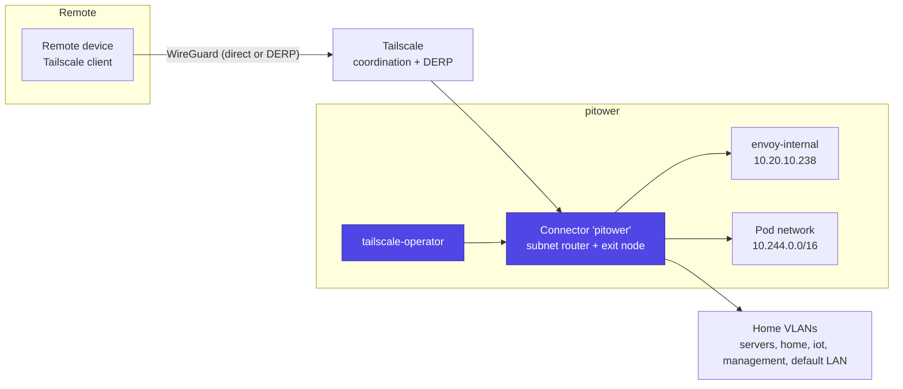

# Tailscale

[Tailscale](https://tailscale.com/) provides remote access to the cluster and home network over a WireGuard mesh. The Tailscale operator (Helm chart `tailscale-operator` `1.102.4`, namespace `networking`) runs a `Connector` that acts as a subnet router and exit node, and proxies the Kubernetes API.

Manifests: `kubernetes/apps/pitower/networking/tailscale/` (`operator/` and `connectors/`).

## Architecture


```mermaid
flowchart LR
    subgraph Remote
        User[Remote device<br/>Tailscale client]
    end

    Coord[Tailscale<br/>coordination + DERP]

    subgraph Cluster["pitower"]
        TSO[tailscale-operator]
        TSC[Connector 'pitower'<br/>subnet router + exit node]
        EI[envoy-internal<br/>10.20.10.238]
        Pods[Pod network<br/>10.244.0.0/16]
    end

    LAN[Home VLANs<br/>servers, home, iot, management, default LAN]

    User -->|"WireGuard (direct or DERP)"| Coord --> TSC
    TSO --> TSC
    TSC --> Pods
    TSC --> LAN
    TSC --> EI

    classDef ts fill:#4f46e5,stroke:#3730a3,color:#fff
    class TSO,TSC ts
```

## Operator Configuration

```yaml title="operator/values.yaml"
operatorConfig:
  hostname: tailscale-operator
apiServerProxyConfig:
  mode: "true"
```

The operator's OAuth client credentials come from Infisical through the `infisical-networking-tailscale` ClusterSecretStore into the `operator-oauth` Secret.

### API Server Proxy

`apiServerProxyConfig.mode: "true"` makes the operator a Kubernetes API proxy on the tailnet, authenticating requests as the caller's Tailscale identity. That identity still needs RBAC in the cluster.

```bash
kubectl --server=https://tailscale-operator get nodes
```

## Connector

```yaml title="connectors/connector.yaml"
apiVersion: tailscale.com/v1alpha1
kind: Connector
metadata:
  name: pitower
spec:
  hostname: pitower
  subnetRouter:
    advertiseRoutes:
      - 10.244.0.0/16
      - 10.10.0.0/16
      - 10.20.0.0/16
      - 10.50.0.0/24
      - 10.101.0.0/16
      - 192.168.0.0/24
  exitNode: true
```

### Advertised Routes

| CIDR | Network |
|:-----|:--------|
| `10.244.0.0/16` | Pod network (IPv4) |
| `10.10.0.0/16` | `home` VLAN 10 |
| `10.20.0.0/16` | `servers` VLAN 20: nodes, API VIP `10.20.10.0`, LoadBalancer IPs `10.20.10.128`-`255` |
| `10.50.0.0/24` | `management` VLAN 50 |
| `10.101.0.0/16` | `iot` VLAN 101 |
| `192.168.0.0/24` | Untagged default LAN |

The `10.20.0.0/16` route is the one that matters day to day: it covers `envoy-internal` (`10.20.10.238`) and every other LoadBalancer IP. The Service network is not advertised.

### Exit Node

`exitNode: true` lets a client send all its internet traffic out through the home connection.

> [!WARNING]
> **Route approval**
>
> Subnet routes and the exit node must be approved in the Tailscale admin console (or by auto-approvers in the tailnet policy) after the Connector registers. Unapproved routes are advertised but unusable.

## Typical Usage

1. Connect the device to the tailnet.
2. Open an internal service, e.g. `https://hubble.wibrow.dev`. The public CNAME resolves to `internal.wibrow.dev` (`10.20.10.238`), which is reachable through the subnet router.
3. Path: device, Tailscale, Connector, `envoy-internal`, app.

## Troubleshooting

```bash
kubectl get connector pitower           # SUBNETROUTES, ISEXITNODE, STATUS
kubectl describe connector pitower

kubectl -n networking get pods          # operator-* and ts-pitower-*
kubectl -n networking logs deploy/operator --tail=50

# From a tailnet device
ping 10.20.10.238
curl -v --resolve hubble.wibrow.dev:443:10.20.10.238 https://hubble.wibrow.dev
```
