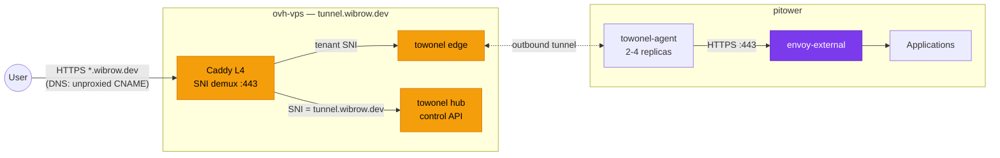

# Towonel Tunnel

External traffic reaches the cluster through [towonel](https://codeberg.org/towonel/towonel), a
self-hosted tunnel that replaced Cloudflare Tunnel (`cloudflared`) in July 2026. An agent in the
cluster dials **out** to a hub on a VPS, so the router still needs no inbound port forwards and the
home IP stays unpublished.

The tunnel has two halves:

| Half | Runs on | Managed by |
|:-----|:--------|:-----------|
| **Hub + edge** | `ovh-vps` (`tunnel.wibrow.dev`) | Ansible role `towonel-hub` — see the runbook in `ansible/README.md` |
| **Agent** | `pitower` cluster | `kubernetes/apps/pitower/networking/towonel-agent/` |

## Architecture



### Traffic flow

1. **User** requests `https://myapp.wibrow.dev`.
2. **Cloudflare DNS** returns the unproxied (grey-cloud) CNAME to `tunnel.wibrow.dev`, which
   resolves to the VPS. Cloudflare is authoritative DNS only — it is *not* in the data path.
3. **Caddy** on the VPS peeks the TLS ClientHello SNI on `:443` without decrypting it, and routes
   tenant hostnames to the towonel edge.
4. **The edge** forwards the connection over the already-established outbound tunnel to
   `towonel-agent` in the cluster.
5. **towonel-agent** proxies to `envoy-external` on `:443`.
6. **envoy-external** matches the HTTPRoute hostname and routes to the application.

TLS is terminated by `envoy-external` inside the cluster — the VPS does SNI passthrough and never
sees plaintext.

!!! note "Why Caddy is in front of towonel"
    The hub's own ACME issuance uses TLS-ALPN-01, which only ever validates on port `:443` — a port
    that otherwise belongs exclusively to the edge, which has no ACME awareness. Caddy's L4 SNI
    demux lets the validator connection land on a listener that understands ACME. The full
    write-up is in the `towonel-hub` runbook in `ansible/README.md`.

## Agent configuration

The agent is stateless. It is given an invite token and a list of hostname → origin mappings:

```yaml title="kubernetes/apps/pitower/networking/towonel-agent/values.yaml"
env:
  TOWONEL_AGENT_HEALTH_LISTEN_ADDR: 0.0.0.0:9090
  TOWONEL_AGENT_SERVICES: |
    [
      {"hostname":"*.wibrow.dev","origin":"envoy-external.networking.svc.cluster.local:443"}
    ]
  TOWONEL_INVITE_TOKEN:
    valueFrom:
      secretKeyRef:
        name: towonel-agent-secret
        key: TOWONEL_INVITE_TOKEN
```

A single wildcard service covers every public hostname, so adding a public app needs no tunnel
change — only an HTTPRoute with `parentRefs` to `envoy-external`.

The deployment runs 2 replicas with an HPA to 4 on 75% CPU (`hpa.yaml`), non-root with a read-only
root filesystem and all capabilities dropped.

!!! warning "The invite token embeds the hub URL"
    `TOWONEL_INVITE_TOKEN` (Infisical, `/networking/towonel-agent/`) hard-codes
    `TOWONEL_HUB_PUBLIC_URL`. Changing the hub URL invalidates the token — it must be reissued from
    the hub and the agent restarted. Each invite is a new tenant identity; the old tenant is
    orphaned and should be cleaned up with `towonel tenant remove`.

## DNS

Subdomains are **unproxied** CNAMEs to the hub — Cloudflare proxying would break the SNI
passthrough the edge depends on:

```yaml title="kubernetes/apps/pitower/networking/towonel-agent/dnsendpoint.yaml"
- dnsName: "external.wibrow.dev"
  recordType: CNAME
  targets: ["tunnel.wibrow.dev"]
  providerSpecific:
    - name: external-dns.alpha.kubernetes.io/cloudflare-proxied
      value: "false"
- dnsName: "*.wibrow.dev"
  recordType: CNAME
  targets: ["tunnel.wibrow.dev"]
  providerSpecific:
    - name: external-dns.alpha.kubernetes.io/cloudflare-proxied
      value: "false"
```

The wildcard means an unmatched subdomain still reaches the edge and hits the `envoy-external`
fallback 404 route rather than returning NXDOMAIN.

!!! note "The apex is not on the tunnel"
    `wibrow.dev` is served entirely by a Cloudflare Worker route at the edge and has no origin. It
    keeps a **proxied** placeholder record (`AAAA 100::`, the IPv6 discard prefix) purely so the
    Worker route has a proxied hostname to attach to — see
    `kubernetes/apps/pitower/networking/external-dns/dnsendpoint.yaml`.

## Health and troubleshooting

The agent serves `/healthz` on `:9090`, used for all three probes.

```sh
# Agent status
kubectl get pods -n networking -l app.kubernetes.io/name=towonel-agent
kubectl logs -n networking -l app.kubernetes.io/name=towonel-agent --tail=50

# Hub status (on the VPS)
systemctl status towonel-hub
docker logs -f towonel

# Is the hub reachable and presenting a valid cert? (run off-VPS)
curl -v https://tunnel.wibrow.dev/v1/health

# Confirm DNS is unproxied — the answer must be the VPS IP, not a Cloudflare IP
dig +short external.wibrow.dev
```

??? failure "Everything public returns 5xx"
    Check the agent's tunnel is established (`kubectl logs`), then that the hub is up on the VPS.
    Because the agent dials out, a hub restart drops every route until the agent reconnects.

??? failure "A hostname returns 404 from Envoy"
    The tunnel is fine — the wildcard delivered the request and `envoy-external` had no matching
    HTTPRoute. Check the app's HTTPRoute `hostnames` and `parentRefs`.

??? failure "Cloudflare error page instead of the app"
    The DNS record got proxied. `external-dns` applies `--cloudflare-proxied` globally, so every
    towonel record needs the explicit `cloudflare-proxied: "false"` providerSpecific override.
