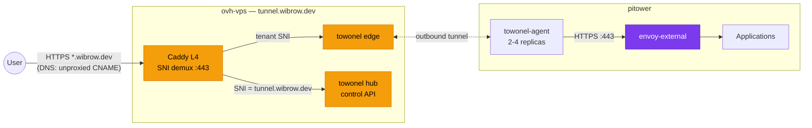

# Towonel Tunnel

External traffic reaches the cluster through [towonel](https://codeberg.org/towonel/towonel), a
self-hosted tunnel that replaced Cloudflare Tunnel (`cloudflared`) in July 2026. An agent in the
cluster dials **out** to a hub on a VPS, so the router still needs no inbound port forwards and the
home IP stays unpublished.

The tunnel has two halves:

| Half | Runs on | Managed by |
|:-----|:--------|:-----------|
| **Hub + edge** | `ovh-vps` (`tunnel.wibrow.dev`) | Ansible role `towonel-hub` — see the runbook in `ansible/README.md` |
| **Agent** | `pitower` cluster | `kubernetes/apps/pitower/networking/towonel-agent/` |

## Architecture


```mermaid
flowchart LR
    User((User))

    subgraph VPS["ovh-vps — tunnel.wibrow.dev"]
        Caddy[Caddy L4<br/>SNI demux :443]
        Edge[towonel edge]
        Hub[towonel hub<br/>control API]
    end

    subgraph Cluster["pitower"]
        Agent[towonel-agent<br/>2-4 replicas]
        EE[envoy-external]
        Apps[Applications]
    end

    User -->|"HTTPS *.wibrow.dev<br/>(DNS: unproxied CNAME)"| Caddy
    Caddy -->|"tenant SNI"| Edge
    Caddy -->|"SNI = tunnel.wibrow.dev"| Hub
    Edge <-.->|"outbound tunnel"| Agent
    Agent -->|"HTTPS :443"| EE
    EE --> Apps

    classDef vps fill:#f59e0b,stroke:#d97706,color:#000
    classDef gw fill:#7c3aed,stroke:#5b21b6,color:#fff
    class Caddy,Edge,Hub vps
    class EE gw
```

### Traffic flow

1. **User** requests `https://myapp.wibrow.dev`.
2. **Cloudflare DNS** returns the unproxied (grey-cloud) CNAME to `tunnel.wibrow.dev`, which
   resolves to the VPS. Cloudflare is authoritative DNS only — it is *not* in the data path.
3. **Caddy** on the VPS peeks the TLS ClientHello SNI on `:443` without decrypting it, and routes
   tenant hostnames to the towonel edge.
4. **The edge** forwards the connection over the already-established outbound tunnel to
   `towonel-agent` in the cluster.
5. **towonel-agent** proxies to `envoy-external` on `:443`.
6. **envoy-external** matches the HTTPRoute hostname and routes to the application.

TLS is terminated by `envoy-external` inside the cluster — the VPS does SNI passthrough and never
sees plaintext.

!!! note "Why Caddy is in front of towonel"
    The hub's own ACME issuance uses TLS-ALPN-01, which only ever validates on port `:443` — a port
    that otherwise belongs exclusively to the edge, which has no ACME awareness. Caddy's L4 SNI
    demux lets the validator connection land on a listener that understands ACME. The full
    write-up is in the `towonel-hub` runbook in `ansible/README.md`.

## Agent configuration

The agent is stateless. It is given an invite token and a list of hostname → origin mappings:

```yaml title="kubernetes/apps/pitower/networking/towonel-agent/values.yaml"
env:
  TOWONEL_AGENT_HEALTH_LISTEN_ADDR: 0.0.0.0:9090
  TOWONEL_AGENT_SERVICES: |
    [
      {"hostname":"*.wibrow.dev","origin":"envoy-external.networking.svc.cluster.local:443"},
      {"hostname":"propagit.dev","origin":"envoy-external.networking.svc.cluster.local:443"},
      {"hostname":"*.propagit.dev","origin":"envoy-external.networking.svc.cluster.local:443"},
      {"hostname":"*.cloudsnacks.dev","origin":"envoy-external.networking.svc.cluster.local:443"},
      {"hostname":"*.apps.cloudsnacks.dev","origin":"envoy-external.networking.svc.cluster.local:443"},
      {"hostname":"api.pantry.cloudsnacks.dev","origin":"envoy-external.networking.svc.cluster.local:443"}
    ]
  TOWONEL_INVITE_TOKEN:
    valueFrom:
      secretKeyRef:
        name: towonel-agent-secret
        key: TOWONEL_INVITE_TOKEN
```

Every origin is the same — `envoy-external` — so this list exists only to tell the edge which SNI
values belong to this tenant. Each zone's first-level wildcard is listed, so adding an app under
`*.wibrow.dev`, `*.propagit.dev`, or `*.cloudsnacks.dev` needs no tunnel change, just an HTTPRoute
with `parentRefs` to `envoy-external`. Anything **deeper** than one label needs its own entry.

!!! danger "A new pattern must also be granted on the hub"
    This list is only half the story. The hub keeps its own allowlist of hostname patterns per
    tenant, carried on the invite, and rejects anything else:

    ```
    hub returned 403 (hostname_not_owned):
    tenant is not authorized for hostname: *.cloudsnacks.dev
    ```

    The agent logs that at WARN, keeps running, and simply serves one hostname fewer, so the
    Deployment, the ReplicaSet, and ArgoCD all stay green. The edge's `dynamic route update applied`
    line reports the count the **hub** accepted — compare it against `invite get`, not against the
    values file.

    The allowlist itself lives in the hub's SQLite DB (`/data/hub.db`), but it is reconciled from
    `towonel_hub_invite_hostnames` in the `towonel-hub` role, so grant a pattern by editing that list
    — keeping it a superset of `TOWONEL_AGENT_SERVICES` — and applying the role. The agent then needs
    a restart, because it publishes TLS policy only at session start:

    ```sh
    just ansible deploy-ovh-vps
    kubectl -n networking rollout restart deploy/towonel-agent
    ```

    Expect a few seconds of failures on the *new* hostname after the restart: the edge drops the old
    agent session up to ~30s after the new ones register, and until then a connection can still land
    on a session that predates the grant. The runbook in `ansible/README.md` has the manual
    `invite get` / `add-hostnames` / `remove-hostname` equivalents, and why `409 hostname_conflict`
    from `add-hostnames` does not mean the change was rejected.

!!! warning "An unlisted hostname fails at the VPS, not in Envoy"
    The edge matches the ClientHello SNI against this list and nothing else. A hostname that is not
    covered gets its TLS handshake dropped at the VPS (`curl` reports `SSL_ERROR_SYSCALL`) and never
    reaches the cluster — a cert on `envoy-external` and a working DNS record are not enough.

    Wildcards match a single label. `*.cloudsnacks.dev` covers `pitwall.cloudsnacks.dev` but **not**
    `foo.apps.cloudsnacks.dev`, which is why `*.apps.cloudsnacks.dev` and the two-label
    `api.pantry.cloudsnacks.dev` are listed separately. `pitwall.cloudsnacks.dev` shipped with a
    cert, a listener, and DNS, and stayed unreachable until `*.cloudsnacks.dev` was both listed here
    and granted on the hub.

The deployment runs 2 replicas with an HPA to 4 on 75% CPU (`hpa.yaml`), non-root with a read-only
root filesystem and all capabilities dropped.

!!! warning "The invite token embeds the hub URL"
    `TOWONEL_INVITE_TOKEN` (Infisical, `/networking/towonel-agent/`) hard-codes
    `TOWONEL_HUB_PUBLIC_URL`. Changing the hub URL invalidates the token — it must be reissued from
    the hub and the agent restarted. Each invite is a new tenant identity; the old tenant is
    orphaned and should be cleaned up with `towonel tenant remove`.

## DNS

Subdomains are **unproxied** CNAMEs to the hub — Cloudflare proxying would break the SNI
passthrough the edge depends on:

```yaml title="kubernetes/apps/pitower/networking/towonel-agent/dnsendpoint.yaml"
- dnsName: "external.wibrow.dev"
  recordType: CNAME
  targets: ["tunnel.wibrow.dev"]
  providerSpecific:
    - name: external-dns.alpha.kubernetes.io/cloudflare-proxied
      value: "false"
- dnsName: "*.wibrow.dev"
  recordType: CNAME
  targets: ["tunnel.wibrow.dev"]
  providerSpecific:
    - name: external-dns.alpha.kubernetes.io/cloudflare-proxied
      value: "false"
```

The wildcard means an unmatched subdomain still reaches the edge and hits the `envoy-external`
fallback 404 route rather than returning NXDOMAIN.

The other zones on the tunnel get their records the same way, from three places:

| Name | Record | Source |
|:-----|:-------|:-------|
| `propagit.dev`, `*.propagit.dev` | CNAME → `tunnel.wibrow.dev` | `towonel-agent/dnsendpoint.yaml` |
| `*.apps.cloudsnacks.dev`, `api.pantry.cloudsnacks.dev` | CNAME → `tunnel.wibrow.dev` | `pantry-system/pantry/dnsendpoint.yaml` |
| Anything else with an HTTPRoute on `envoy-external` | CNAME → `external.wibrow.dev` | `external-dns`, from the gateway's `external-dns.alpha.kubernetes.io/target` |

The last row is why a route-only hostname such as `pitwall.cloudsnacks.dev` resolves without any
DNSEndpoint: it chains through `external.wibrow.dev` to `tunnel.wibrow.dev`. It resolving proves
nothing about the tunnel — the agent still has to advertise the SNI.

!!! note "The apex is not on the tunnel"
    `wibrow.dev` is served entirely by a Cloudflare Worker route at the edge and has no origin. It
    keeps a **proxied** placeholder record (`AAAA 100::`, the IPv6 discard prefix) purely so the
    Worker route has a proxied hostname to attach to — see
    `kubernetes/apps/pitower/networking/external-dns/dnsendpoint.yaml`.

## Health and troubleshooting

The agent serves `/healthz` on `:9090`, used for all three probes.

```sh
# Agent status
kubectl get pods -n networking -l app.kubernetes.io/name=towonel-agent
kubectl logs -n networking -l app.kubernetes.io/name=towonel-agent --tail=50

# Hub status (on the VPS)
systemctl status towonel-hub
docker logs -f towonel

# Is the hub reachable and presenting a valid cert? (run off-VPS)
curl -v https://tunnel.wibrow.dev/v1/health

# Confirm DNS is unproxied — the answer must be the VPS IP, not a Cloudflare IP
dig +short external.wibrow.dev

# Is a hostname actually advertised to the edge? A 404 means yes, a TLS error means no
curl -sS -o /dev/null -w '%{http_code}\n' https://myapp.wibrow.dev/
```

??? failure "Everything public returns 5xx"
    Check the agent's tunnel is established (`kubectl logs`), then that the hub is up on the VPS.
    Because the agent dials out, a hub restart drops every route until the agent reconnects.

??? failure "A hostname returns 404 from Envoy"
    The tunnel is fine — the wildcard delivered the request and `envoy-external` had no matching
    HTTPRoute. Check the app's HTTPRoute `hostnames` and `parentRefs`.

??? failure "TLS handshake error, no HTTP status at all"
    The edge has no SNI mapping for that hostname. Two causes, in order of likelihood:

    1. Nothing in `TOWONEL_AGENT_SERVICES` covers it — remember a wildcard matches one label only.
    2. It *is* listed, but the hub rejected it as `hostname_not_owned`. The agent logs the 403 at
       WARN and carries on, so the deployment looks healthy:

       ```sh
       kubectl logs -n networking -l app.kubernetes.io/name=towonel-agent | grep publish_tls
       ```

       Compare the accepted count in the edge's `dynamic route update applied` line against the
       number of entries in `TOWONEL_AGENT_SERVICES` — a mismatch means a pattern was refused.

??? failure "Cloudflare error page instead of the app"
    The DNS record got proxied. `external-dns` runs without `--cloudflare-proxied`, so records
    default to unproxied and only a `cloudflare-proxied: "true"` providerSpecific turns it on — the
    explicit `"false"` on the towonel DNSEndpoints is belt-and-braces against that flag ever being
    added. The one record that must stay proxied is the apex.
