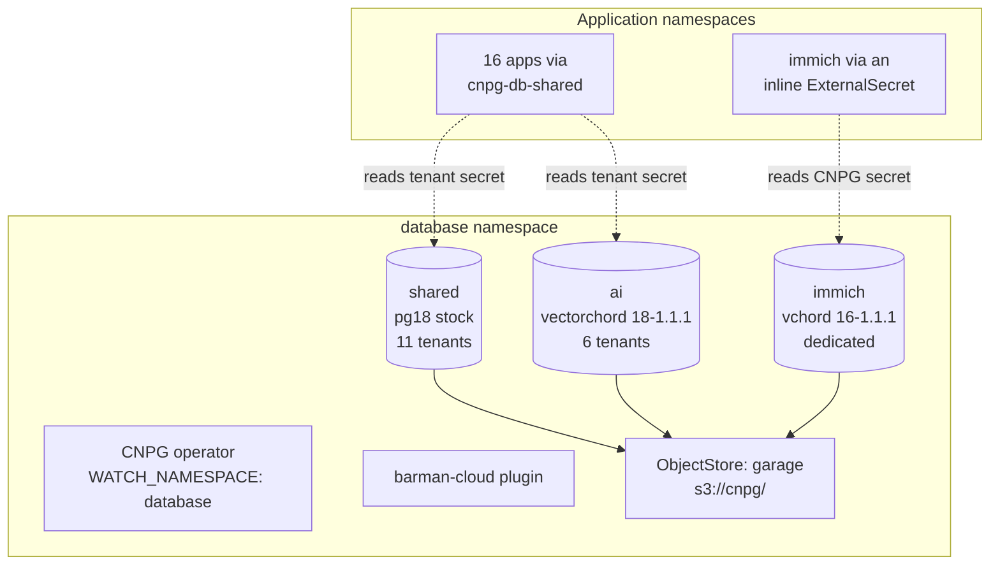

# CNPG Consolidation

How 21 single-purpose PostgreSQL clusters became 3, over 2026-07-28 and
2026-07-29. This is a retrospective record: what the estate looked like, the
procedure that moved each database, the exact commands, the traps that cost
time, and what is still outstanding.

!!! info "Scope of this document"
    Everything here is reconstructed from the git history, the live cluster and
    the working notes taken during the migration. The shell commands used for
    the final batch (forgejo, propagit, rybbit) are reproduced verbatim. The
    commands for the earlier batches are reproduced from the working notes
    written at the time -- they are accurate as procedure, but were run as
    ad-hoc one-liners and were never committed, so they are not recoverable
    byte-for-byte from the repository.

## Summary

| | Before | After |
|---|---|---|
| PostgreSQL clusters | 21 | **3** |
| Postgres pods | 41 | **6** |
| Namespaces holding databases | 2 (`cloudnative-pg`, `database`) | **1** (`database`) |
| CNPG operators | 2 | **1** |
| Databases served | 21 | **18** |
| Backup streams to configure | 21 | **3** |
| Consumer components | 1 (`cnpg-db`) | **2** (`cnpg-db-shared`, `cnpg-db-database`) |

Three databases were deleted rather than migrated (no consumer). One cluster
stays dedicated. Total live data across all 18 databases is roughly 290 MB --
which is precisely why the consolidation was worth doing and why it was cheap.

The win was **operational, not capacity**: provisioned storage went from about
70 GiB to 60 GiB, essentially flat. What collapsed was the number of things to
patch, back up, monitor, fail over and reason about.

## Final shape



| Cluster | Image | Instances | Tenants |
|---|---|---|---|
| `shared` | `ghcr.io/cloudnative-pg/postgresql:18` | 2 | autobrr, firefly, **forgejo**, gatus, ghostfolio, house-hunter, miniflux, paperless, **propagit**, rackrat, **rybbit** |
| `ai` | `ghcr.io/tensorchord/cloudnative-vectorchord:18-1.1.1` | 2 | garrison, goat, litellm, memini, open-webui, phoenix |
| `immich` | `ghcr.io/tensorchord/cloudnative-vectorchord:16-1.1.1` | 2 | immich (dedicated) |

`immich` stays dedicated because it needs `cube`/`earthdistance`/`vchord` **and**
a superuser role -- its migrations create extensions themselves. Granting
`SUPERUSER` is defensible on a single-tenant cluster and not on a shared one.

## Inventory: what happened to every database

Starting estate, 2026-07-28 07:03 -- 19 single-database clusters in
`cloudnative-pg`, plus `immich` (created 2026-07-24) and `phoenix`
(2026-07-25) already in `database`.

| Database | Source | Source PG | Destination | Outcome |
|---|---|---|---|---|
| miniflux | `cloudnative-pg` | 16 | `shared` | tenant (pilot) |
| gatus | `cloudnative-pg` | 16 | `shared` | tenant |
| autobrr | `cloudnative-pg` | 16 | `shared` | tenant |
| house_hunter | `cloudnative-pg` | 16 | `shared` | tenant |
| firefly | `cloudnative-pg` | 16 | `shared` | tenant |
| ghostfolio | `cloudnative-pg` | 16 | `shared` | tenant |
| paperless | `cloudnative-pg` | 16 | `shared` | tenant |
| rackrat | `cloudnative-pg` | 18 | `shared` | tenant |
| litellm | `cloudnative-pg` | 17 | `ai` | tenant |
| open_webui | `cloudnative-pg` | 17 | `ai` | tenant |
| garrison | `cloudnative-pg` | 18 | `ai` | tenant |
| goat | `cloudnative-pg` | 18 | `ai` | tenant |
| memini | `cloudnative-pg` | vchord 0.5.1 | `ai` | tenant (only one with extensions) |
| phoenix | `database` (dedicated) | 18 | `ai` | tenant |
| forgejo | `cloudnative-pg` → dedicated | 17 | `shared` | tenant (two hops) |
| propagit | `cloudnative-pg` → dedicated | 17 | `shared` | tenant (two hops) |
| rybbit | `cloudnative-pg` → dedicated | 17 | `shared` | tenant (two hops) |
| immich | `database` | vchord 16 | -- | stays dedicated |
| backstage | `cloudnative-pg` | 16 | -- | **deleted**, empty, no consumer |
| mattermost | `cloudnative-pg` | 16 | -- | **deleted**, 21 MB, no consumer |
| temporal | `cloudnative-pg` | 17 | -- | **deleted**, unused |

!!! warning "forgejo, propagit and rybbit moved twice"
    On 2026-07-28 these three were given **dedicated** clusters in `database`,
    on the reasoning that forgejo's loss would cost source history and the
    other two were small enough to ride along. On 2026-07-29 that decision was
    reversed and all three became `shared` tenants, for uniform database
    management. The intermediate hop is why `components/cnpg-db-database`
    exists and why these three have two migration cycles in the timeline.

    The reversal is sound -- forgejo's git objects live on a PVC, not in
    Postgres -- but it did mean paying the migration cost twice. If the
    allocation had been settled first, one hop would have done.

## Target architecture

### Tenancy model

Tenants are declared as `Database` + `DatabaseRole` CRs in their own file under
`kubernetes/apps/pitower/database/tenants/`, **never** as `spec.managed.roles`
entries on the Cluster. This is the single most important design choice: it
means onboarding an app never mutates the Cluster resource, so the primary is
never rolled to add a tenant.

The tenants directory is also its own ArgoCD Application, separate from
`clusters/`, so a tenant change can never show up as a diff against a Cluster.

### The tenant credential Secret

One `kubernetes.io/basic-auth` Secret per tenant in `database`, named
`<cluster>-<app>` (e.g. `shared-miniflux`), doing double duty:

- CNPG reads `username`/`password` from it via `DatabaseRole.spec.passwordSecret`
- the consuming app's ExternalSecret extracts all five keys through the
  `cnpg-secrets-database` ClusterSecretStore

Extra keys (`host`, `port`, `dbname`) alongside username/password are accepted
by the API server on a basic-auth Secret -- verified by server dry-run. Because
the FQDN lives in the Secret, `components/cnpg-db-shared` templates **no
namespace at all**, which is what allowed consumers to migrate one at a time
instead of in a single 17-app commit.

Note the key is `username`, not the `user` that CNPG's own `-app` Secrets use.
That difference is the whole reason two consumer components exist:

| Component | Source secret | Key for user | Host in secret |
|---|---|---|---|
| `cnpg-db-shared` | hand-authored `<cluster>-<app>` | `username` | fully qualified |
| `cnpg-db-database` | CNPG-generated `<cluster>-app` | `user` | bare service name |

Both are consumed identically by the app -- they emit the same
`DB_HOST`/`DB_PORT`/`DB_USER`/`DB_PASS`/`DB_NAME`/`DB_URL` Secret -- so flipping
an app between them is a two-line kustomization change.

!!! note "`cnpg-db-database` has since been deleted"
    It was written for the dedicated-cluster detour, and its last three
    consumers left on 2026-07-29, taking it to zero. immich, the only app still
    reading a CNPG-generated secret, does it with an inline ExternalSecret
    against the `cnpg-secrets-database` store rather than through a component,
    so nothing was left to serve. Removed 2026-07-29; the table above is
    kept because it explains why two components existed during the migration.

    `cnpg-db-shared`, with 16 app consumers, is now the only CNPG consumer
    component.

### Backups

One `ObjectStore` (`garage`) serves every cluster. Barman namespaces each
cluster's backups under its own `serverName`, which defaults to the cluster
name, so `shared` and `ai` land in `s3://cnpg/shared/` and `s3://cnpg/ai/`
without extra configuration. `spec.configuration.serverName` must stay unset.

WAL archiving is continuous via the `isWALArchiver` plugin entry.
`ScheduledBackup` only sets how far back a PITR must replay from. Its schedule
is **six** fields, not five -- CNPG prepends a seconds field.

## The migration procedure

This is the canonical per-app sequence, validated on all 17 tenants.

### 1. Seed or mint the tenant password

Two cases:

- **Source is a hand-managed credential** (the 13 apps from `cloudnative-pg`):
  seed the app's **existing** password into Infisical so credentials do not
  change across the cutover.
- **Source is CNPG-generated** (phoenix, forgejo, propagit, rybbit): there is
  nothing to preserve. Mint a new one.

Minting, as run for the final batch:

```bash
for app in FORGEJO PROPAGIT RYBBIT; do
  pw=$(LC_ALL=C tr -dc 'A-Za-z0-9' </dev/urandom | head -c 64)
  env -u INFISICAL_TOKEN infisical secrets set "${app}_PASSWORD=$pw" \
    --path=/database/tenants --env=prod --silent >/dev/null 2>&1 \
    && echo "set ${app}_PASSWORD" || echo "FAILED ${app}"
done
```

The value is never printed. `env -u INFISICAL_TOKEN` is load-bearing: a stale
`INFISICAL_TOKEN` in the environment overrides the logged-in session and fails
with a confusing 404 on a service token that no longer exists.

### 2. Commit the tenant file

`ExternalSecret` + `Database` + `DatabaseRole`, added to
`tenants/kustomization.yaml`. Wait for both CRs to report `applied: true`:

```bash
kubectl --context=admin@pitower -n database get database,databaserole
```

### 3. Hold the writers at zero, in git

**`kubectl scale` does not hold.** Replicas are part of the rendered manifest,
so the next automated ArgoCD sync restores them (`selfHeal: false` does not
prevent this) and the app resumes writing to the source mid-dump. Editing the
Application's syncPolicy does not help either -- it is ApplicationSet-generated
and gets reasserted. Declaring it in git is the only durable hold.

For app-template charts, in `values.yaml`:

```yaml
controllers:
  backend:
    replicas: 0
```

For forgejo, whose chart schema forbids it, a kustomize patch on the rendered
Deployment (see [Traps](#traps-and-gotchas)):

```yaml
patches:
  - target:
      kind: Deployment
      name: forgejo
    patch: |
      - op: replace
        path: /spec/replicas
        value: 0
```

Always confirm the render, never assume:

```bash
kustomize build --enable-helm kubernetes/apps/pitower/dev/forgejo \
  | yq 'select(.kind=="Deployment" or .kind=="StatefulSet")
        | [.kind, .metadata.name, .spec.replicas]' -o=json -I=0
```

### 4. Confirm the source is quiesced

Verify **every** writer, which is not always one Deployment. garrison runs
keep + herald + warhorn, one schema each, all writing directly. goat runs
api + hooks. Apps on the custom `oci://ghcr.io/swibrow/charts` charts take
per-service knobs (`keep.replicas`, `api.replicas`), not the app-template
`controllers.<name>.replicas`.

```bash
for c in forgejo propagit rybbit; do
  echo -n "$c: "
  kubectl --context=admin@pitower -n database exec $c-1 -c postgres -- \
    psql -U postgres -tAc \
    "select coalesce(string_agg(usename||'/'||coalesce(client_addr::text,'local'),','),'NONE')
     from pg_stat_activity where datname='$c';"
done
```

Expect `NONE` for all.

### 5. Capture the baseline

Three fingerprints per database, taken from the source **before** the dump.
Object counts alone are not enough -- a wrong-schema restore passes every one
of them -- so the column signature is captured too.

```bash
COUNTS="select table_schema||'.'||table_name||' '||
  (xpath('/row/c/text()', query_to_xml(
    format('select count(*) as c from %I.%I', table_schema, table_name),
    false, true, '')))[1]::text::bigint
  from information_schema.tables
  where table_type='BASE TABLE'
    and table_schema not in ('pg_catalog','information_schema')
  order by 1;"

COLS="select table_schema||'|'||table_name||'|'||column_name||'|'||data_type||'|'||
  is_nullable||'|'||coalesce(column_default,'-')
  from information_schema.columns
  where table_schema not in ('pg_catalog','information_schema')
  order by 1;"

OBJ="select 'indexes '||count(*) from pg_index i
       join pg_class c on c.oid=i.indrelid
       join pg_namespace n on n.oid=c.relnamespace
       where n.nspname not in ('pg_catalog','information_schema')
     union all
     select 'sequences '||count(*) from information_schema.sequences
     union all
     select 'constraint_'||contype::text||' '||count(*) from pg_constraint co
       join pg_namespace n on n.oid=co.connamespace
       where n.nspname not in ('pg_catalog','information_schema')
       group by contype
     order by 1;"

for c in forgejo propagit rybbit; do
  kubectl --context=admin@pitower -n database exec $c-1 -c postgres -- \
    psql -U postgres -d $c -tAc "$COUNTS" > src-$c-counts.txt
  kubectl --context=admin@pitower -n database exec $c-1 -c postgres -- \
    psql -U postgres -d $c -tAc "$COLS"   > src-$c-cols.txt
  kubectl --context=admin@pitower -n database exec $c-1 -c postgres -- \
    psql -U postgres -d $c -tAc "$OBJ"    > src-$c-obj.txt
done
```

Also check whether the dump will emit ACL statements that the tenant role
cannot replay:

```bash
kubectl --context=admin@pitower -n database exec $c-1 -c postgres -- \
  pg_dump -U postgres -d $c -s | rg -c '^(GRANT|REVOKE|ALTER DEFAULT)'
```

### 6. Dump and restore in one pipe

The migration is **logical, not physical**. Merging N databases into one
cluster cannot use `pg_basebackup`, which is whole-cluster. `pg_dump -Fc` →
`pg_restore` crosses namespaces and major versions natively.

Run it **from the target pod**, so the newer `pg_dump` reads the older server
(the supported direction), and pipe it -- nothing touches disk, because CNPG
pods have a **read-only `/tmp`**.

```bash
for c in forgejo propagit rybbit; do
  SRC=$(kubectl --context=admin@pitower -n database get secret $c-app \
          -o jsonpath='{.data.password}' | base64 -d)
  DST=$(kubectl --context=admin@pitower -n database get secret shared-$c \
          -o jsonpath='{.data.password}' | base64 -d)
  kubectl --context=admin@pitower -n database exec shared-1 -c postgres -- \
    env SRC="$SRC" DST="$DST" APP="$c" sh -c '
      PGPASSWORD="$SRC" pg_dump -Fc --no-acl \
          -h '"$c"'-rw.database.svc.cluster.local -U "$APP" -d "$APP" \
      | PGPASSWORD="$DST" pg_restore --no-owner --role="$APP" --exit-on-error \
          -h shared-rw.database.svc.cluster.local -U "$APP" -d "$APP"
    '
done
```

Three flags carry weight:

- `--no-acl` -- every database bootstrapped by the old cluster ends its dump
  with `ALTER DEFAULT PRIVILEGES FOR ROLE postgres IN SCHEMA public ... TO
  <app>`. The tenant role may not replay a default-privilege rule owned by
  `postgres`, so with `--exit-on-error` and no `--no-acl`, `pg_restore` aborts
  on them -- *after* all data, indexes and constraints have landed, which makes
  it look far worse than it is. The rules carry nothing forward: on the shared
  cluster the tenant owns the database, every table and every sequence.
- `--exit-on-error` -- without it a partial restore reports success.
- Two passwords, not one. When both ends have independent credentials, the
  single `PGPASSWORD` trick fails. Each pipeline stage is its own process, so
  `env SRC=.. DST=.. sh -c '...'` gives each stage its own.

**Extensions**: dump with `--exclude-extension`, do not restore them. Only
memini had any (`vector` + `vchord`). Its dump emits `CREATE EXTENSION IF NOT
EXISTS` *and* `COMMENT ON EXTENSION`; the tenant role owns neither extension, so
the COMMENT aborts the restore, and `--no-acl` does not skip it. Neither
`shared` nor `ai` sets `enableSuperuserAccess`, so there is no superuser to
restore as. The tenant's `Database` CR already declares the extensions and the
operator creates them as superuser before any restore.

### 7. Verify against the baseline

```bash
for c in forgejo propagit rybbit; do
  kubectl --context=admin@pitower -n database exec shared-1 -c postgres -- \
    psql -U postgres -d $c -tAc "$COUNTS" > dst-$c-counts.txt
  # ... same for COLS and OBJ ...
  echo "### $c"
  diff src-$c-counts.txt dst-$c-counts.txt && echo "counts IDENTICAL"
  diff src-$c-cols.txt   dst-$c-cols.txt   && echo "columns IDENTICAL"
  diff src-$c-obj.txt    dst-$c-obj.txt    && echo "objects IDENTICAL"
done
```

Plus sequence values, which no object count would catch:

```bash
SEQ="select schemaname||'.'||sequencename||' '||coalesce(last_value::text,'null')
     from pg_sequences order by 1;"
diff <(kubectl --context=admin@pitower -n database exec $c-1 -c postgres -- \
         psql -U postgres -d $c -tAc "$SEQ") \
     <(kubectl --context=admin@pitower -n database exec shared-1 -c postgres -- \
         psql -U postgres -d $c -tAc "$SEQ")
```

Two verification rules learned the hard way:

- **Do not compare `pg_constraint` totals across majors.** pg18 catalogues NOT
  NULL as `contype='n'` and pg16 does not, so a 37-vs-111 gap is expected.
  Compare per `contype`.
- **Do not trust `n_live_tup`** for a baseline. It is stats-collector data and
  was stale by 3 tables on miniflux. Use real `count(*)`.

### 8. Flip the consumer

Two lines in the app's `kustomization.yaml`, releasing the replica hold in the
same commit:

```diff
 components:
-  - ../../../../components/cnpg-db-database
+  - ../../../../components/cnpg-db-shared
 configMapGenerator:
   - name: cnpg-db-config
     literals:
-      - CNPG_SECRET_KEY=forgejo-app
+      - CNPG_SECRET_KEY=shared-forgejo
```

`SECRET_NAME` and the `DB_URL` key stay the same, so `values.yaml` normally
never needs editing. **Except** where a chart hardcodes the host -- see
[Traps](#traps-and-gotchas).

### 9. Verify the cutover

```bash
# derived secret points at the new cluster
kubectl --context=admin@pitower -n dev get secret forgejo-db-secret \
  -o jsonpath='{.data.DB_HOST}' | base64 -d

# connections appear on the new cluster
kubectl --context=admin@pitower -n database exec shared-1 -c postgres -- \
  psql -U postgres -c "select datname,usename,count(*) from pg_stat_activity
                       where datname in ('forgejo','propagit','rybbit')
                       group by 1,2 order by 1;"

# and are zero on the old
# ... same query against <app>-1 ...

# and a health endpoint that actually touches the database
curl -sS https://git.wibrow.dev/api/healthz | jq '.checks."database:ping"'
```

The source cluster is only ever read from, so **rollback at any point is
reverting the flip commit**.

## Scripts

No scripts were committed to the repository. Everything was run as ad-hoc
shell in a scratch directory, for two reasons: the SQL fingerprints needed
tweaking per batch, and a committed migration script would be dead code the
moment the migration finished.

What was made and run, in order of reuse value:

| Script | Purpose | Fate |
|---|---|---|
| `seed-tenant-passwords.sh` | Read `<app>-app` in `cloudnative-pg`, write to Infisical via CLI, never print the value | Scratch, not committed |
| password-mint loop | `/dev/urandom` → Infisical for the CNPG-generated cases | Reproduced in [step 1](#1-seed-or-mint-the-tenant-password) |
| baseline/verify fingerprints | The three SQL blocks + `diff` | Reproduced in steps [5](#5-capture-the-baseline) and [7](#7-verify-against-the-baseline) |
| dump/restore pipe | The one-pipe migration | Reproduced in [step 6](#6-dump-and-restore-in-one-pipe) |

The `database-toolbox` generator (`generate.sh`, in
`ai/toolhive/toolhive-config/mcpserver-database-toolbox.yaml`) **is** committed
and did have to change: it was rewritten to enumerate credentials in
`database` and emit one genai-toolbox source **per database** rather than per
cluster, since `shared` and `ai` each host many. Coverage is now dynamic --
a new tenant is picked up on the next pod restart with no edits.

## Timeline

Every commit, in order. All times local.

### Phase 1 -- foundations (2026-07-28 07:03 → 08:40)

| Commit | Time | Change |
|---|---|---|
| `42267819` | 07:03 | Collapse to a single CNPG operator, owned by `database` |
| `54ac4243` | 08:23 | Deploy barman-cloud plugin into `database` |
| `61cb9af1` | 08:32 | Garage ObjectStore + namespace-agnostic db component |
| `eeadb68d` | 08:33 | Add `shared` and `ai` multi-tenant clusters |
| `0194ec5d` | 08:40 | Nightly base backups for `shared` and `ai` |

### Phase 2 -- tenant migrations (10:02 → 13:21)

| Commit | Time | Change |
|---|---|---|
| `34a719fb` | 10:02 | Onboard **miniflux** as the pilot tenant |
| `06f33576` | 13:21 | Onboard the remaining **12** tenants of `shared` and `ai` |

miniflux went first, alone, deliberately -- it validated the whole tenancy
design end to end before 12 more were committed at once.

### Phase 3 -- the dedicated detour (20:02 → 20:25)

| Commit | Time | Change |
|---|---|---|
| `29727246` | 20:02 | Add dedicated forgejo, propagit, rybbit, temporal clusters + `cnpg-db-database` |
| `207d890c` | 20:05 | Hold propagit at zero |
| `a7383f6f` | 20:07 | Cut propagit over |
| `f2a74bec` | 20:08 | Hold rybbit backend at zero |
| `db21702d` | 20:10 | Cut rybbit over |
| `58a69c70` | 20:12 | Hold forgejo at zero (failed -- see traps) |
| `ae86925a` | 20:23 | Hold forgejo at zero *with a patch, not replicaCount* |
| `c599ddc5` | 20:25 | Cut forgejo over |

### Phase 4 -- teardown (20:43 → 21:43)

| Commit | Time | Change |
|---|---|---|
| `fb01cedc` | 20:43 | Remove temporal entirely |
| `ebb740b3` | 20:53 | Repoint database-toolbox, one source per database |
| `fc788ec4` | 21:25 | Delete the backstage and mattermost databases |
| `13b6b458` | 21:29 | Take over the CNPG CRDs and the shared ESO ClusterRole |
| `0c4284f7` | 21:41 | **Retire the `cloudnative-pg` namespace** |
| `ce9fe700` | 21:43 | Confine the operator to `database` |

The ordering here is the part that made it safe, and each step exists because
the next one would otherwise have been destructive:

1. An **on-demand `Backup` per destination cluster** first, because the nightly
   ScheduledBackups had never fired and the old PVCs were about to be the only
   other copy. These are still visible as the `*-premigration-cutover` Backups.
2. **CRD + ClusterRole handover** before deleting anything. `includeCRDs: true`
   moves to the surviving release; the chart stamps
   `helm.sh/resource-policy: keep` on all 12 CNPG CRDs and ArgoCD honours it,
   so deleting the old Application could not prune them out from under live
   clusters. The `external-secrets-pg` ClusterRole had no such protection and
   had to be re-declared -- it was defined next to the retired `cnpg-secrets`
   store but bound by the surviving `cnpg-secrets-database` one.
3. Only **then** delete the app directory, letting the ApplicationSet drop the
   Applications and prune 16 Clusters, pods and PVCs.
4. Only **then** narrow `WATCH_NAMESPACE`. Narrowing it first would have
   stranded the old Clusters in Terminating with no operator to run their
   finalizers.
5. `kubectl delete ns cloudnative-pg` by hand -- ArgoCD created it via
   `CreateNamespace=true`, so it was never in git.

### Phase 5 -- phoenix (21:50 → 21:56)

| Commit | Time | Change |
|---|---|---|
| `4bf83cd7` | 21:50 | Back immich up to Garage |
| `484042f8` | 21:50 | Onboard phoenix as a tenant of `ai` |
| `0b371980` | 21:51 | Hold phoenix at zero |
| `0fa570e1` | 21:54 | Cut phoenix over |
| `056a436c` | 21:56 | Drop phoenix's dedicated cluster |

### Phase 6 -- the reversal (2026-07-29 00:46 → 00:55)

| Commit | Time | Change |
|---|---|---|
| `747a104d` | 00:46 | Onboard forgejo, propagit, rybbit as `shared` tenants |
| `206bc44b` | 00:48 | Hold all three writers at zero |
| `2d1f0da1` | 00:52 | Flip all three to `cnpg-db-shared`, release the hold |
| `c202d1e0` | 00:55 | Retire the three dedicated clusters |

Total elapsed: about 18 hours across two sessions, of which the actual
data-in-flight windows were minutes.

## Traps and gotchas

The expensive ones, in rough order of how much time they cost.

### `replicaCount: 0` silently becomes 1

When a chart renders `{{ .Values.replicaCount | default 1 }}`, Helm's `default`
treats `0` as empty. Hit on arizephoenix/phoenix-helm 11.0.7. It fails
**silently**: the render succeeds, ArgoCD syncs, and the pod keeps writing to
the source mid-dump.

Grep the chart's deployment template for `| default` before trusting a hold,
and always confirm with `kustomize build ... | rg 'replicas:'`.

### forgejo's chart schema rejects `replicaCount: 0`

Its JSON schema sets minimum 1, so `replicaCount: 0` fails `helm template` and
the **whole Application stops rendering** -- ArgoCD sync status `Unknown`,
nothing applied, and the pod stayed up on the old database. Cost one wasted
cutover attempt (`58a69c70` → `ae86925a`).

Hold it with a kustomize patch on the rendered Deployment instead. This is the
documented exception to the "helm values over patches" preference: the value is
not expressible in the chart.

### Some charts hardcode the DB host

The component flip alone does not move them. forgejo's
`gitea.config.database.HOST` and temporal's `connectAddr` both had to be edited
directly. **Grep `values.yaml` for the old service name before assuming a flip
is complete.**

```bash
rg -n "forgejo-rw|propagit-rw|rybbit-rw" kubernetes/
```

### Two CNPG operators freeze every webhook

Running an operator in both `cloudnative-pg` and `database` makes them fight
over the shared `caBundle`, which freezes **every** `Cluster` update
cluster-wide and leaves ArgoCD stuck `Unknown`. There is no opt-out. This is
why `42267819` (collapse to one operator) had to be the very first commit.

### CNPG pods have a read-only `/tmp`

No intermediate dump file is possible. The one-pipe form is not a stylistic
choice.

### Immutable Job pod templates wedge the whole Application

Changing a DB host that appears inside an already-completed Job (temporal's
schema setup) makes ArgoCD's server-side diff dry-run fail with `field is
immutable`, which blocks the diff for **every** resource in that app, not just
the Job. Fix by deleting the Job, or setting
`argocd.argoproj.io/sync-options: Replace=true` on it.

### `database-toolbox` holds stale credentials

Its init container renders passwords into `tools.yaml` at pod start, so a
rotated tenant password leaves it holding a stale credential until it restarts.

Restart **`statefulset/database-toolbox`** in `ai`, not
`deploy/database-toolbox` -- both exist with the same name, and the Deployment
is the ToolHive proxy. The real workload is the pod `database-toolbox-0`, and
its containers are distroless (no `cat`, no `grep`), so `tools.yaml` cannot be
inspected in place. Read the `generate-tools` init container log for the source
count instead:

```bash
kubectl --context=admin@pitower -n ai delete pod database-toolbox-0
kubectl --context=admin@pitower -n ai logs database-toolbox-0 -c generate-tools
# database-toolbox: generated 18 postgres source(s) -> /shared/tools.yaml
```

Tool **names** are unchanged by a migration -- the generator strips
`shared-forgejo` to `forgejo`, exactly as `forgejo-app` reduced to `forgejo` --
so garrison's allowlist needed no edit.

### An unbounded connection pool is antisocial on a shared postmaster

Forgejo defaults `MAX_OPEN_CONNS` to unlimited. Harmless on a postmaster of its
own; on `shared` it is a way to eat the cluster-wide `max_connections` out from
under ten other tenants. Capped at 20/5 as part of the move.

Worth auditing for any future tenant: `max_connections: "200"` on `shared` is
the **sum** across all eleven, not a per-app allowance. Current steady state is
39 of 200.

### A stale `INFISICAL_TOKEN` masks a working login

The CLI prefers the env var and fails with a 404 on a service token ID that no
longer exists, which reads like an auth problem rather than a stale-env one.
`env -u INFISICAL_TOKEN` in front of the command.

## Verification results

Final batch, all three databases identical on every axis:

| | tables | columns | indexes / sequences / constraints | sequence values |
|---|---|---|---|---|
| forgejo | 130 ✓ | 1108 ✓ | 649 / 117 / per-`contype` ✓ | ✓ |
| propagit | 18 ✓ | 140 ✓ | 98 / 1 / per-`contype` ✓ | ✓ |
| rybbit | 36 ✓ | 353 ✓ | 135 / 17 / per-`contype` ✓ | ✓ |

Post-cutover: all three Applications `Synced`/`Healthy`, connections present on
`shared` and zero on the retired clusters, health endpoints returning 200
(forgejo's reporting `database:ping: pass`).

The column-signature diff caught nothing wrong on any of the 17 tenants, but it
earned its place anyway: it is what let litellm's "column does not exist"
startup errors be pinned on pre-existing image/schema drift rather than the
migration -- the columns were absent from source *and* target, 926 = 926.

## Follow-ups

Known-stale and outstanding, none blocking:

- ~~`components/cnpg-db-database` has no consumers.~~ **Done** — deleted
  2026-07-29.
- ~~`docs/applications/databases/index.md` is badly out of date.~~ **Done** —
  rewritten against the three-cluster shape 2026-07-29.
- **Three orphaned `Backup` CRs.** `forgejo-premigration-cutover`,
  `propagit-premigration-cutover` and `rybbit-premigration-cutover` reference
  Clusters that no longer exist. They were created on-demand, so ArgoCD has no
  reason to prune them. Harmless metadata; the objects in Garage are the actual
  record.
- **Stale comment in `clusters/patches/affinity.yaml`.** It says the file is
  "Duplicated from cloudnative-pg/cluster/patches/affinity.yaml ... Keep the two
  files in step." That file no longer exists; there is nothing to keep in step.
- **Retired barman streams.** `s3://cnpg/{forgejo,propagit,rybbit,phoenix}/`
  and the 19 `cloudnative-pg`-era prefixes still hold WAL and base backups
  under the 30-day retention policy. They will age out on their own, and until
  they do they are the deepest rollback available.

## See also

- [Backup & Restore](../storage/backup-restore.md)
- [Garage S3](../storage/garage.md)
- [External Secrets](../security/external-secrets.md)
