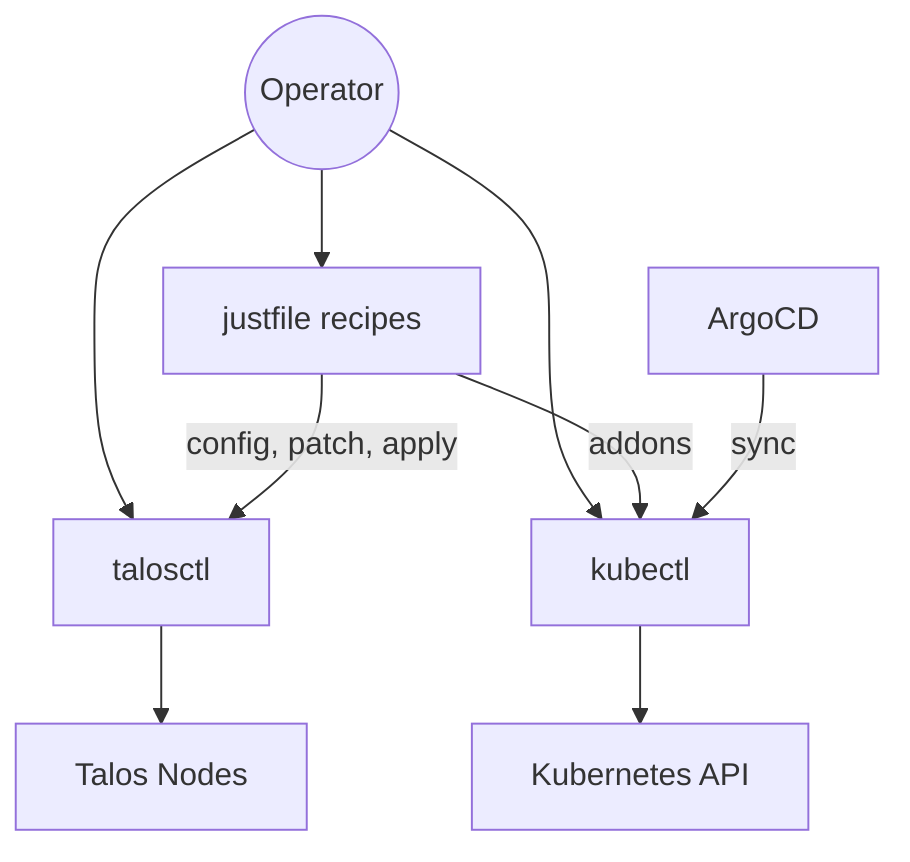

# Operations

Day-to-day operations for the the Kubernetes cluster running on Talos Linux.

---

## Overview

Cluster operations are automated through a combination of [justfile](https://github.com/casey/just) recipes and `talosctl` commands. The justfile lives at `pitower/talos/justfile` and provides high-level recipes for common tasks like configuration generation, node management, upgrades, and diagnostics.

---

## Quick Reference

| Task | Command | Details |
|:-----|:--------|:--------|
| Generate configs | `just config` | Decrypt secrets and generate Talos machine configs |
| Apply to control planes | `just apply-controlplanes` | Push configs to 192.168.0.201-203 |
| Apply to workers | `just apply-workers` | Push configs to all worker nodes |
| Reboot control planes | `just reboot-controlplanes` | Sequential reboot with wait |
| Upgrade control planes | `just upgrade-controlplanes` | ARM image upgrade with --preserve |
| Check cluster health | `talosctl health` | Verify etcd, kubelet, and API server |
| View dashboard | `talosctl dashboard` | Interactive node dashboard |

---

## Sections

| Page | Description |
|:-----|:------------|
| [Justfile Recipes](justfile-recipes.md) | Complete reference of all justfile recipes grouped by category |
| [Talos Commands](talos-commands.md) | Common `talosctl` commands for health checks, logs, and debugging |
| [Troubleshooting](troubleshooting.md) | Common issues and their resolutions |
| [Upgrades](upgrades.md) | Procedures for upgrading Talos, Kubernetes, and applications |

---

## Node Layout

| IP Address | Hostname | Role | Architecture |
|:-----------|:---------|:-----|:-------------|
| 192.168.0.201 | worker-01 | Control Plane | ARM64 (Pi 4) |
| 192.168.0.202 | worker-02 | Control Plane | ARM64 (Pi 4) |
| 192.168.0.203 | worker-03 | Control Plane | AMD64 |
| 192.168.0.204 | worker-04 | Worker | AMD64 (Intel) |
| 192.168.0.211 | worker-pi-01 | Worker | ARM64 (Pi) |
| 192.168.0.212 | worker-pi-02 | Worker | ARM64 (Pi) |
| 192.168.0.213 | worker-pi-03 | Worker | ARM64 (Pi) |

!!! info "Talos Version"
    The cluster runs Talos Linux **v1.12.4** with per-architecture factory images that include system extensions (Intel GPU, AMD, RPi PoE).
