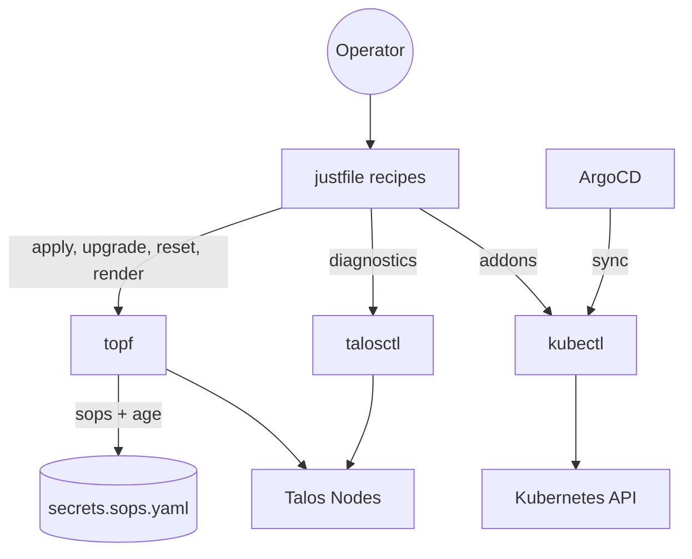

# Operations

Day-to-day operations for the Kubernetes clusters running on Talos Linux.

---

## Overview

Cluster lifecycle is managed declaratively with [topf](https://github.com/postfinance/topf), driven through [justfile](https://github.com/casey/just) recipes. Each cluster directory under `talos/` contains a `topf.yaml` (cluster identity, node inventory, Talos/Kubernetes versions, schematic references) plus layered machine-config patches. Secrets stay SOPS-encrypted on disk — topf decrypts `secrets.sops.yaml` transparently via sops and the repo age key.

`talosctl` is still used for read-only diagnostics (logs, services, dashboards) and Kubernetes minor upgrades (`talosctl upgrade-k8s`).

```mermaid
flowchart TD
    Operator((Operator))
    Just[justfile recipes]
    Topf[topf]
    Talosctl[talosctl]
    Kubectl[kubectl]
    ArgoCD[ArgoCD]

    Operator --> Just
    Just -->|apply, upgrade, reset, render| Topf
    Just -->|diagnostics| Talosctl
    Just -->|addons| Kubectl
    ArgoCD -->|sync| Kubectl

    Topf -->|sops + age| Secrets[(secrets.sops.yaml)]
    Topf --> Nodes[Talos Nodes]
    Talosctl --> Nodes
    Kubectl --> API[Kubernetes API]
```

---

## Quick Reference

Run from the cluster directory (`talos/pitower` or `talos/pistack`), or via the root `talos` module (`just talos pitower <recipe>`).

| Task | Command | Details |
|:-----|:--------|:--------|
| Show node status | `just status` | `topf nodes` — stage, readiness, schematic, version |
| Preview config changes | `just diff` | `topf apply --dry-run`, exit 2 = changes pending |
| Apply config | `just apply` | All nodes, or `just apply 'worker-0[12]'` (regex) |
| Render configs | `just render` | Write merged machine configs to `output/` |
| Upgrade Talos | `just upgrade` | To `talosVersion`/`schematicId` from `topf.yaml` |
| Check pending upgrades | `just upgrade-check` | `topf upgrade --dry-run`, exit 2 = upgrades due |
| Reset a node | `just reset <name>` | Wipes STATE+EPHEMERAL, back to maintenance mode |
| Admin kubeconfig | `just kubeconfig` | Short-lived (12h), written to `output/` |
| Talosconfig | `just talosconfig` | Generated from the secrets bundle |
| Cluster health | `just health` | `talosctl health` |

---

## Sections

| Page | Description |
|:-----|:------------|
| [Justfile Recipes](justfile-recipes.md) | Complete reference of all justfile recipes grouped by category |
| [Talos Commands](talos-commands.md) | Common `talosctl` commands for health checks, logs, and debugging |
| [Troubleshooting](troubleshooting.md) | Common issues and their resolutions |
| [Upgrades](upgrades.md) | Procedures for upgrading Talos, Kubernetes, and applications |

---

## Node Layout (pitower)

| IP Address | Hostname | Role | Hardware |
|:-----------|:---------|:-----|:---------|
| 10.20.10.1 | worker-01 | Control Plane | AMD64 (AMD GPU) |
| 10.20.10.2 | worker-02 | Control Plane | AMD64 (AMD GPU) |
| 10.20.10.3 | worker-03 | Control Plane | AMD64 (AMD GPU) |
| 10.20.10.4 | worker-04 | Worker | AMD64 (Intel GPU), tainted `dedicated=media-home` |
| 10.20.10.5 | worker-05 | Worker | AMD64 (Intel GPU) |
| 10.20.10.6 | worker-06 | Worker | AMD64 (Intel GPU) |

API VIP: `10.20.10.0`. The pistack cluster (3× Raspberry Pi control planes) lives at `10.20.20.1-3` with VIP `10.20.20.0`.

!!! info "Versions"
    Talos and Kubernetes versions are pinned per cluster in `topf.yaml` (`talosVersion`, `kubernetesVersion`). Factory schematics with system extensions are referenced declaratively from `talos/<cluster>/extensions/` via `schematicId: "@…"` — topf computes the schematic IDs locally.
