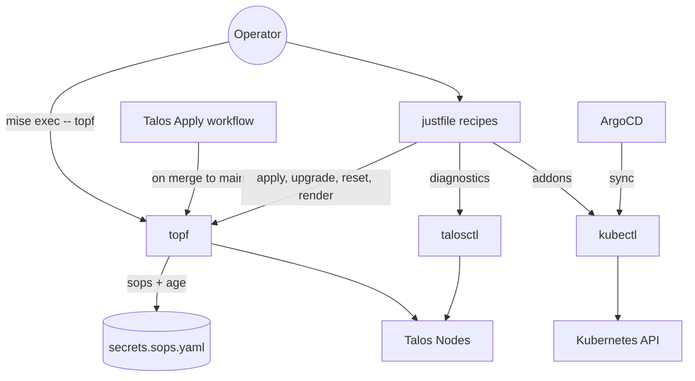

# Operations

Day-to-day operations for the `pitower` Kubernetes cluster running on Talos Linux.

---

## Overview

Cluster lifecycle is managed declaratively with [topf](https://github.com/postfinance/topf). `talos/pitower/` contains a `topf.yaml` (cluster identity, node inventory, Talos/Kubernetes versions, schematic references) plus layered machine-config patches. Secrets stay SOPS-encrypted on disk; topf decrypts `secrets.sops.yaml` transparently with the age key that the root `mise.toml` points `SOPS_AGE_KEY_FILE` at.

Run topf from `talos/pitower` as `mise exec -- topf ...`, or through the [justfile recipes](justfile-recipes.md) that wrap it. The **Talos Apply** workflow also runs `topf apply` for the whole cluster on every merge to `main` that touches `talos/`.

`talosctl` is still used for read-only diagnostics (logs, services, dashboards) and Kubernetes minor upgrades (`talosctl upgrade-k8s`).

```mermaid
flowchart TD
    Operator((Operator))
    CI[Talos Apply workflow]
    Just[justfile recipes]
    Topf[topf]
    Talosctl[talosctl]
    Kubectl[kubectl]
    ArgoCD[ArgoCD]

    Operator -->|mise exec -- topf| Topf
    Operator --> Just
    CI -->|on merge to main| Topf
    Just -->|apply, upgrade, reset, render| Topf
    Just -->|diagnostics| Talosctl
    Just -->|addons| Kubectl
    ArgoCD -->|sync| Kubectl

    Topf -->|sops + age| Secrets[(secrets.sops.yaml)]
    Topf --> Nodes[Talos Nodes]
    Talosctl --> Nodes
    Kubectl --> API[Kubernetes API]
```

---

## Quick Reference

Run from `talos/pitower`. `apply` and `upgrade` prompt y/n per node; review `--dry-run` first and add the global `--confirm=false` only when running non-interactively.

| Task | Command | Details |
|:-----|:--------|:--------|
| Show node status | `mise exec -- topf nodes` | Stage, readiness, schematic, version |
| Preview config changes | `mise exec -- topf apply --dry-run` | Exit 2 = changes pending |
| Apply config | `mise exec -- topf apply` | All nodes, or `--nodes-filter 'worker-0[12]'` (regex) |
| Render configs | `mise exec -- topf render` | Write merged machine configs to `output/` |
| Upgrade Talos | `mise exec -- topf upgrade` | To `talosVersion`/`schematicId` from `topf.yaml` |
| Check pending upgrades | `mise exec -- topf upgrade --dry-run` | Exit 2 = upgrades due |
| Reset a node | `just talos pitower reset <name>` | Wipes STATE+EPHEMERAL, back to maintenance mode |
| Admin kubeconfig | `mise exec -- topf kubeconfig > output/kubeconfig` | Short-lived (12h), printed to stdout |
| Cluster health | `just talos pitower health` | `talosctl health` |

> [!WARNING]
> **Silence alerts first**
>
> Before upgrades, drains, reboots or other disruptive work, add an Alertmanager silence and expire it once the work is verified. See [Prometheus Stack → Silences](../monitoring/prometheus-stack.md#silences).

---

## Sections

| Page | Description |
|:-----|:------------|
| [Justfile Recipes](justfile-recipes.md) | Reference of the justfile modules and Talos recipes |
| [Talos Commands](talos-commands.md) | Common `talosctl` commands for health checks, logs, and debugging |
| [Troubleshooting](troubleshooting.md) | Common issues and their resolutions |
| [Upgrades](upgrades.md) | Procedures for upgrading Talos, Kubernetes, and applications |

---

## Node Layout (pitower)

All nodes sit on VLAN 20. worker-01..03 are the control planes behind the API VIP `10.20.10.0`.

| IP Address | Hostname | Role | Hardware (schematic) |
|:-----------|:---------|:-----|:---------|
| 10.20.10.1 | worker-01 | Control Plane | AMD Ryzen mini PC (`amd`), Ceph OSD |
| 10.20.10.2 | worker-02 | Control Plane | AMD Ryzen mini PC (`amd`), Ceph OSD |
| 10.20.10.3 | worker-03 | Control Plane | AMD Ryzen mini PC (`amd`), Ceph OSD |
| 10.20.10.4 | worker-04 | Worker | Intel (`intel`), tainted `dedicated=media-home` |
| 10.20.10.5 | worker-05 | Worker | Intel (`intel`), also on the untagged LAN |
| 10.20.10.6 | worker-06 | Worker | Intel (`intel`), also on the untagged LAN |
| 10.20.10.7 | worker-07 | Worker | Dell R630 (`r630`), ZFS pools, Garage, CI runners |
| 10.20.10.8 | worker-08 | Worker | Raspberry Pi 4 (`rpi-poe`) |
| 10.20.10.9 | worker-09 | Worker | Raspberry Pi 4 (`rpi-poe`) |
| 10.20.10.10 | worker-10 | Worker | Raspberry Pi 4 (`rpi-poe`) |
| 10.20.10.11 | worker-ai-01 | Worker | GPU workstation (`nvidia`), tainted `dedicated=gpu` |

> [!NOTE]
> **Versions**
>
> Talos and Kubernetes versions are pinned in `talos/pitower/topf.yaml` (`talosVersion`, `kubernetesVersion`). Factory schematics with system extensions are referenced from `talos/pitower/extensions/` via `schematicId: "@extensions/<file>.yaml"`; topf computes the schematic IDs locally.

> [!NOTE]
> **CI runners live on worker-07**
>
> The self-hosted `home-ops` runners are pinned to worker-07. While it is drained or down, workflows (including Talos Apply) queue, so plan and apply topf and Terraform changes locally.
