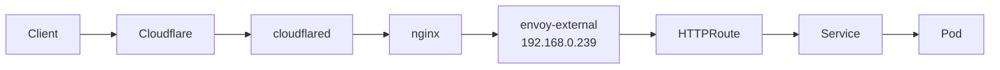

# Troubleshooting

Common issues and their resolutions for the cluster.

---

## Node Not Joining Cluster

**Symptoms**: Node shows as not ready, or does not appear in `kubectl get nodes`.

### Check Talos Health

```bash
talosctl health --nodes <node-ip>
```

Look for failures in etcd, kubelet, or API server connectivity.

### Check etcd Membership

```bash
talosctl etcd members --nodes 192.168.0.201
```

If the node was previously part of the cluster and was reset, its stale etcd member entry may need to be removed:

```bash
talosctl etcd remove-member <member-id> --nodes 192.168.0.201
```

### Verify Machine Config

Ensure the node has the correct machine config applied:

```bash
talosctl apply-config --nodes <node-ip> --file ./clusterconfig/<node-config>.yaml --dry-run
```

### Check kubelet-csr-approver

New nodes need their CSRs approved. Verify the kubelet-csr-approver is running:

```bash
kubectl get pods -n kube-system -l app.kubernetes.io/name=kubelet-csr-approver
kubectl get csr
```

!!! tip "Bootstrap Addons"
    If kubelet-csr-approver is not running, apply the bootstrap addons:
    ```bash
    cd pitower/talos && just addons
    ```

---

## Pod Stuck in Pending State

**Symptoms**: Pod stays in `Pending` status and never gets scheduled.

### Check Node Resources

```bash
kubectl describe node <node-name> | grep -A10 "Allocated resources"
kubectl top nodes
```

### Check Storage

If the pod requires a PVC, verify the storage class and available capacity:

```bash
kubectl get pvc -n <namespace>
kubectl describe pvc <pvc-name> -n <namespace>
```

For Rook Ceph:

```bash
kubectl -n rook-ceph exec deploy/rook-ceph-tools -- ceph status
kubectl -n rook-ceph exec deploy/rook-ceph-tools -- ceph osd df
```

For OpenEBS (local PV):

```bash
kubectl get blockdevice -n openebs
```

### Check Pod Events

```bash
kubectl describe pod <pod-name> -n <namespace>
kubectl get events -n <namespace> --sort-by='.lastTimestamp' | tail -20
```

### Check Node Taints

```bash
kubectl get nodes -o custom-columns=NAME:.metadata.name,TAINTS:.spec.taints
```

---

## DNS Not Resolving

**Symptoms**: Services cannot resolve DNS names, or external DNS records are not created.

### Ubiquiti DNS Interception

!!! warning "Port 53 Interception"
    The Ubiquiti router intercepts all DNS traffic on port 53. This means standard DNS lookups may return the router's cached results rather than actual Cloudflare records.

#### Verify with DoH (DNS over HTTPS)

To check actual Cloudflare DNS records, bypass the router's interception using DoH:

```bash
# Using curl to query Cloudflare DoH
curl -sH 'accept: application/dns-json' \
  'https://cloudflare-dns.com/dns-query?name=echo.example.com&type=A' | jq

# Using dig with DoH (if supported)
dig @1.1.1.1 echo.example.com +https
```

### Check CoreDNS

```bash
kubectl get pods -n kube-system -l k8s-app=kube-dns
kubectl logs -n kube-system -l k8s-app=kube-dns --tail=50
```

### Check external-dns

```bash
kubectl get pods -n networking -l app.kubernetes.io/name=external-dns
kubectl logs -n networking -l app.kubernetes.io/name=external-dns --tail=50
```

Verify external-dns is watching the correct gateways:

```bash
kubectl get gateways -A -l external-dns.alpha.kubernetes.io/enabled=true
```

!!! note "Gateway Label Filter"
    external-dns uses `--gateway-label-filter=external-dns.alpha.kubernetes.io/enabled=true` to select which gateways to process. Ensure the target gateway has this label.

### Check HTTPRoute and Gateway

```bash
kubectl get httproutes -A
kubectl get gateways -A
```

---

## Certificate Issues

**Symptoms**: TLS errors, expired certificates, or certificates not being issued.

### Check cert-manager

```bash
kubectl get pods -n cert-manager
kubectl logs -n cert-manager deploy/cert-manager --tail=50
```

### Check Certificate Status

```bash
kubectl get certificates -A
kubectl get certificaterequests -A
kubectl get orders.acme.cert-manager.io -A
kubectl get challenges.acme.cert-manager.io -A
```

### Check ClusterIssuer

```bash
kubectl get clusterissuers
kubectl describe clusterissuer letsencrypt-production
```

### Force Certificate Renewal

Delete the certificate to trigger re-issuance:

```bash
kubectl delete certificate <cert-name> -n <namespace>
```

!!! tip "DNS-01 Challenges"
    If using DNS-01 challenges with Cloudflare, verify the API token has the correct permissions and the DNS zone is accessible.

---

## Service Not Accessible

**Symptoms**: Cannot reach a service via its URL, connection timeouts, or 404 errors.

### Check Gateway Status

```bash
kubectl get gateways -n networking
kubectl describe gateway envoy-external -n networking
kubectl describe gateway envoy-internal -n networking
```

### Check HTTPRoute

```bash
kubectl get httproutes -A
kubectl describe httproute <route-name> -n <namespace>
```

Verify the route's `parentRefs` point to the correct gateway:

- **envoy-external**: For services accessed via Cloudflare tunnel (proxied)
- **envoy-internal**: For services accessed via Tailscale/LAN

### Check Cilium L2 Announcements

Verify LoadBalancer IPs are being announced:

```bash
kubectl get svc -A | grep LoadBalancer
cilium status
```

Check that the Cilium L2 announcement policy is active:

```bash
kubectl get ciliuml2announcementpolicies
kubectl get ciliumbgppeeringpolicies
```

### Check Cloudflare Tunnel

For externally exposed services:

```bash
kubectl get pods -n networking -l app.kubernetes.io/name=cloudflared
kubectl logs -n networking -l app.kubernetes.io/name=cloudflared --tail=50
```

### Check nginx Reverse Proxy

```bash
kubectl get pods -n networking -l app.kubernetes.io/name=nginx
kubectl get svc -n networking | grep nginx
```

### End-to-End Request Flow



Verify each hop in the chain to isolate where the failure occurs.

---

## ArgoCD Sync Failed

**Symptoms**: Application shows `OutOfSync`, `Degraded`, or `Unknown` in ArgoCD.

### Check Application Status

```bash
kubectl get applications -n argocd
kubectl describe application <app-name> -n argocd
```

### ArgoCD CLI

```bash
argocd app list
argocd app get <app-name>
argocd app diff <app-name>
```

### Common Sync Failures

#### Resource Already Exists

If a resource was manually created, ArgoCD may fail to adopt it:

```bash
argocd app sync <app-name> --force
```

#### Schema Validation Errors

CRDs may not be installed yet when the app tries to sync:

```bash
# Check if CRDs exist
kubectl get crds | grep <crd-name>

# Sync CRDs first if needed
argocd app sync <crd-app-name>
```

#### Health Check Failures

Check pod health and events:

```bash
kubectl get pods -n <namespace> -l app.kubernetes.io/name=<app>
kubectl describe pod <pod-name> -n <namespace>
kubectl get events -n <namespace> --sort-by='.lastTimestamp'
```

#### Helm Template Errors

For apps using Helm, test rendering locally:

```bash
cd pitower/kubernetes/apps/<category>/<app>
kustomize build . --enable-helm
```

---

## Storage Issues

### Rook Ceph Degraded

```bash
kubectl -n rook-ceph exec deploy/rook-ceph-tools -- ceph status
kubectl -n rook-ceph exec deploy/rook-ceph-tools -- ceph health detail
kubectl -n rook-ceph exec deploy/rook-ceph-tools -- ceph osd tree
```

### PVC Stuck in Pending

```bash
kubectl get pvc -A | grep Pending
kubectl describe pvc <pvc-name> -n <namespace>
kubectl get sc
```

### VolSync Backup Failures

```bash
kubectl get replicationsources -A
kubectl describe replicationsource <name> -n <namespace>
```

---

## Network Issues

### Pod-to-Pod Communication

```bash
# Test from a debug pod
kubectl run -it --rm debug --image=busybox -- sh
# Inside the pod:
wget -qO- http://<service>.<namespace>.svc.cluster.local:<port>
```

### Cilium Connectivity

```bash
cilium connectivity test
cilium status --verbose
```

### Envoy Gateway Logs

```bash
kubectl logs -n envoy-gateway-system deploy/envoy-gateway --tail=50
```
