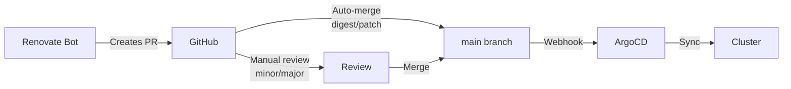

# Upgrades

Procedures for upgrading Talos Linux, Kubernetes, and applications in the cluster.

---

## Talos Linux Upgrades

Talos upgrades are performed per-architecture using factory images that include the appropriate system extensions. The cluster currently runs **Talos v1.12.4**.

### Architecture-Specific Images

The justfile defines four factory images, each tailored to a specific hardware type:

| Variable | Architecture | Nodes | Extensions |
|:---------|:-------------|:------|:-----------|
| `cp_image` | ARM64 | 192.168.0.201-202 | Base Pi 4 extensions |
| `cp_amd_image` | AMD64 | 192.168.0.203 | AMD extensions |
| `worker_intel_image` | AMD64 | 192.168.0.204 | Intel GPU extensions |
| `worker_rpi_image` | ARM64 | 192.168.0.211-213 | RPi PoE hat extensions |

### Pre-Upgrade Checklist

Before upgrading Talos:

- [ ] Verify cluster health: `talosctl health`
- [ ] Check etcd membership: `talosctl etcd members --nodes 192.168.0.201`
- [ ] Back up etcd: `talosctl etcd snapshot etcd-backup.snapshot --nodes 192.168.0.201`
- [ ] Review the [Talos release notes](https://www.talos.dev/latest/introduction/what-is-new/) for breaking changes
- [ ] Update the factory image IDs if extensions have changed: `just image-id`
- [ ] Update the image variables in the justfile

### Upgrade Procedure

!!! warning "Sequential Upgrades"
    All upgrade recipes process nodes one at a time with `--wait` and `--preserve`. Never upgrade all nodes simultaneously.

#### Step 1: Upgrade Control Plane Nodes

Upgrade ARM-based control plane nodes first:

```bash
cd pitower/talos
just upgrade-controlplanes
```

Then upgrade AMD control plane node(s):

```bash
just upgrade-controlplanes-amd
```

Each node upgrade:

1. Downloads the new Talos image
2. Stages the upgrade
3. Reboots the node
4. Waits for the node to come back with the new version
5. Proceeds to the next node

#### Step 2: Upgrade Worker Nodes

Upgrade Intel/AMD workers:

```bash
just upgrade-workers-intel
```

Upgrade Raspberry Pi workers:

```bash
just upgrade-workers-rpi
```

#### Step 3: Verify

```bash
talosctl version --nodes 192.168.0.201
talosctl health
kubectl get nodes -o wide
```

### The `--preserve` Flag

All upgrade commands use `--preserve`, which retains the node's ephemeral partition data across the upgrade. This means:

- Container images are preserved (faster restart)
- Local PVs are retained
- The node rejoins the cluster faster

!!! note "When NOT to Preserve"
    Omit `--preserve` only when you want a clean slate (e.g., after major version upgrades that require a fresh state).

### Updating Factory Images

When Talos releases a new version or you change system extensions:

1. Update extension files in `pitower/talos/extensions/` (e.g., `amd.yaml`, `intel.yaml`, `rpi-poe.yaml`)

2. Get new schematic IDs:

    ```bash
    just image-id
    ```

3. Update the image variables at the top of the justfile with the new schematic IDs and version tag

4. Proceed with the upgrade

---

## Kubernetes Version Upgrades

Kubernetes version is managed by Talos. When upgrading Talos, check whether the new Talos release includes a Kubernetes version bump.

### Check Current Kubernetes Version

```bash
kubectl version
talosctl get machineconfig --nodes 192.168.0.201 -o yaml | grep kubernetesVersion
```

### Upgrade Kubernetes

If you need to upgrade Kubernetes independently of Talos:

```bash
talosctl upgrade-k8s --to <version> --nodes 192.168.0.201
```

!!! info "Talos-Managed Kubernetes"
    Talos manages the Kubernetes control plane components (API server, controller manager, scheduler, etcd). A Talos upgrade often includes a Kubernetes version bump. Check the Talos release notes for the bundled Kubernetes version.

### Post-Upgrade Verification

```bash
kubectl get nodes -o wide
kubectl get pods -A | grep -v Running | grep -v Completed
talosctl health
```

---

## Application Upgrades

Application upgrades are handled automatically by **Renovate** and deployed via **ArgoCD**.

### Renovate Workflow



### Auto-Merge Rules

Renovate automatically merges certain update types:

| Update Type | Auto-Merge |
|:------------|:-----------|
| Docker digest updates | Yes |
| Docker patch versions | Yes |
| Docker pin/pinDigest | Yes |
| Helm patch versions | Yes |
| Helm digest/pin | Yes |
| KPS minor/patch | Yes |
| GitHub Actions digest/patch | Yes |
| Docker minor versions | No (manual review) |
| Docker major versions | No (manual review) |
| Helm minor versions | No (manual review) |

### Manual Application Upgrade

To manually upgrade an application:

1. Update the image tag or chart version in the app's `values.yaml` or `kustomization.yaml`:

    ```yaml
    # kustomization.yaml
    helmCharts:
      - name: app-template
        repo: oci://ghcr.io/bjw-s-labs/helm
        version: 4.6.2  # Update this
    ```

    ```yaml
    # values.yaml
    controllers:
      app-name:
        containers:
          app:
            image:
              repository: ghcr.io/example/app
              tag: 2.0.0  # Update this
    ```

2. Commit and push to `main`

3. ArgoCD will automatically detect the change and sync

### Helm Chart Upgrades

For bjw-s app-template chart upgrades:

1. Check the [release notes](https://github.com/bjw-s-labs/helm-charts/releases) for breaking changes
2. Update the `version` field in all `kustomization.yaml` files
3. Test locally:

    ```bash
    cd pitower/kubernetes/apps/<category>/<app>
    kustomize build . --enable-helm
    ```

4. Push to `main` for ArgoCD to pick up

---

## Upgrade Order of Operations

For a full stack upgrade, follow this order:

1. **Talos Linux** -- Foundation must be upgraded first
2. **Kubernetes** -- Usually bundled with Talos
3. **CNI (Cilium)** -- Network layer before workloads
4. **Storage (Rook Ceph, OpenEBS)** -- Storage layer before workloads
5. **Core Infrastructure** -- cert-manager, external-secrets, ArgoCD
6. **Applications** -- Workloads last

!!! danger "Never Skip Major Versions"
    Always upgrade incrementally. Do not skip major versions of Talos, Kubernetes, or critical infrastructure components.

---

## Rollback Procedures

### Talos Rollback

Talos keeps the previous version available. If an upgrade fails:

```bash
talosctl rollback --nodes <node-ip>
```

### Application Rollback

Use ArgoCD to roll back to a previous sync:

```bash
argocd app rollback <app-name>
```

Or revert the Git commit:

```bash
git revert <commit-hash>
git push origin main
```

ArgoCD will automatically sync the reverted state.
