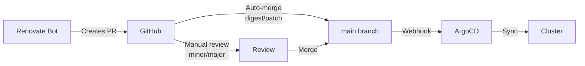

# Upgrades

Procedures for upgrading Talos Linux, Kubernetes, and applications in the cluster.

---

## Talos Linux Upgrades

Talos upgrades are driven by [topf](https://github.com/postfinance/topf): the target version is `talosVersion` in the cluster's `topf.yaml`, and per-hardware system extensions come from schematic files referenced via `schematicId: "@../shared/extensions/<file>.yaml"` (cluster default + per-node overrides). topf resolves schematic IDs locally and compares both version *and* schematic against each running node, so editing an extension file flags the affected nodes for upgrade just like a version bump.

### Pre-Upgrade Checklist

Before upgrading Talos:

- [ ] Verify cluster health: `just health`
- [ ] Check etcd membership: `talosctl etcd members --nodes 10.20.10.1`
- [ ] Back up etcd: `talosctl etcd snapshot etcd-backup.snapshot --nodes 10.20.10.1`
- [ ] Review the [Talos release notes](https://www.talos.dev/latest/introduction/what-is-new/) for breaking changes
- [ ] Bump `talosVersion` in `topf.yaml` (and edit `shared/extensions/*.yaml` if extensions change)
- [ ] Preview: `just upgrade-check` (exit 2 = upgrades due)

### Upgrade Procedure

!!! warning "Sequential Upgrades"
    topf upgrades nodes one at a time with per-node confirmation, data preservation, and a stabilization wait. Never force-parallelize upgrades.

#### Step 1: Upgrade Control Plane Nodes

```bash
cd kubernetes/talos/pitower
just upgrade-controlplanes
```

Each node upgrade:

1. Checks etcd health (refuses to proceed if unhealthy)
2. Stages the new installer image and reboots (kexec)
3. Waits for the node to come back with the new version
4. Proceeds to the next node

#### Step 2: Upgrade Worker Nodes

```bash
just upgrade-workers
```

#### Step 3: Verify

```bash
just status
just health
kubectl get nodes -o wide
```

### Updating System Extensions

When you change system extensions:

1. Edit the schematic files in `kubernetes/talos/shared/extensions/` (e.g., `amd.yaml`, `intel.yaml`, `rpi-poe.yaml`)
2. Check the resolved IDs: `just schematic-ids`
3. If the extension combination is brand-new to the image factory, register it once with `topf upgrade --dry-run --submit-to-factory`
4. `just upgrade-check` will now show the affected nodes as due — proceed with the upgrade

---

## Kubernetes Version Upgrades

Kubernetes version is managed by Talos. When upgrading Talos, check whether the new Talos release includes a Kubernetes version bump.

### Check Current Kubernetes Version

```bash
kubectl version
grep kubernetesVersion kubernetes/talos/pitower/topf.yaml
```

### Upgrade Kubernetes

Use `talosctl upgrade-k8s` for minor upgrades — it validates version skew and rolls components in order, which `topf apply` does not:

```bash
talosctl upgrade-k8s --to <version> --nodes 10.20.10.1
```

Afterwards, update `kubernetesVersion` in `topf.yaml` to match, so the next `just apply` doesn't revert it. For patch-level bumps (e.g. `1.36.1` → `1.36.2`), editing `kubernetesVersion` and running `just apply` is fine.

!!! info "Talos-Managed Kubernetes"
    Talos manages the Kubernetes control plane components (API server, controller manager, scheduler, etcd). Each Talos release supports a specific Kubernetes version range — check the release notes before bumping either version.

### Post-Upgrade Verification

```bash
kubectl get nodes -o wide
kubectl get pods -A | grep -v Running | grep -v Completed
talosctl health
```

---

## Application Upgrades

Application upgrades are handled automatically by **Renovate** and deployed via **ArgoCD**.

### Renovate Workflow


```mermaid
flowchart LR
    Renovate[Renovate Bot] -->|Creates PR| GitHub[GitHub]
    GitHub -->|Auto-merge<br/>digest/patch| Main[main branch]
    GitHub -->|Manual review<br/>minor/major| Review[Review]
    Review -->|Merge| Main
    Main -->|Webhook| ArgoCD[ArgoCD]
    ArgoCD -->|Sync| Cluster[Cluster]
```

### Auto-Merge Rules

Renovate automatically merges certain update types:

| Update Type | Auto-Merge |
|:------------|:-----------|
| Docker digest updates | Yes |
| Docker patch versions | Yes |
| Docker pin/pinDigest | Yes |
| Helm patch versions | Yes |
| Helm digest/pin | Yes |
| KPS minor/patch | Yes |
| GitHub Actions digest/patch | Yes |
| Docker minor versions | No (manual review) |
| Docker major versions | No (manual review) |
| Helm minor versions | No (manual review) |

### Manual Application Upgrade

To manually upgrade an application:

1. Update the image tag or chart version in the app's `values.yaml` or `kustomization.yaml`:

    ```yaml
    # kustomization.yaml
    helmCharts:
      - name: app-template
        repo: oci://ghcr.io/bjw-s-labs/helm
        version: 4.6.2  # Update this
    ```

    ```yaml
    # values.yaml
    controllers:
      app-name:
        containers:
          app:
            image:
              repository: ghcr.io/example/app
              tag: 2.0.0  # Update this
    ```

2. Commit and push to `main`

3. ArgoCD will automatically detect the change and sync

### Helm Chart Upgrades

For bjw-s app-template chart upgrades:

1. Check the [release notes](https://github.com/bjw-s-labs/helm-charts/releases) for breaking changes
2. Update the `version` field in all `kustomization.yaml` files
3. Test locally:

    ```bash
    cd pitower/kubernetes/apps/<category>/<app>
    kustomize build . --enable-helm
    ```

4. Push to `main` for ArgoCD to pick up

---

## Upgrade Order of Operations

For a full stack upgrade, follow this order:

1. **Talos Linux** -- Foundation must be upgraded first
2. **Kubernetes** -- Usually bundled with Talos
3. **CNI (Cilium)** -- Network layer before workloads
4. **Storage (Rook Ceph, OpenEBS)** -- Storage layer before workloads
5. **Core Infrastructure** -- cert-manager, external-secrets, ArgoCD
6. **Applications** -- Workloads last

!!! danger "Never Skip Major Versions"
    Always upgrade incrementally. Do not skip major versions of Talos, Kubernetes, or critical infrastructure components.

---

## Rollback Procedures

### Talos Rollback

Talos keeps the previous version available. If an upgrade fails:

```bash
talosctl rollback --nodes <node-ip>
```

### Application Rollback

Use ArgoCD to roll back to a previous sync:

```bash
argocd app rollback <app-name>
```

Or revert the Git commit:

```bash
git revert <commit-hash>
git push origin main
```

ArgoCD will automatically sync the reverted state.
