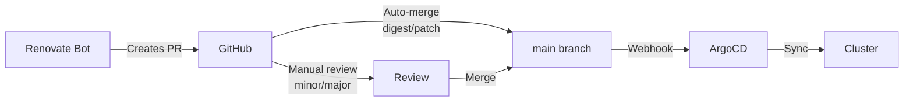

# Upgrades

Procedures for upgrading Talos Linux, Kubernetes, and applications in the cluster.

---

## Talos Linux Upgrades

Talos upgrades are driven by [topf](https://github.com/postfinance/topf): the target version is `talosVersion` in the cluster's `topf.yaml`, and per-hardware system extensions come from schematic files referenced via `schematicId: "@extensions/<file>.yaml"` (cluster default + per-node overrides). topf resolves schematic IDs locally and compares both version *and* schematic against each running node, so editing an extension file flags the affected nodes for upgrade just like a version bump.

### Pre-Upgrade Checklist

Before upgrading Talos:

- [ ] Silence Alertmanager for the duration of the work (see [Silences](../monitoring/prometheus-stack.md#silences))
- [ ] Verify cluster health: `just talos pitower health`
- [ ] Check etcd membership: `talosctl etcd members --nodes 10.20.10.1`
- [ ] Back up etcd: `talosctl etcd snapshot etcd-backup.snapshot --nodes 10.20.10.1`
- [ ] Review the [Talos release notes](https://www.talos.dev/latest/introduction/what-is-new/) for breaking changes
- [ ] Bump `talosVersion` in `topf.yaml` (and edit `extensions/*.yaml` if extensions change)
- [ ] Preview: `mise exec -- topf upgrade --dry-run` (exit 2 = upgrades due)

### Upgrade Procedure

> [!WARNING]
> **Sequential Upgrades**
>
> topf upgrades one node at a time by default (`--max-parallel 1`; control planes are always one at a time), with a y/n prompt per node. Never force-parallelize upgrades. The `just` recipes export `TOPF_CONFIRM=false` and skip the prompt.

#### Step 1: Upgrade Control Plane Nodes

```bash
cd talos/pitower
mise exec -- topf upgrade --nodes-filter 'worker-0[123]'
```

Each node upgrade:

1. Cordons and drains the node (`--drain`, default on)
2. Issues the upgrade (etcd health is validated server-side on Talos >= 1.13) and reboots via kexec
3. Waits for the node to come back Ready and stay Ready for the stabilization window, then uncordons it
4. Proceeds to the next node

#### Step 2: Upgrade Worker Nodes

```bash
mise exec -- topf upgrade --nodes-filter 'worker-(0[4-9]|10|ai-01)'
```

worker-07 hosts the CI runners, Garage and the monitoring TSDBs; expect those to pause while it reboots.

#### Step 3: Verify

```bash
mise exec -- topf nodes
just talos pitower health
kubectl get nodes -o wide
```

Expire the Alertmanager silence once everything is healthy.

### Updating System Extensions

When you change system extensions:

1. Edit the schematic files in `talos/pitower/extensions/` (`amd.yaml`, `intel.yaml`, `r630.yaml`, `rpi-poe.yaml`, `nvidia.yaml`)
2. Check the resolved IDs: `mise exec -- topf schematic-ids`
3. If the extension combination is brand-new to the Image Factory, submit it before installing, or the installer image 404s: `curl -X POST --data-binary @extensions/<file>.yaml https://factory.talos.dev/schematics` (or run topf once with the global `--submit-to-factory`)
4. `mise exec -- topf upgrade --dry-run` now shows the affected nodes as due; proceed with the upgrade

---

## Kubernetes Version Upgrades

Kubernetes version is managed by Talos. When upgrading Talos, check whether the new Talos release includes a Kubernetes version bump.

### Check Current Kubernetes Version

```bash
kubectl version
grep kubernetesVersion talos/pitower/topf.yaml
```

### Upgrade Kubernetes

Use `talosctl upgrade-k8s` for minor upgrades: it validates version skew and rolls components in order, which `topf apply` does not:

```bash
talosctl upgrade-k8s --to <version> --nodes 10.20.10.1
```

Afterwards, update `kubernetesVersion` in `topf.yaml` to match, so the next `topf apply` (including the Talos Apply workflow on merge) doesn't revert it. For patch-level bumps (e.g. `1.36.1` → `1.36.2`), editing `kubernetesVersion` and running `topf apply` is fine.

> [!NOTE]
> **Talos-Managed Kubernetes**
>
> Talos manages the Kubernetes control plane components (API server, controller manager, scheduler, etcd). Each Talos release supports a specific Kubernetes version range, so check the release notes before bumping either version.

### Post-Upgrade Verification

```bash
kubectl get nodes -o wide
kubectl get pods -A | grep -v Running | grep -v Completed
talosctl health
```

---

## Application Upgrades

Application upgrades are handled automatically by **Renovate** and deployed via **ArgoCD**.

### Renovate Workflow


```mermaid
flowchart LR
    Renovate[Renovate Bot] -->|Creates PR| GitHub[GitHub]
    GitHub -->|Auto-merge<br/>digest/patch| Main[main branch]
    GitHub -->|Manual review<br/>minor/major| Review[Review]
    Review -->|Merge| Main
    Main -->|Webhook| ArgoCD[ArgoCD]
    ArgoCD -->|Sync| Cluster[Cluster]
```

### Auto-Merge Rules

Renovate automatically merges certain update types (`.renovate/autoMerge.json5`, `.renovate/automerge-*.json`):

| Update Type | Auto-Merge |
|:------------|:-----------|
| Any patch update | Yes |
| Docker digest, patch, minor, pin, pinDigest | Yes |
| Helm digest, patch, minor, pin, pinDigest | Yes |
| GitHub Actions minor/patch | Yes (after 3 days; `actions/*` and `bjw-s-labs/*` immediately, digests too) |
| Major versions | No (manual review) |
| Rook Ceph, Cilium, CloudNativePG, Talos installer/talosctl, Envoy Gateway, cert-manager, snapshot-controller, OpenEBS, renovate-operator | Never (manual review) |

### Manual Application Upgrade

To manually upgrade an application:

1. Update the image tag or chart version in the app's `values.yaml` or `kustomization.yaml`:

    ```yaml
    # kustomization.yaml
    helmCharts:
      - name: app-template
        repo: oci://ghcr.io/bjw-s-labs/helm
        version: 5.2.1  # Update this
    ```

    ```yaml
    # values.yaml
    controllers:
      app-name:
        containers:
          app:
            image:
              repository: ghcr.io/example/app
              tag: 2.0.0  # Update this
    ```

2. Commit and push to `main`

3. ArgoCD will automatically detect the change and sync

### Helm Chart Upgrades

For bjw-s app-template chart upgrades:

1. Check the [release notes](https://github.com/bjw-s-labs/helm-charts/releases) for breaking changes
2. Update the `version` field in all `kustomization.yaml` files
3. Test locally:

    ```bash
    cd kubernetes/apps/pitower/<category>/<app>
    kustomize build . --enable-helm
    ```

4. Push to `main` for ArgoCD to pick up

---

## Upgrade Order of Operations

For a full stack upgrade, follow this order:

1. **Talos Linux** -- Foundation must be upgraded first
2. **Kubernetes** -- Usually bundled with Talos
3. **CNI (Cilium)** -- Network layer before workloads
4. **Storage (Rook Ceph, OpenEBS)** -- Storage layer before workloads
5. **Core Infrastructure** -- cert-manager, external-secrets, ArgoCD
6. **Applications** -- Workloads last

> [!CAUTION]
> **Never Skip Major Versions**
>
> Always upgrade incrementally. Do not skip major versions of Talos, Kubernetes, or critical infrastructure components.

---

## Rollback Procedures

### Talos Rollback

Talos keeps the previous version available. If an upgrade fails:

```bash
talosctl rollback --nodes <node-ip>
```

Then revert `talosVersion`/`schematicId` in `topf.yaml`, or the next `topf upgrade` rolls the node forward again.

### Application Rollback

Every app is auto-synced (`syncPolicy.automated`), and `argocd app rollback` refuses to run while auto-sync is on. Revert the Git commit instead:

```bash
git revert <commit-hash>
```

Merge the revert to `main` and ArgoCD syncs the reverted state.
