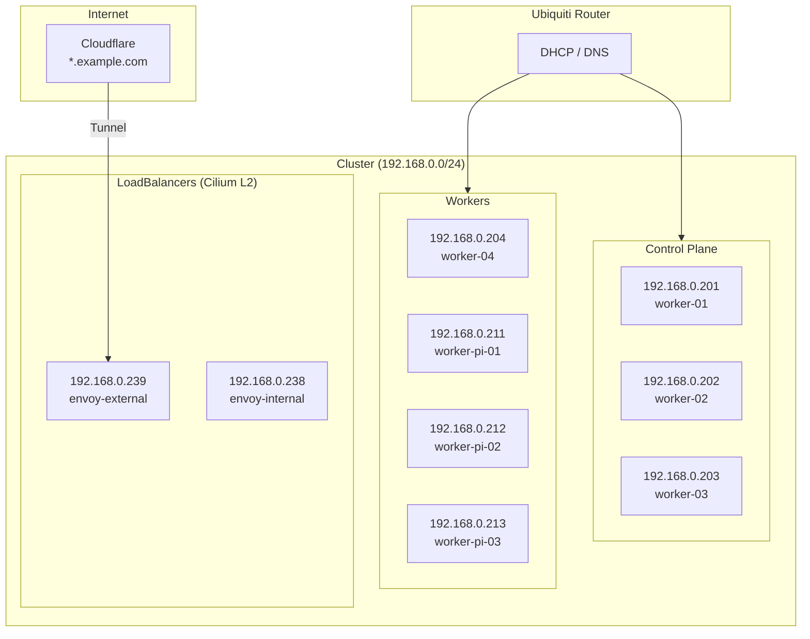
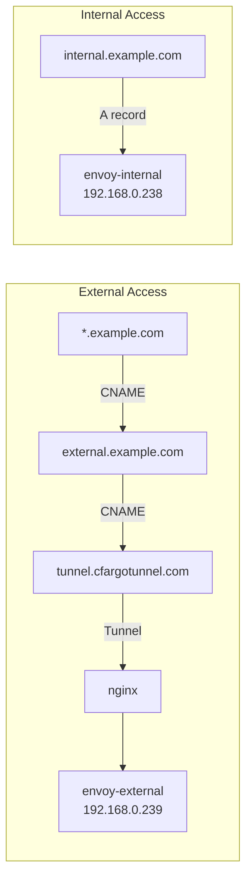

# IP Allocation

Complete IP address allocation and DNS record tables for the cluster.

---

## Node Addresses

| IP Address | Hostname | Role | Architecture |
|:-----------|:---------|:-----|:-------------|
| 192.168.0.200 | -- | Talos VIP (unused) | Virtual IP |
| 192.168.0.201 | worker-01 | Control Plane | ARM64 (Pi 4) |
| 192.168.0.202 | worker-02 | Control Plane | ARM64 (Pi 4) |
| 192.168.0.203 | worker-03 | Control Plane | AMD64 |
| 192.168.0.204 | worker-04 | Worker (Intel) | AMD64 |
| 192.168.0.211 | worker-pi-01 | Worker (Pi) | ARM64 |
| 192.168.0.212 | worker-pi-02 | Worker (Pi) | ARM64 |
| 192.168.0.213 | worker-pi-03 | Worker (Pi) | ARM64 |

---

## LoadBalancer IP Pool

The Cilium LBIPAM pool allocates LoadBalancer service IPs from the range `192.168.0.220-239`.

| IP Address | Service | Type |
|:-----------|:--------|:-----|
| 192.168.0.220-237 | Available | Cilium LBIPAM Pool |
| 192.168.0.238 | envoy-internal | Gateway |
| 192.168.0.239 | envoy-external | Gateway |

### Gateway Details

| Gateway | IP | Target Domain | Purpose |
|:--------|:---|:-------------|:--------|
| envoy-external | 192.168.0.239 | external.example.com | Receives traffic from Cloudflare tunnel via nginx |
| envoy-internal | 192.168.0.238 | internal.example.com | Receives traffic from LAN and Tailscale VPN |

---

## Network Diagram



---

## DNS Records

### Cloudflare-Managed Records

| Record | Type | Target | Proxied | Purpose |
|:-------|:-----|:-------|:--------|:--------|
| `*.example.com` | CNAME | `external.example.com` | Yes | Wildcard for all services |
| `external.example.com` | CNAME | `<tunnel-id>.cfargotunnel.com` | Yes | Cloudflare tunnel endpoint |
| `internal.example.com` | A | `192.168.0.238` | No | Internal gateway |

### Traffic Flow by Record



---

## Address Space Summary

| Range | Purpose | Count |
|:------|:--------|:------|
| 192.168.0.200 | Talos VIP | 1 |
| 192.168.0.201-203 | Control plane nodes | 3 |
| 192.168.0.204 | Intel/AMD worker | 1 |
| 192.168.0.205-210 | Reserved (future workers) | 6 |
| 192.168.0.211-213 | Raspberry Pi workers | 3 |
| 192.168.0.214-219 | Reserved (future Pi workers) | 6 |
| 192.168.0.220-239 | Cilium LBIPAM pool | 20 |

!!! note "DNS Interception"
    The Ubiquiti router intercepts all DNS traffic on port 53. To verify actual Cloudflare DNS records, use DNS over HTTPS (DoH):
    ```bash
    curl -sH 'accept: application/dns-json' \
      'https://cloudflare-dns.com/dns-query?name=echo.example.com&type=A' | jq
    ```
