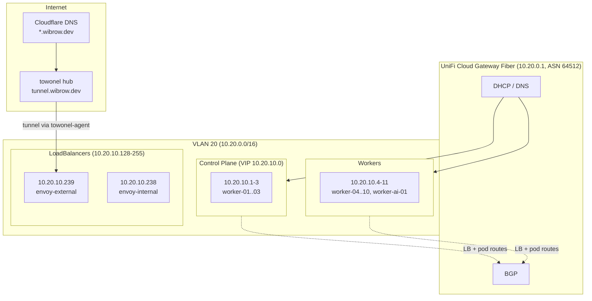
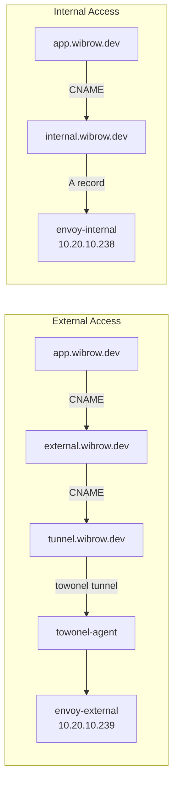

# IP Allocation

IP address allocation and DNS record tables for the cluster. Networks and DHCP reservations are managed in `terraform/unifi/`.

---

## Networks

| Network | VLAN | Subnet | DHCP range |
|:--------|:-----|:-------|:-----------|
| Default | untagged | `192.168.0.0/24` | `192.168.0.6` - `192.168.0.190` |
| home | 10 | `10.10.0.0/16` | `10.10.0.46` - `10.10.255.254` |
| servers | 20 | `10.20.0.0/16` | `10.20.200.1` - `10.20.255.254` |
| management | 50 | `10.50.0.0/24` | `10.50.0.6` - `10.50.0.254` |
| iot | 101 | `10.101.0.0/16` | `10.101.0.46` - `10.101.255.254` |

On VLAN 20, everything below `10.20.200.0` is static: nodes, the API VIP, the LoadBalancer pool, Multus pod IPs, and reservations. IPv6 comes from the Init7 delegated prefix `2a02:16a:2a0a::/56`: VLAN 20 is slice 2 (`2a02:16a:2a0a:2::/64`, nodes use SLAAC) and the LoadBalancer pool uses slice 3.

---

## Node Addresses

| IP Address | Hostname | Role | Architecture |
|:-----------|:---------|:-----|:-------------|
| 10.20.10.0 | -- | Kubernetes API VIP (control planes) | Virtual IP |
| 10.20.10.1 | worker-01 | Control Plane | AMD64 |
| 10.20.10.2 | worker-02 | Control Plane | AMD64 |
| 10.20.10.3 | worker-03 | Control Plane | AMD64 |
| 10.20.10.4 | worker-04 | Worker (Intel) | AMD64 |
| 10.20.10.5 | worker-05 | Worker (Intel) | AMD64 |
| 10.20.10.6 | worker-06 | Worker (Intel) | AMD64 |
| 10.20.10.7 | worker-07 | Worker (Dell R630) | AMD64 |
| 10.20.10.8 | worker-08 | Worker (Raspberry Pi 4) | ARM64 |
| 10.20.10.9 | worker-09 | Worker (Raspberry Pi 4) | ARM64 |
| 10.20.10.10 | worker-10 | Worker (Raspberry Pi 4) | ARM64 |
| 10.20.10.11 | worker-ai-01 | Worker (GPU) | AMD64 |

### Other Reservations

| IP Address | Host | Purpose |
|:-----------|:-----|:--------|
| 10.20.0.1 | UniFi Cloud Gateway Fiber | VLAN 20 gateway, DNS, BGP peer (ASN 64512) |
| 10.20.10.100 | `data` | Synology NAS (NFS) |
| 10.20.85.197 | `nut` | NUT server for the UPSes |
| 10.101.13.61 | `homeassistant` | Home Assistant OS (Pi 4) on the iot VLAN |
| 192.168.0.248 | netboot | PXE server on the untagged LAN (Multus `networking/lan`) |

---

## LoadBalancer IP Pool

Cilium LB-IPAM allocates LoadBalancer IPs from `10.20.10.128` - `10.20.10.255` (and `2a02:16a:2a0a:3::/112` for IPv6). Addresses are pinned per Service with the `lbipam.cilium.io/ips` annotation and announced over L2 (ARP) and BGP to the gateway. worker-ai-01 takes part in neither.

| IP Address | Namespace | Service |
|:-----------|:----------|:--------|
| 10.20.10.229 | media | jellyfin |
| 10.20.10.230 | dev | forgejo-ssh |
| 10.20.10.231 | dev | dev-desktop |
| 10.20.10.232 | dev | herdr-app |
| 10.20.10.233 | vms | omarchy |
| 10.20.10.234 | vms | dev |
| 10.20.10.235 | home-automation | frigate-webrtc-udp |
| 10.20.10.238 | networking | envoy-internal |
| 10.20.10.239 | networking | envoy-external |

### Gateway Details

| Gateway | IP | Target Domain | Purpose |
|:--------|:---|:--------------|:--------|
| envoy-external | 10.20.10.239 | external.wibrow.dev | Receives public traffic from the towonel agent |
| envoy-internal | 10.20.10.238 | internal.wibrow.dev | Receives traffic from the home network and Tailscale; also serves Kanidm LDAP on port 389 |

---

## Network Diagram


```mermaid
flowchart TB
    subgraph Internet
        CF[Cloudflare DNS<br/>*.wibrow.dev]
        Hub[towonel hub<br/>tunnel.wibrow.dev]
    end

    subgraph GW["UniFi Cloud Gateway Fiber (10.20.0.1, ASN 64512)"]
        DHCP[DHCP / DNS]
        BGP[BGP]
    end

    subgraph Cluster["VLAN 20 (10.20.0.0/16)"]
        subgraph ControlPlane["Control Plane (VIP 10.20.10.0)"]
            CP[10.20.10.1-3<br/>worker-01..03]
        end
        subgraph Workers["Workers"]
            W[10.20.10.4-11<br/>worker-04..10, worker-ai-01]
        end
        subgraph LB["LoadBalancers (10.20.10.128-255)"]
            EE[10.20.10.239<br/>envoy-external]
            EI[10.20.10.238<br/>envoy-internal]
        end
    end

    CF --> Hub
    Hub -->|tunnel via towonel-agent| EE
    DHCP --> ControlPlane
    DHCP --> Workers
    ControlPlane -.->|LB + pod routes| BGP
    Workers -.->|LB + pod routes| BGP
```

---

## DNS Records

### Cloudflare-Managed Records

| Record | Type | Target | Proxied | Purpose |
|:-------|:-----|:-------|:--------|:--------|
| `*.wibrow.dev` | CNAME | `tunnel.wibrow.dev` | No | Catch-all to the towonel edge (unmatched names hit the fallback 404 route) |
| `external.wibrow.dev` | CNAME | `tunnel.wibrow.dev` | No | Target for public app records |
| `internal.wibrow.dev` | A | `10.20.10.238` | No | Target for internal app records |
| `<app>.wibrow.dev` | CNAME | `external.wibrow.dev` or `internal.wibrow.dev` | No | Created by external-dns from each HTTPRoute |

The wildcard and `external` records come from the `towonel-agent` DNSEndpoint, `internal` from the `envoy-internal` DNSEndpoint. A second external-dns instance (`networking/external-dns-unifi`) publishes records to the UniFi gateway's local DNS.

### Traffic Flow by Record


```mermaid
flowchart LR
    subgraph External["External Access"]
        W1["app.wibrow.dev"] -->|CNAME| E1["external.wibrow.dev"]
        E1 -->|CNAME| T1["tunnel.wibrow.dev"]
        T1 -->|towonel tunnel| A1[towonel-agent]
        A1 --> EE1[envoy-external<br/>10.20.10.239]
    end

    subgraph Internal["Internal Access"]
        W3["app.wibrow.dev"] -->|CNAME| I3["internal.wibrow.dev"]
        I3 -->|A record| EI1[envoy-internal<br/>10.20.10.238]
    end
```

---

## Address Space Summary

| Range | Purpose |
|:------|:--------|
| 10.20.0.1 | Gateway |
| 10.20.10.0 | Kubernetes API VIP |
| 10.20.10.1 - 10.20.10.11 | Nodes |
| 10.20.10.100 | Synology NAS |
| 10.20.10.128 - 10.20.10.255 | Cilium LB-IPAM pool |
| 10.20.200.1 - 10.20.255.254 | DHCP |
| 10.244.0.0/16, fd10:244::/56 | Pod CIDRs (routable from the LAN via BGP, except on worker-ai-01) |
| 10.96.0.0/12, fd10:96::/112 | Service CIDRs |

> [!NOTE]
> **Checking public DNS**
>
> The UniFi gateway answers for local names, so to see what Cloudflare actually serves, use DNS over HTTPS (DoH):
> ```bash
> curl -sH 'accept: application/dns-json' \
>   'https://cloudflare-dns.com/dns-query?name=echo.wibrow.dev&type=CNAME' | jq
> ```
