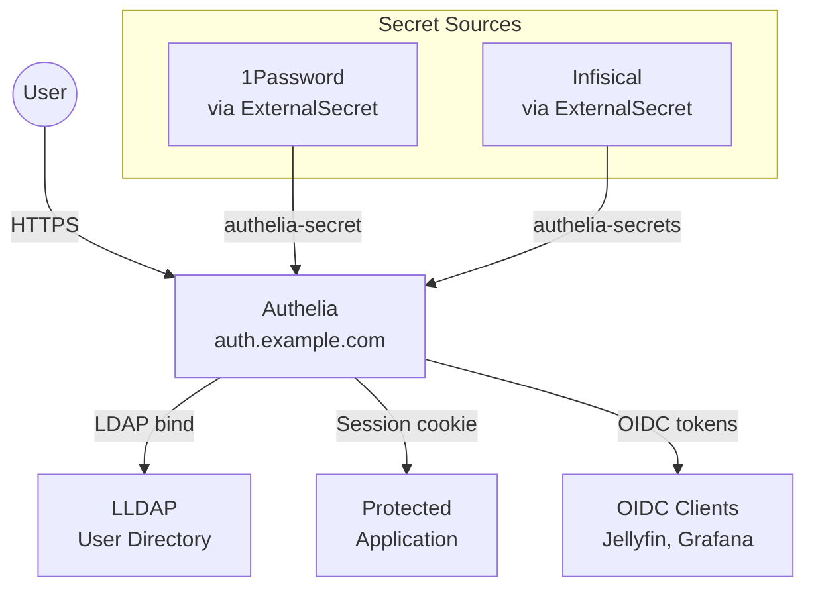

# Authelia

[Authelia](https://www.authelia.com/) is the single sign-on (SSO) portal for the cluster. It protects internal services behind authentication, provides an OpenID Connect (OIDC) identity provider for compatible applications, and integrates with LLDAP as its user directory backend.

## Architecture



## Deployment

Authelia is deployed via the [app-template](https://github.com/bjw-s-labs/helm-charts) Helm chart (v4.6.2) in the `security` namespace:

| Setting | Value |
|:--------|:------|
| Image | `ghcr.io/authelia/authelia:4.39.15` |
| Replicas | 1 |
| Listen port | 8080 |
| Metrics port | 9000 |
| Theme | Dark |
| URL | `https://auth.example.com` |

The application is exposed via the external Envoy gateway, making it accessible through the Cloudflare tunnel:

```yaml title="values.yaml (route section)"
route:
  app:
    enabled: true
    hostnames:
      - auth.example.com
    parentRefs:
      - name: envoy-external
        namespace: networking
        sectionName: https
```

## LDAP Backend

Authelia authenticates users against the [LLDAP](lldap.md) server running in the same namespace:

```yaml title="configuration.yaml (authentication_backend section)"
authentication_backend:
  ldap:
    address: ldap://lldap.security.svc.cluster.local:5389
    implementation: custom
    timeout: 5s
    start_tls: false
    base_dn: dc=example,dc=com
    additional_users_dn: ou=people
    users_filter: "(&({username_attribute}={input})(objectClass=person))"
    additional_groups_dn: ou=groups
    groups_filter: "(member={dn})"
    attributes:
      username: uid
      display_name: displayName
      mail: mail
      member_of: memberOf
      group_name: cn
```

The LDAP bind credentials (`LLDAP_BIND_USER_DN` and `LLDAP_BIND_PASSWORD`) are injected as environment variables from Infisical via an ExternalSecret.

## Access Control

The default access control policy is `one_factor`, meaning all protected services require at least a username and password:

```yaml title="configuration.yaml (access_control section)"
access_control:
  default_policy: one_factor
  rules:
    - domain:
        - actual.example.com
      subject:
        - ["group:auth_users"]
      policy: one_factor
    - domain:
        - jellyfin.example.com
      subject:
        - ["group:auth_users"]
      policy: one_factor
```

!!! info "Policy levels"
    Authelia supports three policy levels:

    - `bypass` -- No authentication required
    - `one_factor` -- Username and password
    - `two_factor` -- Username, password, and a second factor (TOTP, WebAuthn, or Duo)

## OIDC Provider

Authelia acts as an OpenID Connect identity provider, allowing applications to delegate authentication:

### Configured Clients

| Client | Client ID | Redirect URI | Scopes |
|:-------|:----------|:-------------|:-------|
| Jellyfin | (from 1Password) | `https://jellyfin.example.com/sso/OID/redirect/authelia` | openid, profile, groups |
| Grafana | `grafana` | `https://grafana.example.com/login/generic_oauth` | openid, profile, groups, email |

Both clients use PKCE with S256 challenge method for enhanced security.

!!! tip "Adding a new OIDC client"
    To add a new application as an OIDC client:

    1. Generate a client ID and secret, store them in 1Password
    2. Add the client configuration to `authelia/config/configuration.yaml` under `identity_providers.oidc.clients`
    3. Configure the application to use Authelia as its OIDC provider with the redirect URI

## Session Configuration

```yaml title="configuration.yaml (session section)"
session:
  same_site: lax
  inactivity: 5m
  expiration: 1h
  remember_me: 1M
  cookies:
    - name: session
      domain: example.com
      authelia_url: https://auth.example.com
      default_redirection_url: https://example.com
```

The session cookie is scoped to the `example.com` domain, enabling SSO across all subdomains.

## Storage

Authelia uses a local SQLite database for session and configuration storage:

```yaml
storage:
  local:
    path: "/config/db.sqlite3"
```

The database is persisted via a PVC to survive pod restarts.

## Secrets Management

Authelia receives secrets from two external sources:

| Secret | Source | Contains |
|:-------|:-------|:---------|
| `authelia-secret` | 1Password (via ExternalSecret) | OIDC keys, session secret, storage encryption key, JWT secret, client secrets |
| `authelia-secrets` | Infisical (via ExternalSecret) | LLDAP bind credentials |

The Authelia configuration file itself is rendered as a template by External Secrets, with secret values injected at sync time using `templateFrom`:

```yaml title="externalsecret.yaml (template rendering)"
spec:
  target:
    name: authelia-secret
    template:
      templateFrom:
        - configMap:
            name: authelia-configmap
            items:
              - key: configuration.yaml
                templateAs: Values
          target: Data
```

!!! note "Reloader integration"
    The deployment has `reloader.stakater.com/auto: "true"` annotation, so it automatically restarts when the referenced secrets or configmaps change.

## Monitoring

Authelia exposes Prometheus metrics on port 9000, scraped by a ServiceMonitor:

```yaml
serviceMonitor:
  app:
    serviceName: authelia
    endpoints:
      - port: metrics
        scheme: http
        path: /metrics
        interval: 1m
```
