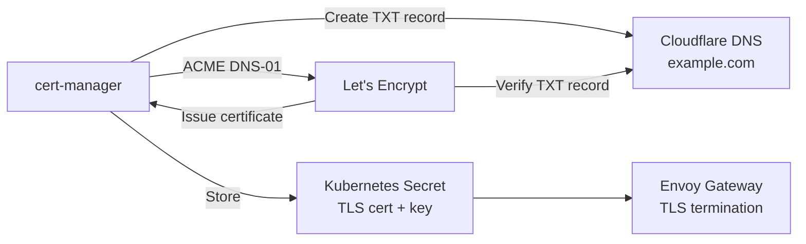
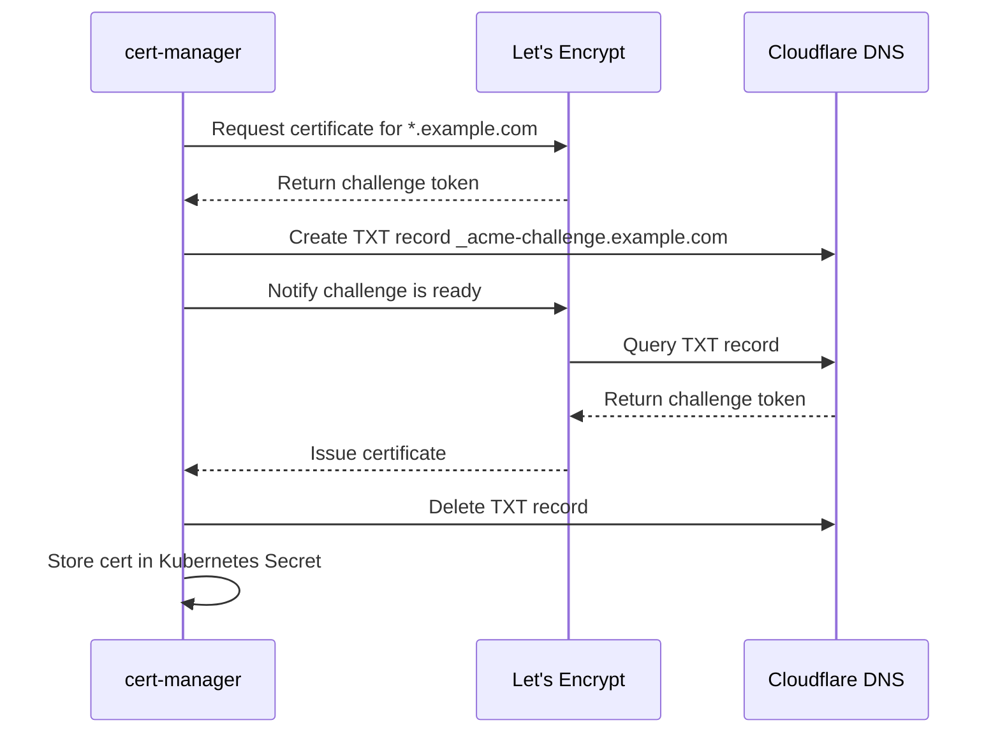

# cert-manager

[cert-manager](https://cert-manager.io/) automates TLS certificate management for the cluster. It obtains certificates from Let's Encrypt using ACME DNS-01 challenges via Cloudflare, enabling wildcard certificates for `*.example.com` without exposing any HTTP challenge endpoints.

## Architecture



## Deployment

cert-manager is deployed via its official Helm chart in the `cert-manager` namespace:

```yaml title="cert-manager/values.yaml"
global:
  leaderElection:
    namespace: cert-manager
crds:
  enabled: true
dns01RecursiveNameservers: https://1.1.1.1:443/dns-query,https://1.0.0.1:443/dns-query
dns01RecursiveNameserversOnly: true
prometheus:
  enabled: true
  servicemonitor:
    enabled: true
```

### Key Configuration

| Setting | Value | Purpose |
|:--------|:------|:--------|
| `dns01RecursiveNameservers` | Cloudflare DoH | Bypasses local DNS interception for ACME verification |
| `dns01RecursiveNameserversOnly` | `true` | Forces cert-manager to use only the specified resolvers |
| `crds.enabled` | `true` | CRDs managed by the Helm chart |

!!! info "Why DoH nameservers?"
    The Ubiquiti router intercepts DNS traffic on port 53. By configuring cert-manager to use Cloudflare's DNS-over-HTTPS endpoints (`1.1.1.1:443/dns-query`), DNS-01 challenge verification queries bypass the local DNS interception and reach Cloudflare directly.

## ClusterIssuers

Two ClusterIssuers are configured -- production and staging:

### Production

```yaml title="issuers/issuers.yaml"
apiVersion: cert-manager.io/v1
kind: ClusterIssuer
metadata:
  name: letsencrypt-production
spec:
  acme:
    server: https://acme-v02.api.letsencrypt.org/directory
    email: sam.wibrow.wa@gmail.com
    privateKeySecretRef:
      name: letsencrypt-production
    solvers:
      - dns01:
          cloudflare:
            apiTokenSecretRef:
              name: cert-manager-secret
              key: api-token
        selector:
          dnsZones:
            - "example.com"
```

### Staging

```yaml
apiVersion: cert-manager.io/v1
kind: ClusterIssuer
metadata:
  name: letsencrypt-staging
spec:
  acme:
    server: https://acme-staging-v02.api.letsencrypt.org/directory
    email: sam.wibrow.wa@gmail.com
    privateKeySecretRef:
      name: letsencrypt-staging
    solvers:
      - dns01:
          cloudflare:
            apiTokenSecretRef:
              name: cert-manager-secret
              key: api-token
        selector:
          dnsZones:
            - "example.com"
```

!!! tip "Use staging first"
    When testing new certificate configurations, use `letsencrypt-staging` to avoid hitting Let's Encrypt production rate limits. Staging certificates are not trusted by browsers but validate the entire ACME flow.

## Cloudflare API Token

The Cloudflare API token used for DNS-01 challenges is synced from Infisical via an ExternalSecret:

```yaml title="issuers/externalsecret.yaml"
apiVersion: external-secrets.io/v1
kind: ExternalSecret
metadata:
  name: cert-manager-secret
spec:
  secretStoreRef:
    kind: ClusterSecretStore
    name: infisical-cert-manager
  target:
    name: cert-manager-secret
  dataFrom:
    - find:
        name:
          regexp: .*
```

The token requires `Zone:DNS:Edit` permissions for the `example.com` zone in Cloudflare.

## How DNS-01 Challenge Works



The DNS-01 challenge method:

1. **Proves domain ownership** by creating a DNS TXT record
2. **Supports wildcards** -- unlike HTTP-01, DNS-01 can issue `*.example.com` certificates
3. **Works behind tunnels** -- no need to expose port 80 or 443 for challenge verification

## Requesting a Certificate

### Wildcard Certificate

```yaml
apiVersion: cert-manager.io/v1
kind: Certificate
metadata:
  name: wildcard-cert
  namespace: networking
spec:
  secretName: wildcard-cert-tls
  issuerRef:
    name: letsencrypt-production
    kind: ClusterIssuer
  dnsNames:
    - "example.com"
    - "*.example.com"
```

### Single-Domain Certificate

```yaml
apiVersion: cert-manager.io/v1
kind: Certificate
metadata:
  name: my-app-cert
  namespace: my-app
spec:
  secretName: my-app-tls
  issuerRef:
    name: letsencrypt-production
    kind: ClusterIssuer
  dnsNames:
    - "my-app.example.com"
```

## Internal PKI

In addition to Let's Encrypt certificates, cert-manager manages internal self-signed certificates for cluster components. For example, the [Snapshot Controller](../storage/backup-restore.md#snapshot-controller) webhook uses a self-signed CA chain:

```yaml
# Self-signed root issuer
apiVersion: cert-manager.io/v1
kind: Issuer
metadata:
  name: snapshot-controller-webhook-selfsign
spec:
  selfSigned: {}

# CA certificate (5-year duration)
apiVersion: cert-manager.io/v1
kind: Certificate
metadata:
  name: snapshot-controller-webhook-ca
spec:
  secretName: snapshot-controller-webhook-ca
  duration: 43800h
  isCA: true
  issuerRef:
    name: snapshot-controller-webhook-selfsign

# CA issuer for signing webhook certs
apiVersion: cert-manager.io/v1
kind: Issuer
metadata:
  name: snapshot-controller-webhook-ca
spec:
  ca:
    secretName: snapshot-controller-webhook-ca
```

## Troubleshooting

### Check Certificate Status

```bash
# List all certificates and their status
kubectl get certificates -A

# Describe a specific certificate for detailed status
kubectl describe certificate wildcard-cert -n networking

# Check certificate requests
kubectl get certificaterequests -A

# Check ACME orders and challenges
kubectl get orders -A
kubectl get challenges -A
```

### Common Issues

| Symptom | Likely Cause | Fix |
|:--------|:-------------|:----|
| Challenge stuck in `pending` | Cloudflare API token lacks `Zone:DNS:Edit` | Verify token permissions in Cloudflare dashboard |
| Challenge fails DNS propagation | Local DNS interception | Verify `dns01RecursiveNameserversOnly: true` is set |
| Rate limit hit | Too many production certificate requests | Use `letsencrypt-staging` for testing, wait for rate limit to reset |
| Certificate not renewing | cert-manager pod not running | Check `cert-manager` namespace for pod health |

!!! note "Automatic renewal"
    cert-manager automatically renews certificates before they expire (default: 30 days before expiry). No manual intervention is needed for routine renewals.

## Monitoring

cert-manager exports Prometheus metrics and is scraped via a ServiceMonitor:

```yaml
prometheus:
  enabled: true
  servicemonitor:
    enabled: true
```

Key metrics to monitor:

- `certmanager_certificate_expiration_timestamp_seconds` -- time until certificate expiry
- `certmanager_certificate_ready_status` -- whether certificates are in ready state
- `certmanager_http_acme_client_request_count` -- ACME API call volume
