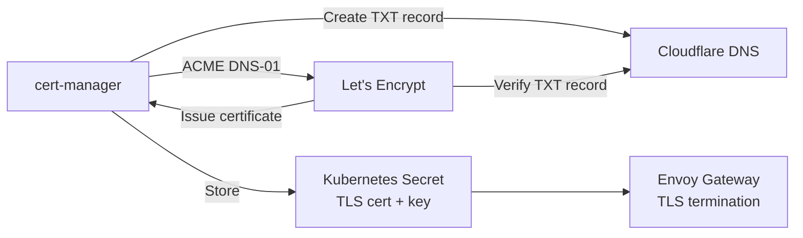
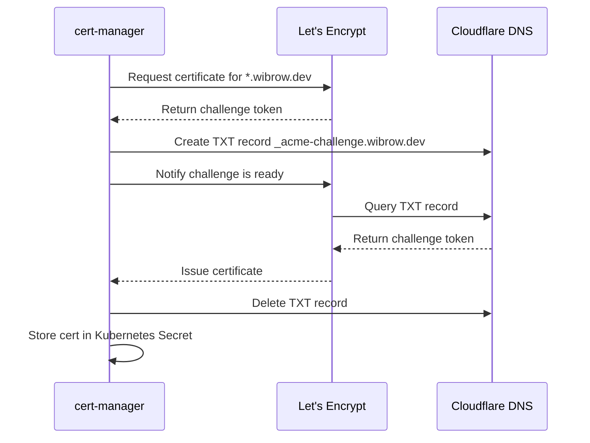

# cert-manager

[cert-manager](https://cert-manager.io/) automates TLS certificate management for the cluster. It obtains certificates from Let's Encrypt using ACME DNS-01 challenges via Cloudflare, enabling wildcard certificates for `wibrow.dev`, `propagit.dev` and `cloudsnacks.dev` without exposing any HTTP challenge endpoints.

## Architecture


```mermaid
flowchart LR
    CM[cert-manager] -->|ACME DNS-01| LE[Let's Encrypt]
    CM -->|Create TXT record| CF[Cloudflare DNS]
    LE -->|Verify TXT record| CF
    LE -->|Issue certificate| CM
    CM -->|Store| SEC[Kubernetes Secret\nTLS cert + key]
    SEC --> GW[Envoy Gateway\nTLS termination]
```

## Deployment

cert-manager (Helm chart `v1.21.2`) runs in the `cert-manager` namespace. Manifests: `kubernetes/apps/pitower/cert-manager/` (`cert-manager/` for the chart, `issuers/` for the ClusterIssuers and token).

```yaml title="cert-manager/values.yaml"
global:
  leaderElection:
    namespace: cert-manager
crds:
  enabled: true
dns01RecursiveNameservers: https://1.1.1.1:443/dns-query,https://1.0.0.1:443/dns-query
dns01RecursiveNameserversOnly: true
extraArgs:
  - --logging-format=json
prometheus:
  enabled: true
  servicemonitor:
    enabled: true
```

### Key Configuration

| Setting | Value | Purpose |
|:--------|:------|:--------|
| `dns01RecursiveNameservers` | Cloudflare DoH | Bypasses local DNS interception for ACME verification |
| `dns01RecursiveNameserversOnly` | `true` | Forces cert-manager to use only the specified resolvers |
| `crds.enabled` | `true` | CRDs managed by the Helm chart |

> [!NOTE]
> **Why DoH nameservers?**
>
> The Ubiquiti router intercepts DNS traffic on port 53. By configuring cert-manager to use Cloudflare's DNS-over-HTTPS endpoints (`1.1.1.1:443/dns-query`), DNS-01 challenge verification queries bypass the local DNS interception and reach Cloudflare directly.

## ClusterIssuers

Two ClusterIssuers are configured, production and staging, both solving DNS-01 for the three zones:

### Production

```yaml title="issuers/issuers.yaml"
apiVersion: cert-manager.io/v1
kind: ClusterIssuer
metadata:
  name: letsencrypt-production
spec:
  acme:
    server: https://acme-v02.api.letsencrypt.org/directory
    email: sam.wibrow.wa@gmail.com
    privateKeySecretRef:
      name: letsencrypt-production
    solvers:
      - dns01:
          cloudflare:
            apiTokenSecretRef:
              name: cert-manager-secret
              key: api-token
        selector:
          dnsZones:
            - "wibrow.dev"
            - "propagit.dev"
            - "cloudsnacks.dev"
```

### Staging

`letsencrypt-staging` is identical except for `server: https://acme-staging-v02.api.letsencrypt.org/directory` and `privateKeySecretRef: letsencrypt-staging`.

> [!TIP]
> **Use staging first**
>
> When testing new certificate configurations, use `letsencrypt-staging` to avoid hitting Let's Encrypt production rate limits. Staging certificates are not trusted by browsers but validate the entire ACME flow.

## Cloudflare API Token

The Cloudflare API token used for DNS-01 challenges is synced from Infisical via an ExternalSecret:

```yaml title="issuers/externalsecret.yaml"
apiVersion: external-secrets.io/v1
kind: ExternalSecret
metadata:
  name: cert-manager-secret
spec:
  secretStoreRef:
    kind: ClusterSecretStore
    name: infisical-cert-manager
  target:
    name: cert-manager-secret
  dataFrom:
    - find:
        name:
          regexp: .*
```

The token lives in Infisical under `/cert-manager` and needs `Zone:DNS:Edit` on each of the three zones.

## How DNS-01 Challenge Works


```mermaid
sequenceDiagram
    participant CM as cert-manager
    participant LE as Let's Encrypt
    participant CF as Cloudflare DNS

    CM->>LE: Request certificate for *.wibrow.dev
    LE-->>CM: Return challenge token
    CM->>CF: Create TXT record _acme-challenge.wibrow.dev
    CM->>LE: Notify challenge is ready
    LE->>CF: Query TXT record
    CF-->>LE: Return challenge token
    LE-->>CM: Issue certificate
    CM->>CF: Delete TXT record
    CM->>CM: Store cert in Kubernetes Secret
```

The DNS-01 challenge method:

1. **Proves domain ownership** by creating a DNS TXT record
2. **Supports wildcards**: unlike HTTP-01, DNS-01 can issue wildcard certificates
3. **Works behind the tunnel**: no need to expose port 80 or 443 for challenge verification

## Certificates in the Cluster

| Certificate | Namespace | Names | Used By |
|:------------|:----------|:------|:--------|
| `wibrow-dev-production` | networking | `wibrow.dev`, `*.wibrow.dev` | Both Envoy gateways |
| `propagit-dev-production` | networking | `propagit.dev`, `*.propagit.dev` | `envoy-external` |
| `cloudsnacks-apps-production` | networking | `*.apps.cloudsnacks.dev`, `api.pantry.cloudsnacks.dev` | `envoy-external` |
| `pitwall-cloudsnacks-dev-production` | networking | `pitwall.cloudsnacks.dev` | `envoy-external` |
| `kanidm-tls` | security | `idm.wibrow.dev` | Kanidm (terminates TLS itself) |

The gateway certificates are in `kubernetes/apps/pitower/networking/envoy-gateway/certificate.yaml`. A wildcard covers one label only, so a deeper name such as `*.apps.cloudsnacks.dev` needs its own SAN.

```yaml
apiVersion: cert-manager.io/v1
kind: Certificate
metadata:
  name: my-app-tls
  namespace: my-app
spec:
  secretName: my-app-tls
  issuerRef:
    name: letsencrypt-production
    kind: ClusterIssuer
  dnsNames:
    - "my-app.wibrow.dev"
```

cert-manager also issues webhook serving certificates for charts that ask for it, such as `amazon-eks-pod-identity-webhook` (`pki.certManager.enabled: true`).

## Troubleshooting

### Check Certificate Status

```bash
# List all certificates and their status
kubectl get certificates -A

# Describe a specific certificate for detailed status
kubectl describe certificate wibrow-dev-production -n networking

# Check certificate requests
kubectl get certificaterequests -A

# Check ACME orders and challenges
kubectl get orders -A
kubectl get challenges -A
```

### Common Issues

| Symptom | Likely Cause | Fix |
|:--------|:-------------|:----|
| Challenge stuck in `pending` | Cloudflare API token lacks `Zone:DNS:Edit` | Verify token permissions in Cloudflare dashboard |
| Challenge fails DNS propagation | Local DNS interception | Verify `dns01RecursiveNameserversOnly: true` is set |
| Rate limit hit | Too many production certificate requests | Use `letsencrypt-staging` for testing, wait for rate limit to reset |
| Certificate not renewing | cert-manager pod not running | Check `cert-manager` namespace for pod health |

> [!NOTE]
> **Automatic renewal**
>
> cert-manager automatically renews certificates before they expire (default: 30 days before expiry). No manual intervention is needed for routine renewals.

## Monitoring

cert-manager exports Prometheus metrics and is scraped via a ServiceMonitor:

```yaml
prometheus:
  enabled: true
  servicemonitor:
    enabled: true
```

Key metrics to monitor:

- `certmanager_certificate_expiration_timestamp_seconds` -- time until certificate expiry
- `certmanager_certificate_ready_status` -- whether certificates are in ready state
- `certmanager_http_acme_client_request_count` -- ACME API call volume
