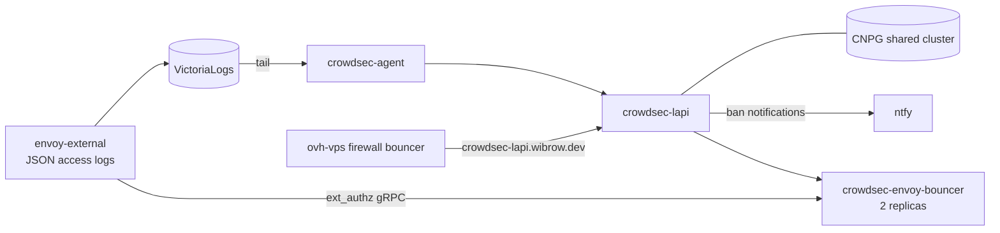

# CrowdSec

[CrowdSec](https://www.crowdsec.net/) detects abusive clients from the `envoy-external` access logs and bans them at the gateway and on the tunnel VPS.

Manifests: `kubernetes/apps/pitower/security/crowdsec/` (charts `crowdsec` `0.24.2` and `envoy-proxy-bouncer` `0.8.1`, namespace `security`).

## Architecture



## Components

| Component | Role |
|:----------|:-----|
| `crowdsec-agent` | Single Deployment (no DaemonSet, no hostPath). Tails `envoy-external` container logs from VictoriaLogs and parses the Envoy JSON format with custom parsers; scenarios from `crowdsecurity/base-http-scenarios` |
| `crowdsec-lapi` | Local API with the online API disabled. Stores state in the shared CNPG cluster (`cnpg-db-shared` component) |
| `crowdsec-envoy-bouncer` | ext_authz service that enforces decisions on `envoy-external` |
| `crowdsec-home-allowlist` | CronJob that keeps the current home WAN addresses in the LAPI `home` allowlist, looked up at runtime so the home IP never lands in this public repo |

Decisions are 4h IP bans (`profiles.yaml`), each also sent to ntfy (`pitower-alerts` topic). A `CrowdSecAcquisitionStalled` PrometheusRule alerts when the agent stops reading logs.

## Allowlists

- `pitower/infra-allowlist`: the tunnel VPS (`164.132.98.136`), whose monitoring trips `http-bad-user-agent`.
- `pitower/cloudflare-allowlist`: Cloudflare edge and Workers ranges, since Cloudflare-proxied requests reach Envoy from Cloudflare's addresses rather than the real client's.
- `home`: maintained by the CronJob above.

## Enforcement on Envoy

`networking/envoy-gateway/securitypolicy.yaml` attaches the bouncer to the whole `envoy-external` Gateway with `failOpen: true`, so a bouncer outage does not take public apps down. A ReferenceGrant lets the policy in `networking` reach the bouncer Service in `security`.

The bouncer bans on the rightmost `X-Forwarded-For` entry, which Envoy appends from the PROXY protocol source address, so clients cannot spoof it. `envoy-external` deliberately trusts no XFF hops for this reason.

> [!WARNING]
> **Route-level SecurityPolicies**
>
> A route on `envoy-external` with its own SecurityPolicy must set `mergeType: StrategicMerge`, otherwise it replaces the gateway policy and skips the bouncer.

## VPS Firewall Bouncer

The ovh-vps runs a firewall bouncer that drops banned IPs in nftables before they reach Caddy and the tunnel. It pulls decisions from `crowdsec-lapi.wibrow.dev` on `envoy-external`, where only `/v1/decisions` and `/v1/usage-metrics` are routed and a route SecurityPolicy allows only the VPS's own IPv4.

## Secrets

The LAPI secret and the bouncer keys (envoy and VPS) are generated once in-cluster by External Secrets `Password` generators (`refreshInterval: "0"`), because the chart's own random secret would re-roll on every ArgoCD render. The ntfy password and the UniFi API key used by the allowlist CronJob come from Infisical; the database credentials come from the `cnpg-secrets-database` store. The VPS bouncer key is copied to `ansible/roles/crowdsec-firewall-bouncer/vars/secrets.sops.yaml`.

## Troubleshooting

```bash
kubectl -n security get pods | grep crowdsec

# Active decisions
kubectl -n security exec deploy/crowdsec-lapi -- cscli decisions list

# Remove a ban
kubectl -n security exec deploy/crowdsec-lapi -- cscli decisions delete --ip <ip>

# Is the agent parsing anything?
kubectl -n security exec deploy/crowdsec-agent -- cscli metrics
```
