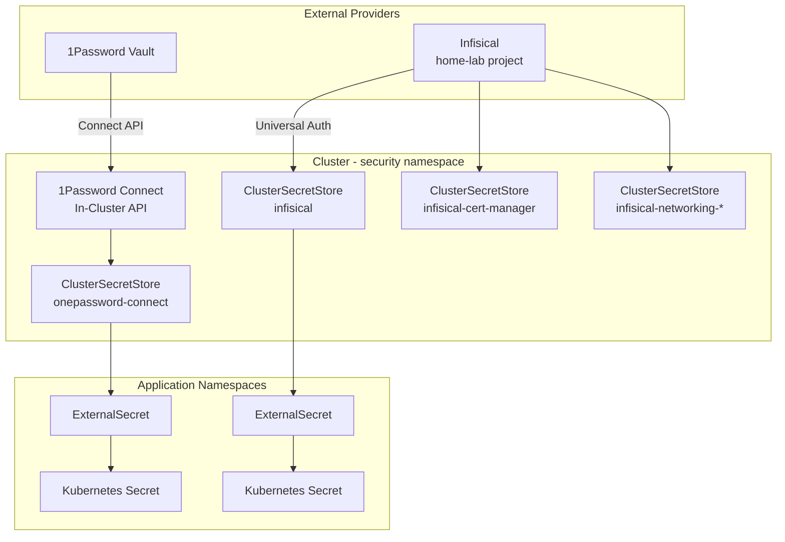
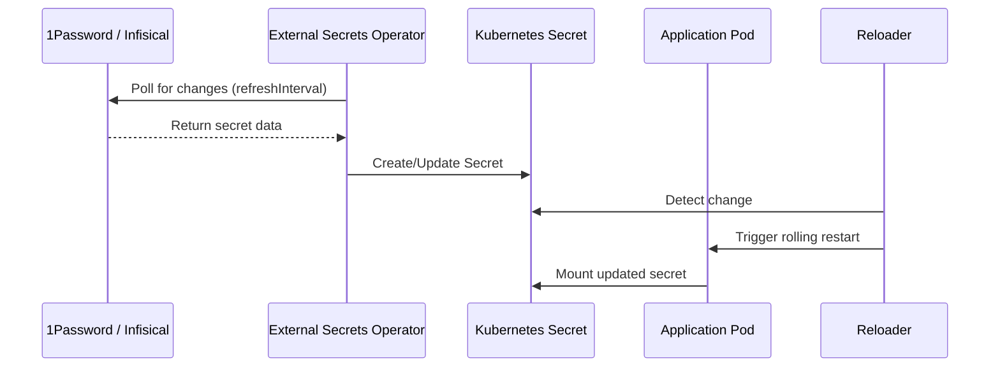

# External Secrets

[External Secrets Operator](https://external-secrets.io/) (ESO) syncs secrets from external providers into Kubernetes `Secret` resources. The cluster uses two secret backends -- **1Password Connect** for application secrets and **Infisical** for infrastructure secrets -- connected through `ClusterSecretStore` resources.

## Architecture



## Components

### External Secrets Operator

The operator is deployed via Helm in the `security` namespace:

```yaml title="operator/values.yaml"
installCRDs: true
replicaCount: 1
leaderElect: true
grafana:
  enabled: true
serviceMonitor:
  enabled: true
  interval: 1m
```

All sub-controllers (background, cleanup, reports) have ServiceMonitors enabled for Prometheus scraping.

### 1Password Connect

[1Password Connect](https://developer.1password.com/docs/connect/) runs as an in-cluster API server that provides authenticated access to the 1Password vault:

```yaml title="1password-connect/values.yaml"
connect:
  create: true
operator:
  create: false
```

It is deployed via the official 1Password Connect Helm chart (v2.2.1). The connect server credentials (`1password-credentials.json` and token) are stored as SOPS-encrypted secrets in the repository.

!!! info "Why in-cluster?"
    Running 1Password Connect inside the cluster avoids external API calls for every secret sync. The connect server caches vault data locally and serves it to External Secrets over the cluster network.

---

## ClusterSecretStores

### 1Password Store

The `onepassword-connect` ClusterSecretStore connects to the in-cluster 1Password Connect server:

```yaml title="stores/onepassword/clustersecretstore.yaml"
apiVersion: external-secrets.io/v1
kind: ClusterSecretStore
metadata:
  name: onepassword-connect
spec:
  provider:
    onepassword:
      connectHost: http://onepassword-connect:8080
      vaults:
        pitower: 1
      auth:
        secretRef:
          connectTokenSecretRef:
            name: onepassword-connect-token
            key: token
            namespace: security
```

### Infisical Stores

Multiple Infisical ClusterSecretStores provide scoped access to different secret paths:

| Store Name | Secrets Path | Used By |
|:-----------|:-------------|:--------|
| `infisical` | `/` (root, recursive) | General application secrets |
| `infisical-cert-manager` | `/cert-manager` | Cloudflare API token for DNS-01 challenges |
| `infisical-networking-cloudflared` | `/networking/cloudflared` | Cloudflare tunnel credentials |
| `infisical-networking-external-dns` | `/networking/external-dns` | External DNS Cloudflare token |
| `infisical-networking-tailscale` | `/networking/tailscale` | Tailscale auth key |

All Infisical stores authenticate using Universal Auth credentials stored in the `universal-auth-credentials` secret (SOPS-encrypted in Git):

```yaml title="stores/infisical/clustersecretstore.yaml (example)"
apiVersion: external-secrets.io/v1
kind: ClusterSecretStore
metadata:
  name: infisical
spec:
  provider:
    infisical:
      hostAPI: https://eu.infisical.com
      auth:
        universalAuthCredentials:
          clientId:
            key: clientId
            namespace: security
            name: universal-auth-credentials
          clientSecret:
            key: clientSecret
            namespace: security
            name: universal-auth-credentials
      secretsScope:
        projectSlug: home-lab-iwi-y
        environmentSlug: prod
        secretsPath: /
        recursive: true
```

---

## ExternalSecret Pattern

Applications reference a `ClusterSecretStore` to sync secrets into their namespace. Here is the typical pattern:

### Simple Key Extraction

Pull all fields from a 1Password item into a Kubernetes secret:

```yaml
apiVersion: external-secrets.io/v1
kind: ExternalSecret
metadata:
  name: my-app
  namespace: my-app
spec:
  refreshInterval: 5m
  secretStoreRef:
    kind: ClusterSecretStore
    name: onepassword-connect
  target:
    name: my-app-secret
    creationPolicy: Owner
  dataFrom:
    - extract:
        key: my-app  # 1Password item name
```

### Templated Secrets

Combine external secret values with templates to produce configuration files:

```yaml
apiVersion: external-secrets.io/v1
kind: ExternalSecret
metadata:
  name: my-app-config
spec:
  secretStoreRef:
    kind: ClusterSecretStore
    name: onepassword-connect
  target:
    name: my-app-config
    template:
      data:
        config.yaml: |
          database_url: postgres://{{ .db_user }}:{{ .db_pass }}@db:5432/myapp
          api_key: {{ .api_key }}
  dataFrom:
    - extract:
        key: my-app
```

### Rewriting Keys

Prefix keys from external sources to avoid naming collisions:

```yaml
dataFrom:
  - extract:
      key: my-app
    rewrite:
      - regexp:
          source: "(.*)"
          target: "myapp_$1"
```

---

## Secret Lifecycle



!!! tip "Refresh intervals"
    Most ExternalSecrets use a `refreshInterval` of `5m`. This means changes in 1Password or Infisical propagate to the cluster within 5 minutes. For critical secrets, this can be reduced to `1m`.

## Monitoring

The operator exposes Grafana dashboards and Prometheus metrics:

- **ServiceMonitor** on the main operator and all sub-controllers
- **Grafana dashboard** auto-provisioned (`grafana.enabled: true`)
- Alerts can be configured based on `externalsecret_sync_calls_error` and `externalsecret_status_condition` metrics
