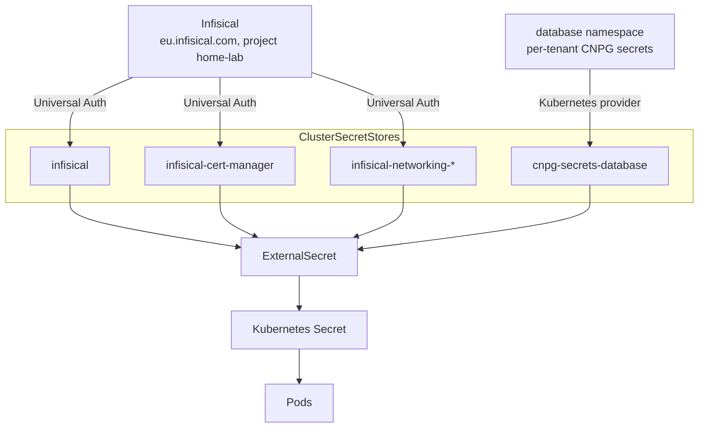
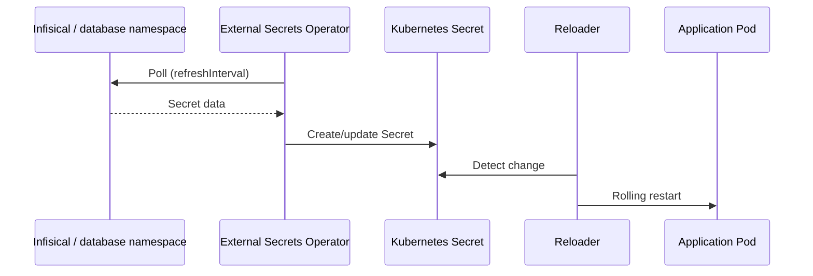

# External Secrets

[External Secrets Operator](https://external-secrets.io/) (ESO, Helm chart `2.12.0`, namespace `security`) syncs secrets into Kubernetes `Secret` resources. App secrets come from **Infisical**; database credentials come from **CNPG** secrets in the `database` namespace through a Kubernetes-provider store. A few secrets are generated in-cluster with ESO generators.

## Architecture


```mermaid
flowchart TD
    INF[Infisical<br/>eu.infisical.com, project home-lab]
    DB[database namespace<br/>per-tenant CNPG secrets]

    subgraph Stores["ClusterSecretStores"]
        CSS1[infisical]
        CSS2[infisical-cert-manager]
        CSS3[infisical-networking-*]
        CSS4[cnpg-secrets-database]
    end

    INF -->|Universal Auth| CSS1 & CSS2 & CSS3
    DB -->|Kubernetes provider| CSS4

    CSS1 & CSS2 & CSS3 & CSS4 --> ES[ExternalSecret] --> KS[Kubernetes Secret] --> Pod[Pods]
```

## Operator

`kubernetes/apps/pitower/security/external-secrets/operator/values.yaml`:

```yaml
installCRDs: true
replicaCount: 1
leaderElect: true
grafana:
  enabled: true
serviceMonitor:
  enabled: true
  interval: 1m
```

The background, cleanup and reports controllers have ServiceMonitors too.

## ClusterSecretStores

### Infisical

Defined in `stores/infisical/clustersecretstore.yaml`. All of them use `hostAPI: https://eu.infisical.com`, project `home-lab-iwi-y`, environment `prod`, `recursive: true`:

| Store | `secretsPath` | Used By |
|:------|:--------------|:--------|
| `infisical` | `/` | Everything else; ExternalSecrets usually reference absolute keys like `/category/app/SECRET_NAME` |
| `infisical-cert-manager` | `/cert-manager` | Cloudflare token for DNS-01 |
| `infisical-networking-external-dns` | `/networking/external-dns` | Cloudflare token for external-dns |
| `infisical-networking-towonel-agent` | `/networking/towonel-agent` | towonel invite token |
| `infisical-networking-tailscale` | `/networking/tailscale` | Tailscale operator OAuth client |

They authenticate with Universal Auth credentials from the `security/universal-auth-credentials` Secret. That Secret is the one bootstrap credential: it lives SOPS-encrypted in `stores/infisical/secret.sops.yaml`, is not part of the kustomization, and is applied by hand (see [SOPS](sops.md)).

### CNPG

`cnpg-secrets-database` (`kubernetes/apps/pitower/database/clustersecretstore/`) uses the Kubernetes provider to read Secrets from the `database` namespace, authenticating as the `database/external-secrets-pg` ServiceAccount (read-only on Secrets). Apps consume it through the `kubernetes/components/cnpg-db-shared` component, which templates `DB_HOST`, `DB_PORT`, `DB_USER`, `DB_PASS`, `DB_NAME` and `DB_URL` from a per-tenant source Secret.

### ClusterExternalSecret: `ghcr-pull-secret`

`ghcr-pull-secret/clusterexternalsecret.yaml` fans a `ghcr.io` dockerconfigjson (token from Infisical `/security/ghcr/token`) out to every namespace except `kube-system`, `kube-public` and `kube-node-lease`, so any workload can use `imagePullSecrets: [ghcr-pull-secret]`.

## ExternalSecret Patterns

### Whole path

Pull every key under a scoped store's path (used by the networking and cert-manager stores):

```yaml
apiVersion: external-secrets.io/v1
kind: ExternalSecret
metadata:
  name: external-dns-secret
spec:
  secretStoreRef:
    kind: ClusterSecretStore
    name: infisical-networking-external-dns
  target:
    name: external-dns-secret
  dataFrom:
    - find:
        name:
          regexp: .*
```

### Single keys

Reference absolute Infisical paths through the root store:

```yaml
spec:
  secretStoreRef:
    kind: ClusterSecretStore
    name: infisical
  target:
    name: external-dns-unifi-secret
    creationPolicy: Owner
  data:
    - secretKey: api-key
      remoteRef:
        key: /networking/external-dns-unifi/api-key
```

### Generated secrets

For secrets nothing external needs to know, a `generators.external-secrets.io` `Password` generator with `refreshInterval: "0"` creates a value once and keeps it (e.g. the CrowdSec LAPI and bouncer keys).

## Secret Lifecycle


```mermaid
sequenceDiagram
    participant Src as Infisical / database namespace
    participant ESO as External Secrets Operator
    participant KS as Kubernetes Secret
    participant RL as Reloader
    participant Pod as Application Pod

    ESO->>Src: Poll (refreshInterval)
    Src-->>ESO: Secret data
    ESO->>KS: Create/update Secret
    RL->>KS: Detect change
    RL->>Pod: Rolling restart
```

Controllers that consume secrets carry `reloader.stakater.com/auto: "true"`.

## Adding an Infisical Secret from the CLI

The `infisical` just module wraps the CLI with the project settings from `mise.toml` (`INFISICAL_DOMAIN`, `INFISICAL_PROJECT_ID`, environment `prod`). Values are read from stdin or a hidden prompt, never from a command-line argument, so they stay out of shell history.

```bash
just infisical ls /ai/agentgateway                          # names only
just infisical set /ai/agentgateway UI_OIDC_CLIENT_SECRET   # prompts for the value
some-command | just infisical set /ai/agentgateway API_KEY  # or pipe it in
```

The path mirrors the `remoteRef.key` of the ExternalSecret that consumes it (`/category/app/NAME`). To pick the new value up before the next refresh:

```bash
just k8s es-sync ai agentgateway-ui-oidc
```

> [!NOTE]
> **`INFISICAL_TOKEN`**
>
> The recipes run the CLI with `INFISICAL_TOKEN` unset: a stale token in the environment overrides the `infisical login` session and fails with a confusing 404.

## Troubleshooting

```bash
kubectl get clustersecretstores          # all should be Valid / Ready
kubectl get externalsecrets -A | grep -v SecretSynced
kubectl describe externalsecret <name> -n <namespace>
```
