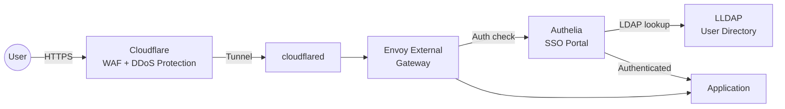
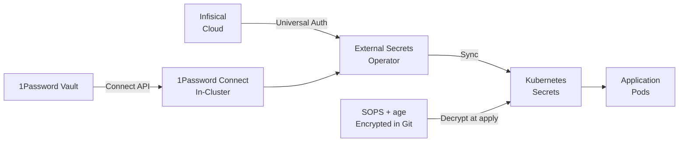

# Security

The cluster follows a defense-in-depth approach, layering multiple security controls from the network edge to individual application secrets. External traffic is filtered by Cloudflare before reaching the cluster, authenticated by Authelia SSO, and served over TLS certificates issued by cert-manager. Secrets are encrypted at rest in Git with SOPS and synced into the cluster via External Secrets Operator.

## Request Flow

## Secrets Flow

## Security Layers

| Layer | Technology | Purpose |
|:------|:-----------|:--------|
| Edge protection | Cloudflare WAF | DDoS mitigation, bot protection, web application firewall |
| Transport | Cloudflare Tunnel | Encrypted tunnel without exposing ports to the internet |
| TLS termination | cert-manager + Let's Encrypt | Automated wildcard certificates for `*.example.com` |
| Authentication | Authelia | Single sign-on portal with OIDC provider capabilities |
| User directory | LLDAP | Lightweight LDAP server for user and group management |
| Secret management | External Secrets + 1Password | Automated sync from 1Password vault to Kubernetes secrets |
| Secret management | External Secrets + Infisical | Automated sync from Infisical cloud to Kubernetes secrets |
| Encryption at rest | SOPS + age | Git-committed secrets encrypted with age keys |
| Network policy | Cilium | eBPF-based network policies for pod-to-pod traffic control |

## Components

| Component | Namespace | Description |
|:----------|:----------|:------------|
| [Authelia](authelia.md) | `security` | SSO portal and OIDC provider |
| [LLDAP](lldap.md) | `security` | Lightweight LDAP user directory |
| [External Secrets](external-secrets.md) | `security` | Operator that syncs secrets from external stores |
| [1Password Connect](external-secrets.md#1password-connect) | `security` | In-cluster 1Password API server |
| [SOPS](sops.md) | N/A (CLI tool) | Encrypts secrets in the Git repository |
| [cert-manager](cert-manager.md) | `cert-manager` | TLS certificate management via ACME |

## Sections

| Page | Description |
|:-----|:------------|
| [Authelia](authelia.md) | SSO portal, OIDC configuration, access control policies |
| [LLDAP](lldap.md) | Lightweight LDAP server, user and group management |
| [External Secrets](external-secrets.md) | 1Password Connect and Infisical backends, ClusterSecretStore patterns |
| [SOPS](sops.md) | age encryption, `.sops.yaml` configuration, encrypt/decrypt workflows |
| [cert-manager](cert-manager.md) | Let's Encrypt ACME, DNS-01 challenge, ClusterIssuer configuration |

## Key Design Decisions

- **Two secret backends** -- 1Password Connect serves application secrets from the the 1Password vault, while Infisical handles infrastructure secrets (Cloudflare tokens, Tailscale keys). This separation of concerns allows different access controls per category.
- **SOPS for bootstrap secrets** -- Secrets needed before External Secrets is running (e.g., 1Password Connect credentials, Infisical auth) are encrypted with SOPS and committed to Git.
- **DNS-01 challenges** -- cert-manager uses Cloudflare DNS-01 challenges instead of HTTP-01, enabling wildcard certificates and working behind the Cloudflare tunnel without exposing challenge endpoints.
- **LDAP over embedded users** -- LLDAP provides a central user directory that both Authelia and other services can query, avoiding duplicated user management.
