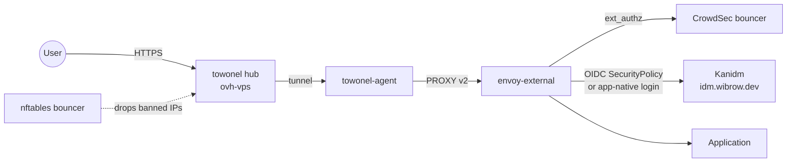
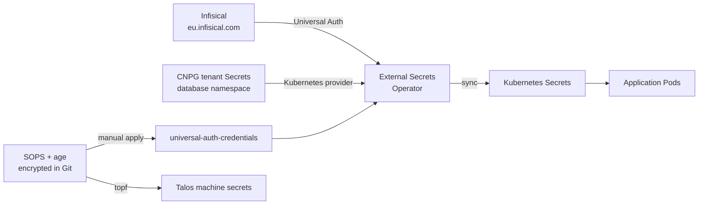

# Security

Security is layered from the edge to individual secrets. Public traffic arrives through the self-hosted towonel tunnel (no inbound ports, home IP unpublished), is screened by CrowdSec on `envoy-external`, and is served over Let's Encrypt certificates from cert-manager. Kanidm is the identity provider for OIDC and LDAP. Secrets live in Infisical and are synced by External Secrets; the few that must be in Git are encrypted with SOPS and age.

## Request Flow

```mermaid
flowchart LR
    User((User)) -->|HTTPS| Hub[towonel hub<br/>ovh-vps]
    VPSB[nftables bouncer] -.->|drops banned IPs| Hub
    Hub -->|tunnel| TA[towonel-agent]
    TA -->|PROXY v2| EE[envoy-external]
    EE -->|ext_authz| CS[CrowdSec bouncer]
    EE -->|OIDC SecurityPolicy<br/>or app-native login| K[Kanidm<br/>idm.wibrow.dev]
    EE --> APP[Application]
```

## Secrets Flow

```mermaid
flowchart LR
    INF[Infisical<br/>eu.infisical.com] -->|Universal Auth| ESO[External Secrets<br/>Operator]
    DB[CNPG tenant Secrets<br/>database namespace] -->|Kubernetes provider| ESO
    ESO -->|sync| KS[Kubernetes Secrets]
    KS --> APP[Application Pods]

    SOPS[SOPS + age<br/>encrypted in Git] -->|manual apply| UAC[universal-auth-credentials]
    UAC --> ESO
    SOPS -->|topf| Talos[Talos machine secrets]
```

## Security Layers

| Layer | Technology | Purpose |
|:------|:-----------|:--------|
| Transport | [towonel tunnel](../networking/towonel-tunnel.md) | Outbound-only tunnel, SNI passthrough, no port forwards |
| Intrusion prevention | [CrowdSec](crowdsec.md) | Bans abusive IPs at `envoy-external` and on the VPS firewall |
| TLS | [cert-manager](cert-manager.md) + Let's Encrypt | DNS-01 certificates for `wibrow.dev`, `propagit.dev`, `cloudsnacks.dev` |
| Identity | [Kanidm](kanidm.md) | Users and groups, OAuth2/OIDC provider, LDAPS |
| Kubernetes API auth | Kanidm via Talos `KubeAuthenticationConfig` | OIDC logins (Headlamp), RBAC on `oidc:` groups |
| Secret management | [External Secrets](external-secrets.md) | Infisical and CNPG ClusterSecretStores |
| Secrets in Git | [SOPS](sops.md) + age | Talos secrets (via topf) and bootstrap Secrets |
| Cloud access | aws-identity-webhook | Projected service account tokens for AWS IAM roles |

## Components

| Component | Namespace | Description |
|:----------|:----------|:------------|
| [Kanidm](kanidm.md) | `security` | Identity provider (OIDC, LDAPS) at `idm.wibrow.dev` |
| [OIDC Clients](oidc-clients.md) | n/a | How apps are registered as Kanidm OAuth2 clients |
| [CrowdSec](crowdsec.md) | `security` | Log-based detection, Envoy and VPS bouncers |
| [External Secrets](external-secrets.md) | `security` | Syncs secrets from Infisical and CNPG |
| [SOPS](sops.md) | n/a (CLI) | Encrypts secrets committed to Git |
| [cert-manager](cert-manager.md) | `cert-manager` | ACME certificates via Cloudflare DNS-01 |
| aws-identity-webhook | `security` | EKS pod identity webhook for IRSA-style AWS access |
| rbac | n/a | `cluster-admin` for the Kanidm `apps` group |

## AWS Identity Webhook

`kubernetes/apps/pitower/security/aws-identity-webhook/` runs `amazon-eks-pod-identity-webhook` (2 replicas, serving certificate from cert-manager). Pods whose ServiceAccount carries `eks.amazonaws.com/role-arn` get a projected token and AWS environment variables, and exchange the token with STS for that role.

This works because the API server's `service-account-issuer` is `https://raw.githubusercontent.com/swibrow/home-ops/main/pitower/kubernetes` (set in `talos/pitower/control-plane/01-cluster.yaml`), whose discovery document and JWKS are committed under `pitower/kubernetes/`. The IAM OIDC provider for that issuer is created in `terraform/bootstrap/aws_iam_roles.tf`; role trust policies are in `terraform/general/` (e.g. `toolhive.tf`). Current users are the ACK controllers (`kubernetes/argocd/ack-applicationset.yaml`) and the ToolHive AWS MCP server.

## Key Design Decisions

- **One secret backend**: application and infrastructure secrets are all in Infisical, with path-scoped stores for the sensitive infrastructure tokens.
- **SOPS only where Git is unavoidable**: Talos secrets (topf reads them from the repo) and the Infisical credentials that External Secrets needs before it can sync anything.
- **DNS-01 challenges**: wildcard certificates and nothing exposed for HTTP-01, which suits a tunnel with SNI passthrough.
- **CrowdSec fails open**: a bouncer outage degrades protection instead of taking public apps down.
- **Kanidm over Authelia + LLDAP**: one component for directory, OIDC and LDAP, with per-client issuers.
