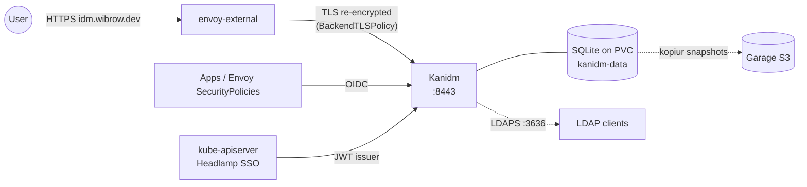

# Kanidm

[Kanidm](https://kanidm.com/) is the identity provider for the cluster: the user and group directory, the OAuth2/OIDC provider for browser and API logins, and an LDAPS endpoint for apps that only speak LDAP. It replaced Authelia and LLDAP.

## Architecture



## Deployment

Manifests: `kubernetes/apps/pitower/security/kanidm/` (app-template, namespace `security`).

| Setting | Value |
|:--------|:------|
| Image | `docker.io/kanidm/server:1.11.2` |
| Controller | StatefulSet, 1 replica, uid/gid 2000 |
| Domain / origin | `idm.wibrow.dev` / `https://idm.wibrow.dev` |
| HTTPS | `8443` |
| LDAPS | `3636` (ClusterIP Service only) |
| Database | `/data/kanidm.db` on PVC `kanidm-data` (1Gi) |
| Tracing | OTLP to `otel-collector.monitoring:4317` |

Kanidm terminates TLS itself, so it needs a real certificate even behind the gateway:

- `certificate.yaml`: `kanidm-tls` for `idm.wibrow.dev` from `letsencrypt-production`, mounted at `/certs`.
- `httproute.yaml`: `idm.wibrow.dev` on `envoy-external`, backend port `8443`.
- `backendtlspolicy.yaml`: Envoy re-encrypts to the Service and validates the certificate against the system CAs with hostname `idm.wibrow.dev`.

`KANIDM_TRUST_X_FORWARD_FOR` is enabled so Kanidm logs the client address Envoy forwards.

### Backups

The `pvc` and `kopiur` components back up `kanidm-data` with Kopia to the `garage` repository. The kopiur mover is patched to run as uid/gid 2000 so it can read the database.

## OAuth2 / OIDC Clients

Each app is a confidential OAuth2 client in Kanidm, with a per-client issuer `https://idm.wibrow.dev/oauth2/openid/<client>`. Clients are not managed in Git; they are created with the `kanidm` just module and their secrets stored in Infisical. See [OIDC Clients](oidc-clients.md).

Apps that reference it include Grafana, Headlamp, Argo Workflows, Forgejo, Immich, Affine, Mealie, Miniflux, Actual, Ghostfolio, Autobrr, Open WebUI, Hermes, Iris, ToolHive and the agentgateway UI (`rg -l idm.wibrow.dev kubernetes` for the full list).

## Kubernetes API Authentication

The API server trusts Kanidm through a Talos `KubeAuthenticationConfig` (`talos/pitower/control-plane/01-cluster.yaml`):

| Field | Value |
|:------|:------|
| Issuer | `https://idm.wibrow.dev/oauth2/openid/headlamp` |
| Audience | `headlamp` |
| Username | `email` claim, prefix `oidc:` |
| Groups | `groups` claim, prefix `oidc:` |

`kubernetes/apps/pitower/security/rbac/clusterrolebinding.yaml` binds `cluster-admin` to the group `oidc:apps@idm.wibrow.dev`, plus a safety binding for the user `oidc:sam@wibrow.dev` so a missing groups claim cannot lock the cluster out of Headlamp.

## LDAP

Kanidm serves LDAPS on port `3636` inside the cluster. `envoy-internal` has a TCP `ldap` listener on port 389 (probed by blackbox-exporter), but no TCPRoute is currently attached to it.

## Administration

Kanidm is administered with the `kanidm` CLI against `https://idm.wibrow.dev`. OAuth2 client tasks are wrapped by the `kanidm` just module (`just kanidm ls`, `just kanidm oidc-client`, `just kanidm oidc-secret`); see [OIDC Clients](oidc-clients.md).

## Troubleshooting

```bash
kubectl -n security get pods kanidm-0
kubectl -n security logs kanidm-0 --tail=100

# Issuer discovery for a client
curl -s https://idm.wibrow.dev/oauth2/openid/<client>/.well-known/openid-configuration | jq .issuer

# Certificate
kubectl -n security get certificate kanidm-tls
```
