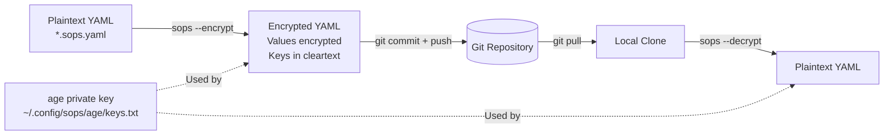

# SOPS

[SOPS](https://github.com/getsops/sops) (Secrets OPerationS) encrypts sensitive values in YAML files so they can be safely committed to Git. The cluster uses SOPS with [age](https://github.com/FiloSottile/age) as the encryption backend, ensuring that secrets like 1Password credentials, Infisical auth tokens, and Talos machine secrets are protected at rest in the repository.

## How It Works



SOPS encrypts only the **values** in YAML files (controlled by `encrypted_regex`), leaving keys and structure visible. This allows diffs to show which fields changed without revealing the actual secret data.

## Configuration

The `.sops.yaml` file at the repository root defines encryption rules for different file paths:

```yaml title=".sops.yaml"
---
creation_rules:
  - path_regex: kubernetes/pitower/.*\.sops\.ya?ml
    encrypted_regex: "^(data|stringData)$"
    key_groups:
      - age:
          - "age1tkaddc3hgjx0eagjl6mqpxvzzkerd44e34rua6gzucv6emr5f5fs4mlu67"
  - path_regex: pitower/talos/.*\.sops\.ya?ml
    encrypted_regex: "^(crt|id|token|key|secret|stringData|secretboxencryptionsecret|bootstraptoken)$"
    key_groups:
      - age:
          - "age1tkaddc3hgjx0eagjl6mqpxvzzkerd44e34rua6gzucv6emr5f5fs4mlu67"
  - path_regex: /dev/stdin
    key_groups:
      - age:
          - "age1tkaddc3hgjx0eagjl6mqpxvzzkerd44e34rua6gzucv6emr5f5fs4mlu67"
  - path_regex: .*\.sops\.ya?ml$
    key_groups:
      - age:
          - "age1tkaddc3hgjx0eagjl6mqpxvzzkerd44e34rua6gzucv6emr5f5fs4mlu67"
```

### Rule Breakdown

| Path Pattern | `encrypted_regex` | Purpose |
|:-------------|:-------------------|:--------|
| `kubernetes/pitower/.*\.sops\.ya?ml` | `^(data\|stringData)$` | Kubernetes Secret manifests -- encrypts only `data` and `stringData` fields |
| `pitower/talos/.*\.sops\.ya?ml` | `^(crt\|id\|token\|key\|secret\|...)$` | Talos machine secrets -- encrypts certificates, tokens, keys, and bootstrap data |
| `/dev/stdin` | (all values) | Piped input for ad-hoc encryption |
| `.*\.sops\.ya?ml$` | (all values) | Catch-all for any other `.sops.yaml` files |

!!! info "File naming convention"
    SOPS-encrypted files must use the `.sops.yaml` or `.sops.yml` extension. This convention makes it immediately clear which files contain encrypted data and ensures the correct `.sops.yaml` rules are matched.

## age Encryption

The cluster uses a single age public key for encryption:

```
age1tkaddc3hgjx0eagjl6mqpxvzzkerd44e34rua6gzucv6emr5f5fs4mlu67
```

The corresponding private key must be available locally for decryption:

```bash
export SOPS_AGE_KEY_FILE=~/.config/sops/age/keys.txt
```

!!! danger "Protect the private key"
    The age private key is the master key for **all** encrypted secrets in the repository. It must never be committed to Git. Store it securely and ensure it is backed up.

## Encrypt / Decrypt Workflow

### Encrypting a New Secret

1. **Create the plaintext file** with the `.sops.yaml` extension:

    ```yaml title="my-secret.sops.yaml"
    apiVersion: v1
    kind: Secret
    metadata:
      name: my-secret
      namespace: my-app
    stringData:
      api-key: "super-secret-value"
      password: "another-secret"
    ```

2. **Encrypt the file** in place:

    ```bash
    sops --encrypt --in-place my-secret.sops.yaml
    ```

3. **Verify** -- the file now has encrypted values but readable keys:

    ```yaml
    apiVersion: v1
    kind: Secret
    metadata:
      name: my-secret
      namespace: my-app
    stringData:
      api-key: ENC[AES256_GCM,data:...,type:str]
      password: ENC[AES256_GCM,data:...,type:str]
    sops:
      age:
        - recipient: age1tkaddc3hgjx0eagjl6mqpxvzzkerd44e34rua6gzucv6emr5f5fs4mlu67
          enc: |
            -----BEGIN AGE ENCRYPTED FILE-----
            ...
            -----END AGE ENCRYPTED FILE-----
      lastmodified: "2025-01-01T00:00:00Z"
      mac: ENC[AES256_GCM,data:...,type:str]
      version: 3.9.0
    ```

4. **Commit** the encrypted file to Git.

### Decrypting a Secret

```bash
sops --decrypt my-secret.sops.yaml
```

### Editing an Encrypted Secret

SOPS can open encrypted files in your editor, decrypting on open and re-encrypting on save:

```bash
sops my-secret.sops.yaml
```

This opens the file in `$EDITOR` with plaintext values. When you save and close, SOPS re-encrypts the changed values automatically.

## Talos Secrets

Talos machine secrets (certificates, tokens, encryption keys) are stored as SOPS-encrypted files under `pitower/talos/`. The `encrypted_regex` for this path is broader than for Kubernetes secrets, covering fields specific to Talos:

- `crt` -- TLS certificates
- `id` -- Machine identifiers
- `token` -- Bootstrap and join tokens
- `key` -- Private keys
- `secret` -- General secrets
- `secretboxencryptionsecret` -- Kubernetes secret encryption key
- `bootstraptoken` -- Cluster bootstrap token

```bash
# Decrypt Talos secrets for inspection
sops --decrypt pitower/talos/secrets.sops.yaml

# Edit Talos secrets
sops pitower/talos/secrets.sops.yaml
```

## Integration with ArgoCD

ArgoCD does not natively decrypt SOPS files. Instead, bootstrap secrets (like 1Password Connect credentials and Infisical auth) are:

1. Encrypted with SOPS and committed to Git
2. Decrypted locally and applied directly with `kubectl` during cluster bootstrap
3. Referenced by External Secrets Operator, which then handles syncing all other secrets

This means SOPS is used primarily for **bootstrap secrets** -- the minimal set of credentials needed to start External Secrets Operator, which then takes over secret management for all applications.

## Best Practices

!!! tip "SOPS best practices"

    - **Always use `encrypted_regex`** -- encrypt only the fields that contain sensitive data, not the entire file. This makes diffs meaningful and review easier.
    - **Use the `.sops.yaml` extension** -- this ensures SOPS rules are applied correctly and makes encrypted files easy to identify.
    - **Never commit the age private key** -- store it in a password manager or secure vault, separate from the repository.
    - **Rotate secrets periodically** -- when rotating the age key, re-encrypt all SOPS files with the new key and update `.sops.yaml`.
    - **Verify before committing** -- run `sops --decrypt` on the file to ensure it was encrypted correctly before pushing.
