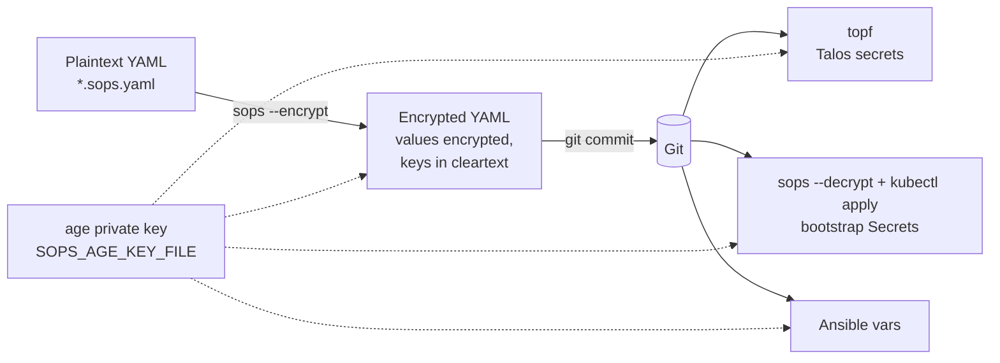

# SOPS

[SOPS](https://github.com/getsops/sops) with [age](https://github.com/FiloSottile/age) encrypts the secrets that have to live in Git: Talos machine secrets (decrypted by topf), the few Kubernetes bootstrap Secrets that External Secrets depends on, and Ansible vars. Everything else is in Infisical (see [External Secrets](external-secrets.md)).

## How It Works


```mermaid
flowchart LR
    PLAIN[Plaintext YAML<br/>*.sops.yaml] -->|sops --encrypt| ENC[Encrypted YAML<br/>values encrypted,<br/>keys in cleartext]
    ENC -->|git commit| GIT[(Git)]
    GIT --> TOPF[topf<br/>Talos secrets]
    GIT --> MANUAL[sops --decrypt + kubectl apply<br/>bootstrap Secrets]
    GIT --> ANS[Ansible vars]

    AGE[age private key<br/>SOPS_AGE_KEY_FILE] -.-> ENC & TOPF & MANUAL & ANS
```

SOPS encrypts only the values selected by `encrypted_regex`, so diffs still show which fields changed.

## Configuration

```yaml title=".sops.yaml"
creation_rules:
  # Shared kubernetes apps (all clusters)
  - path_regex: kubernetes/apps/.*\.sops\.ya?ml
    encrypted_regex: "^(data|stringData)$"
    key_groups:
      - age:
          - "age1tkaddc3hgjx0eagjl6mqpxvzzkerd44e34rua6gzucv6emr5f5fs4mlu67"
  # Pitower kubernetes bootstrap/argocd
  - path_regex: pitower/kubernetes/.*\.sops\.ya?ml
    encrypted_regex: "^(data|stringData)$"
    key_groups:
      - age:
          - "age1tkaddc3hgjx0eagjl6mqpxvzzkerd44e34rua6gzucv6emr5f5fs4mlu67"
  # Talos secrets (all clusters)
  - path_regex: talos/.*/.*\.sops\.ya?ml
    encrypted_regex: "^(crt|id|token|key|secret|stringData|secretboxencryptionsecret|bootstraptoken)$"
    key_groups:
      - age:
          - "age1tkaddc3hgjx0eagjl6mqpxvzzkerd44e34rua6gzucv6emr5f5fs4mlu67"
  - path_regex: /dev/stdin
    key_groups:
      - age:
          - "age1tkaddc3hgjx0eagjl6mqpxvzzkerd44e34rua6gzucv6emr5f5fs4mlu67"
  # Catch-all fallback
  - path_regex: .*\.sops\.ya?ml$
    key_groups:
      - age:
          - "age1tkaddc3hgjx0eagjl6mqpxvzzkerd44e34rua6gzucv6emr5f5fs4mlu67"
```

Every rule uses the same age recipient. Files must be named `*.sops.yaml` to match.

## Encrypted Files

| File | Rule | Content |
|:-----|:-----|:--------|
| `talos/pitower/secrets.sops.yaml` | Talos | Cluster secrets bundle (CA certs, tokens, keys) consumed by topf |
| `kubernetes/apps/pitower/security/external-secrets/stores/infisical/secret.sops.yaml` | Kubernetes apps | `universal-auth-credentials` for the Infisical stores |
| `kubernetes/bootstrap/secrets.sops.yaml` | Catch-all | `argocd-secret-custom`, `argocd-repo-creds-github-swibrow` and a copy of `universal-auth-credentials` |
| `kubernetes/bootstrap/age-key.sops.yaml` | Catch-all | `argocd/sops-age` Secret |
| `ansible/**/*.sops.yaml` | Catch-all | Ansible vars (ovh-vps, towonel-hub, otel-agent, nut, ...) |

## The age Key

`SOPS_AGE_KEY_FILE` points at the private key. The root `mise.toml` sets it to `~/.config/mise/age.txt`; the justfiles default to `age.key` at the repo root when the variable is unset. The same key also decrypts the age-encrypted values in `mise.toml` and `terraform/mise.toml` (`mise set --age-encrypt`).

> [!CAUTION]
> **Protect the private key**
>
> The age private key decrypts every secret in the repository. It must never be committed.

## Talos Secrets and topf

Talos is managed with [topf](https://github.com/postfinance/topf) from `talos/pitower`. `topf.yaml` sets `secretsPath: secrets.sops.yaml`, and topf decrypts it transparently with the key from `SOPS_AGE_KEY_FILE` when rendering node configs:

```bash
cd talos/pitower
mise exec -- topf apply --dry-run      # review first
```

To inspect or edit the bundle directly:

```bash
sops --decrypt talos/pitower/secrets.sops.yaml
sops talos/pitower/secrets.sops.yaml
```

## Kubernetes Bootstrap Secrets

ArgoCD does not decrypt SOPS. The `*.sops.yaml` files under `kubernetes/` are not referenced by any kustomization; they are decrypted and applied by hand when bootstrapping, after which External Secrets takes over:

```bash
sops --decrypt kubernetes/apps/pitower/security/external-secrets/stores/infisical/secret.sops.yaml \
  | kubectl apply -n security -f -
```

## Workflow

```bash
sops --encrypt --in-place my-secret.sops.yaml   # encrypt a new file
sops my-secret.sops.yaml                        # edit in $EDITOR, re-encrypts on save
sops --decrypt my-secret.sops.yaml              # print plaintext

just secret-ls                                  # list all *.sops.yaml files
just sops re-encrypt                            # decrypt and re-encrypt every file (key rotation)
```

> [!TIP]
> **Rotating the age key**
>
> Update the recipient in `.sops.yaml`, then run `just sops re-encrypt` while the old key is still available to decrypt.
