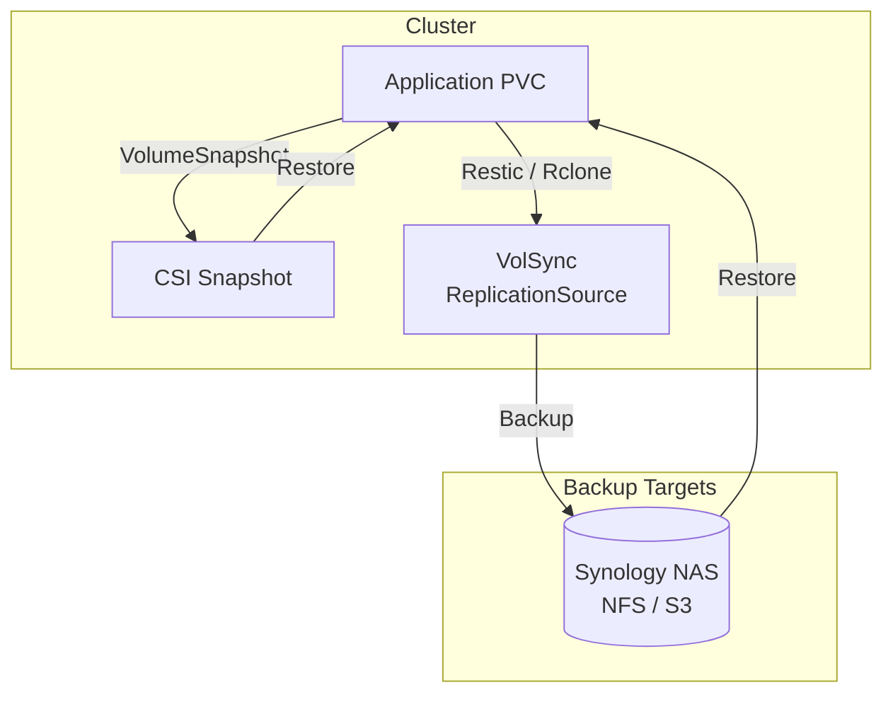

# Backup & Restore

The cluster uses a combination of VolSync for PVC replication, the CSI Snapshot Controller for point-in-time snapshots, and the Synology NAS as a backup target. Together, these provide data protection across multiple failure scenarios.

## Architecture



---

## VolSync

[VolSync](https://volsync.readthedocs.io/) is a Kubernetes operator that replicates persistent volume data using Restic, Rclone, or Rsync. It runs in the `system` namespace and provides scheduled backups of PVCs to external storage.

### Deployment

VolSync is deployed via Helm (v0.14.0) in the `system` namespace:

```yaml title="kustomization.yaml"
helmCharts:
  - name: volsync
    repo: https://backube.github.io/helm-charts/
    version: 0.14.0
    releaseName: volsync
    includeCRDs: true
    namespace: system
```

```yaml title="values.yaml"
manageCRDs: true
metrics:
  disableAuth: true
```

### How It Works

VolSync uses two custom resources:

| Resource | Purpose |
|:---------|:--------|
| `ReplicationSource` | Defines what to back up, the schedule, and the destination |
| `ReplicationDestination` | Defines where to restore from and how to recreate the PVC |

A typical `ReplicationSource` for backing up an application PVC:

```yaml
apiVersion: volsync.backube/v1alpha1
kind: ReplicationSource
metadata:
  name: my-app-backup
  namespace: my-app
spec:
  sourcePVC: my-app-data
  trigger:
    schedule: "0 */6 * * *"  # Every 6 hours
  restic:
    pruneIntervalDays: 7
    repository: my-app-restic-secret
    retain:
      daily: 7
      weekly: 4
      monthly: 6
    storageClassName: ceph-block
    copyMethod: Snapshot
```

### Monitoring

VolSync includes Prometheus alerting rules for backup health:

```yaml title="prometheusrule.yaml"
apiVersion: monitoring.coreos.com/v1
kind: PrometheusRule
metadata:
  name: volsync
spec:
  groups:
    - name: volsync.rules
      rules:
        - alert: VolSyncComponentAbsent
          expr: |
            absent(up{job="volsync-metrics"})
          for: 15m
          labels:
            severity: critical
        - alert: VolSyncVolumeOutOfSync
          expr: |
            volsync_volume_out_of_sync == 1
          for: 15m
          labels:
            severity: critical
```

!!! warning "Alert on out-of-sync volumes"
    The `VolSyncVolumeOutOfSync` alert fires when a volume has not been successfully replicated within its expected schedule. Investigate immediately -- this could indicate a failed backup job, connectivity issues to the backup target, or storage capacity problems.

---

## Snapshot Controller

The [CSI Snapshot Controller](https://github.com/kubernetes-csi/external-snapshotter) enables point-in-time `VolumeSnapshot` resources for CSI-backed PVCs. It runs in the `system` namespace alongside its webhook.

### Deployment

```yaml title="kustomization.yaml"
helmCharts:
  - name: snapshot-controller
    repo: https://piraeus.io/helm-charts/
    version: 5.0.2
    releaseName: snapshot-controller
    includeCRDs: true
    namespace: system
```

```yaml title="values.yaml"
controller:
  serviceMonitor:
    create: true
```

### Webhook PKI

The snapshot controller webhook uses self-signed certificates managed by cert-manager:

```yaml title="pki.yaml"
apiVersion: cert-manager.io/v1
kind: Issuer
metadata:
  name: snapshot-controller-webhook-selfsign
spec:
  selfSigned: {}
---
apiVersion: cert-manager.io/v1
kind: Certificate
metadata:
  name: snapshot-controller-webhook-ca
spec:
  secretName: snapshot-controller-webhook-ca
  duration: 43800h # 5 years
  issuerRef:
    name: snapshot-controller-webhook-selfsign
    kind: Issuer
  commonName: "ca.k8s-ycl.cert-manager"
  isCA: true
---
apiVersion: cert-manager.io/v1
kind: Issuer
metadata:
  name: snapshot-controller-webhook-ca
spec:
  ca:
    secretName: snapshot-controller-webhook-ca
```

### Usage

Create a point-in-time snapshot of a PVC:

```yaml
apiVersion: snapshot.storage.k8s.io/v1
kind: VolumeSnapshot
metadata:
  name: my-app-data-snapshot
  namespace: my-app
spec:
  volumeSnapshotClassName: csi-ceph-blockpool  # or appropriate class
  source:
    persistentVolumeClaimName: my-app-data
```

Restore from a snapshot by referencing it as a PVC data source:

```yaml
apiVersion: v1
kind: PersistentVolumeClaim
metadata:
  name: my-app-data-restored
  namespace: my-app
spec:
  accessModes:
    - ReadWriteOnce
  storageClassName: ceph-block
  resources:
    requests:
      storage: 10Gi
  dataSource:
    name: my-app-data-snapshot
    kind: VolumeSnapshot
    apiGroup: snapshot.storage.k8s.io
```

---

## Synology NAS

The 4-bay Synology NAS (8 TB total) serves as the primary off-cluster backup target and bulk storage endpoint.

### NFS Shares

The Synology exports NFS shares used for:

- **Media storage** -- large media libraries mounted directly by applications (Jellyfin, *arr stack)
- **Backup destinations** -- VolSync Restic repositories for PVC backups
- **Bulk data** -- datasets too large for the Ceph cluster

NFS volumes are mounted via standard Kubernetes PVs:

```yaml
apiVersion: v1
kind: PersistentVolume
metadata:
  name: media-nfs
spec:
  capacity:
    storage: 1Ti
  accessModes:
    - ReadWriteMany
  nfs:
    server: 192.168.0.x  # Synology IP
    path: /volume1/media
---
apiVersion: v1
kind: PersistentVolumeClaim
metadata:
  name: media-nfs
  namespace: media
spec:
  accessModes:
    - ReadWriteMany
  storageClassName: ""
  volumeName: media-nfs
  resources:
    requests:
      storage: 1Ti
```

---

## Restore Procedures

### Restore from VolSync Backup

1. **Create a `ReplicationDestination`** pointing to the Restic repository:

    ```yaml
    apiVersion: volsync.backube/v1alpha1
    kind: ReplicationDestination
    metadata:
      name: my-app-restore
      namespace: my-app
    spec:
      trigger:
        manual: restore-once
      restic:
        repository: my-app-restic-secret
        destinationPVC: my-app-data
        storageClassName: ceph-block
        accessModes:
          - ReadWriteOnce
        capacity: 10Gi
        copyMethod: Direct
    ```

2. **Scale down the application** to release the PVC (if it already exists):

    ```bash
    kubectl -n my-app scale deployment my-app --replicas=0
    ```

3. **Delete the existing PVC** (if replacing):

    ```bash
    kubectl -n my-app delete pvc my-app-data
    ```

4. **Apply the `ReplicationDestination`** to trigger the restore:

    ```bash
    kubectl apply -f replication-destination.yaml
    ```

5. **Wait for completion**, then scale the application back up:

    ```bash
    kubectl -n my-app get replicationdestination my-app-restore -w
    kubectl -n my-app scale deployment my-app --replicas=1
    ```

### Restore from CSI Snapshot

1. **List available snapshots**:

    ```bash
    kubectl -n my-app get volumesnapshots
    ```

2. **Create a new PVC from the snapshot** (see the [Usage section above](#usage))

3. **Update the application** to reference the restored PVC name, or delete the old PVC and rename the restored one.

!!! tip "Test restores regularly"
    Schedule periodic restore tests to verify that backups are valid and the restore process works as expected. A backup that has never been tested is not a backup.
