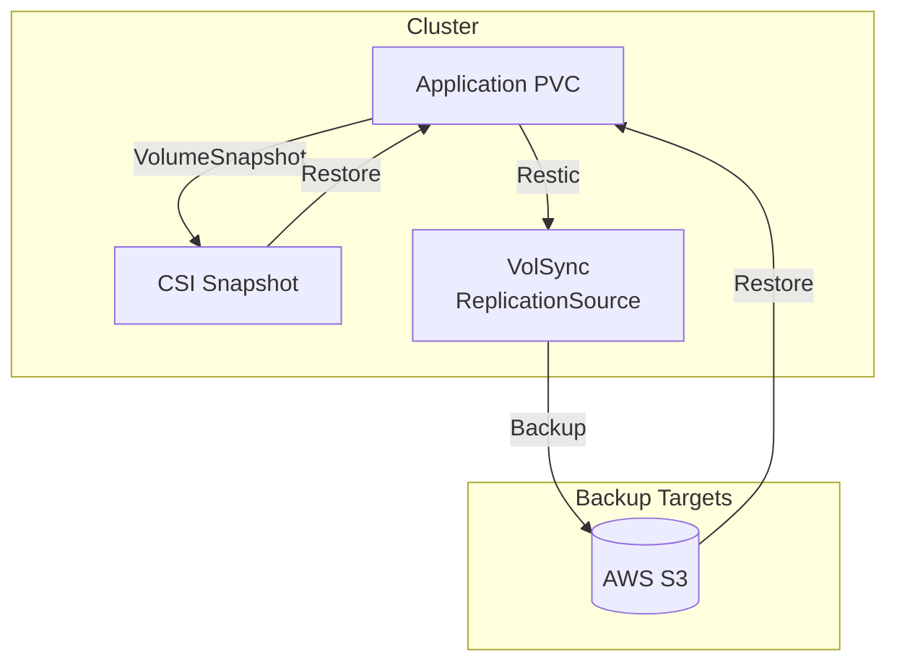

# Backup & Restore

The cluster uses a combination of VolSync for PVC replication, the CSI Snapshot Controller for point-in-time snapshots, and S3 as a backup target. Together, these provide data protection across multiple failure scenarios.

## Architecture


```mermaid
flowchart TD
    subgraph Cluster
        PVC[Application PVC]
        SNAP[CSI Snapshot]
        VS[VolSync\nReplicationSource]
    end

    subgraph Backup Targets
        S3[(AWS S3)]
    end

    PVC -->|VolumeSnapshot| SNAP
    PVC -->|Restic| VS
    VS -->|Backup| S3
    SNAP -->|Restore| PVC
    S3 -->|Restore| PVC
```

---

## VolSync

[VolSync](https://volsync.readthedocs.io/) is a Kubernetes operator that replicates persistent volume data using Restic. It runs in the `system` namespace and provides scheduled backups of PVCs to S3.

### How It Works

VolSync uses two custom resources:

| Resource | Purpose |
|:---------|:--------|
| `ReplicationSource` | Defines what to back up, the schedule, and the destination |
| `ReplicationDestination` | Defines where to restore from and how to recreate the PVC |

### Kustomize Component

Apps opt into VolSync backups by including the volsync component in their `kustomization.yaml`:

```yaml
components:
  - ../../../../components/volsync
```

The component requires a `volsync-config` ConfigMap with app-specific settings. See [Adding Apps](../gitops/adding-apps.md) for details.

### Monitoring

VolSync includes Prometheus alerting rules for backup health:

```yaml title="prometheusrule.yaml"
apiVersion: monitoring.coreos.com/v1
kind: PrometheusRule
metadata:
  name: volsync
spec:
  groups:
    - name: volsync.rules
      rules:
        - alert: VolSyncComponentAbsent
          expr: |
            absent(up{job="volsync-metrics"})
          for: 15m
          labels:
            severity: critical
        - alert: VolSyncVolumeOutOfSync
          expr: |
            volsync_volume_out_of_sync == 1
          for: 15m
          labels:
            severity: critical
```

!!! warning "Alert on out-of-sync volumes"
    The `VolSyncVolumeOutOfSync` alert fires when a volume has not been successfully replicated within its expected schedule. Investigate immediately -- this could indicate a failed backup job, connectivity issues to the backup target, or storage capacity problems.

---

## Snapshot Controller

The [CSI Snapshot Controller](https://github.com/kubernetes-csi/external-snapshotter) enables point-in-time `VolumeSnapshot` resources for CSI-backed PVCs. It runs in the `system` namespace alongside its webhook.

### Usage

Create a point-in-time snapshot of a PVC:

```yaml
apiVersion: snapshot.storage.k8s.io/v1
kind: VolumeSnapshot
metadata:
  name: my-app-data-snapshot
  namespace: my-app
spec:
  volumeSnapshotClassName: csi-ceph-blockpool
  source:
    persistentVolumeClaimName: my-app-data
```

Restore from a snapshot by referencing it as a PVC data source:

```yaml
apiVersion: v1
kind: PersistentVolumeClaim
metadata:
  name: my-app-data-restored
  namespace: my-app
spec:
  accessModes:
    - ReadWriteOnce
  storageClassName: ceph-block
  resources:
    requests:
      storage: 10Gi
  dataSource:
    name: my-app-data-snapshot
    kind: VolumeSnapshot
    apiGroup: snapshot.storage.k8s.io
```

---

## Restore Procedures

### Restore from VolSync (S3 Restic Backup)

#### 1. List available snapshots

Run a temporary pod using the app's volsync secret to list snapshots in S3:

```bash
kubectl run restic-list --restart=Never -n <namespace> \
  --image=restic/restic:latest \
  --env="AWS_ACCESS_KEY_ID=$(kubectl get secret <app>-volsync -n <namespace> -o jsonpath='{.data.AWS_ACCESS_KEY_ID}' | base64 -d)" \
  --env="AWS_SECRET_ACCESS_KEY=$(kubectl get secret <app>-volsync -n <namespace> -o jsonpath='{.data.AWS_SECRET_ACCESS_KEY}' | base64 -d)" \
  --env="RESTIC_PASSWORD=$(kubectl get secret <app>-volsync -n <namespace> -o jsonpath='{.data.RESTIC_PASSWORD}' | base64 -d)" \
  --env="RESTIC_REPOSITORY=$(kubectl get secret <app>-volsync -n <namespace> -o jsonpath='{.data.RESTIC_REPOSITORY}' | base64 -d)" \
  --command -- restic snapshots
```

Retrieve output and clean up:

```bash
kubectl logs restic-list -n <namespace>
kubectl delete pod restic-list -n <namespace>
```

Each snapshot shows an ID, timestamp, and size. Identify the last known-good snapshot before any incident.

#### 2. Disable auto-sync

Prevent ArgoCD from scaling the app back up during restore:

```bash
kubectl patch app <app-name> -n argocd --type json \
  -p '[{"op":"remove","path":"/spec/syncPolicy/automated"}]'
```

#### 3. Scale down the app and suspend backups

```bash
kubectl scale deploy <app> -n <namespace> --replicas=0
```

Suspend the ReplicationSource to prevent it from backing up empty/corrupt data:

```bash
kubectl patch replicationsource <app> -n <namespace> --type merge \
  -p '{"spec":{"trigger":{"schedule":"0 0 31 2 *"}}}'
```

#### 4. Delete the existing PVC

The data is safe in S3:

```bash
kubectl delete pvc <pvc-name> -n <namespace>
```

#### 5. Create an empty PVC

Recreate the PVC with the original name and size:

```bash
kubectl apply -f - <<EOF
apiVersion: v1
kind: PersistentVolumeClaim
metadata:
  name: <pvc-name>
  namespace: <namespace>
spec:
  accessModes: [ReadWriteOnce]
  storageClassName: ceph-block
  resources:
    requests:
      storage: <size>
EOF
```

#### 6. Create a ReplicationDestination to restore

Use `restoreAsOf` to select the snapshot by timestamp:

```bash
kubectl apply -f - <<EOF
apiVersion: volsync.backube/v1alpha1
kind: ReplicationDestination
metadata:
  name: <app>-restore
  namespace: <namespace>
spec:
  trigger:
    manual: restore-once
  restic:
    repository: <app>-volsync
    destinationPVC: <pvc-name>
    copyMethod: Direct
    moverSecurityContext:
      runAsUser: 0
      runAsGroup: 0
    restoreAsOf: "<timestamp-of-good-snapshot>"
EOF
```

!!! warning "moverSecurityContext is required"
    Without `runAsUser: 0`, the restic mover cannot set file ownership (`lchown`), causing the restore to fail with repeated retries. The data IS written to the PVC but restic exits non-zero. Running as root avoids this issue.

Monitor progress:

```bash
kubectl get replicationdestination -n <namespace> -w
```

Wait for `CONDITION` to show `WaitingForManual` (success).

#### 7. Clean up and restart

```bash
kubectl delete replicationdestination <app>-restore -n <namespace>
```

Re-enable auto-sync on the ArgoCD Application. ArgoCD will scale the app back up and restore the ReplicationSource schedule:

```bash
kubectl patch app <app-name> -n argocd --type merge \
  -p '{"spec":{"syncPolicy":{"automated":{"prune":true}}}}'
```

#### 8. Verify

Check the app is running:

```bash
kubectl get pods -n <namespace> -l app.kubernetes.io/name=<app>
```

Verify restored data size with a temporary pod:

```bash
kubectl run check --rm -it --restart=Never -n <namespace> \
  --image=busybox:latest \
  --overrides='{"spec":{"containers":[{"name":"check","image":"busybox:latest","command":["sh","-c","du -sh /data && ls -la /data/"],"volumeMounts":[{"name":"data","mountPath":"/data"}]}],"volumes":[{"name":"data","persistentVolumeClaim":{"claimName":"<pvc-name>"}}]}}'
```

### Restore from CSI Snapshot

1. **List available snapshots**:

    ```bash
    kubectl -n <namespace> get volumesnapshots
    ```

2. **Create a new PVC from the snapshot** (see the [Usage section above](#usage))

3. **Update the application** to reference the restored PVC name, or delete the old PVC and rename the restored one.

!!! tip "Test restores regularly"
    Schedule periodic restore tests to verify that backups are valid and the restore process works as expected. A backup that has never been tested is not a backup.
