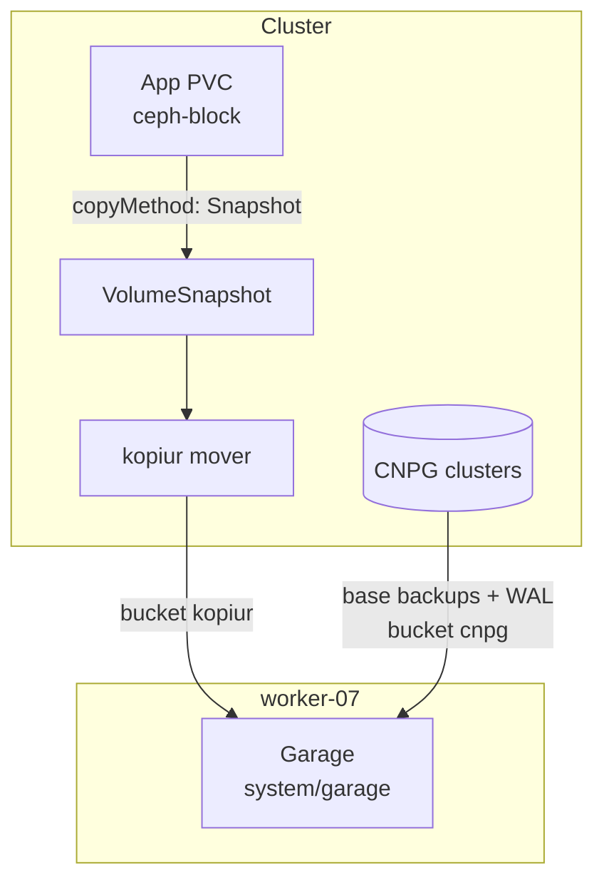

# Backup & Restore

Two backup tiers write to [Garage S3](garage.md) (`s3.wibrow.dev`):

- **kopiur** snapshots application PVCs hourly with Kopia.
- **CNPG** (barman plugin) ships Postgres base backups and continuous WAL.

The CSI Snapshot Controller provides point-in-time `VolumeSnapshot`s on Ceph, which kopiur also
uses to take consistent copies.

## Architecture


```mermaid
flowchart TD
    subgraph Cluster
        PVC[App PVC<br/>ceph-block]
        SNAP[VolumeSnapshot]
        MOV[kopiur mover]
        PG[(CNPG clusters)]
    end
    subgraph worker-07
        G[Garage<br/>system/garage]
    end
    PVC -->|copyMethod: Snapshot| SNAP
    SNAP --> MOV
    MOV -->|bucket kopiur| G
    PG -->|base backups + WAL<br/>bucket cnpg| G
```

## kopiur

[kopiur](https://github.com/home-operations/kopiur) runs Kopia movers from Kubernetes resources:

| Resource | Where | Purpose |
|---|---|---|
| `ClusterRepository` `garage` | `kopiur-system/repository` | Kopia repository in the `kopiur` bucket, encrypted with the repository password |
| `SnapshotPolicy` `<app>-kopiur` | app namespace | What to back up and the retention |
| `SnapshotSchedule` `<app>-kopiur` | app namespace | When (`H * * * *`: hourly at a per-app minute) |
| `Snapshot` | app namespace | One run; `kubectl get snapshots.kopiur.home-operations.com -A` |
| `Restore` | app namespace | A restore into a PVC |

The shared policy (`kubernetes/components/kopiur`) snapshots the PVC through a Ceph
`VolumeSnapshot` (`copyMethod: Snapshot`), compresses with zstd and keeps the latest 3, 24 hourly,
7 daily and 4 weekly snapshots.

### Adding backups to an app

Add the `pvc` and `kopiur` components and their config maps (see `selfhosted/mealie`):

```yaml title="kustomization.yaml"
components:
  - ../../../../components/pvc
  - ../../../../components/kopiur
configMapGenerator:
  - name: pvc-config
    options:
      disableNameSuffixHash: true
    literals:
      - APP_NAME=myapp-pvc
      - CLAIM_NAME=myapp-data
      - STORAGE_SIZE=1Gi
  - name: kopiur-config
    options:
      disableNameSuffixHash: true
    literals:
      - APP_NAME=myapp-kopiur
      - CLAIM_NAME=myapp-data
```

The mover runs as uid/gid `1000`. If the app writes as another user, patch
`spec.mover.securityContext` on the `SnapshotPolicy` (mealie uses `911`), or the mover cannot read
the files.

### Checking backups

```sh
kubectl get snapshotpolicies.kopiur.home-operations.com -A   # LAST-SNAPSHOT per app
kubectl -n <ns> get snapshots.kopiur.home-operations.com      # individual runs and phase
```

### Restore

Scale the app to 0 so nothing writes to the claim, then restore into it:

```yaml
apiVersion: kopiur.home-operations.com/v1alpha1
kind: Restore
metadata:
  name: myapp-restore
  namespace: myns
spec:
  repository:
    kind: ClusterRepository
    name: garage
  source:
    fromPolicy:
      name: myapp-kopiur
      # newest snapshot by default; or pick an older one:
      # offset: 1                     # the one before the newest
      # asOf: "2026-09-27T12:00:00Z"  # newest at or before this time
  target:
    pvcRef:
      name: myapp-data
  options:
    enableFileDeletion: true   # make the claim match the snapshot exactly
  mover:
    securityContext:
      runAsUser: 1000
      runAsGroup: 1000
  credentialProjection:
    enabled: true
```

To restore a specific run, use `source.snapshotRef.name: <Snapshot name>` instead of
`fromPolicy`. To restore into a new claim instead, use `target.pvc` with `name`, `capacity` and
`storageClassName`. Scale the app back up once the `Restore` succeeds.

## CNPG (Postgres)

Every CNPG cluster archives WAL continuously and takes scheduled base backups to the `cnpg` bucket
through the `garage` `ObjectStore`, so point-in-time recovery is possible back to the retention
window (30 days). Setup and recovery are documented with the databases:
[Databases → Backups](../applications/databases/index.md#backups).

```sh
kubectl -n database get cluster.postgresql.cnpg.io   # ContinuousArchiving condition
kubectl -n database get backups.postgresql.cnpg.io
```

## CSI snapshots

The [CSI Snapshot Controller](https://github.com/kubernetes-csi/external-snapshotter) runs in
`system`. Ceph volumes (`csi-ceph-blockpool`) support manual point-in-time snapshots, useful before
a risky change:

```yaml
apiVersion: snapshot.storage.k8s.io/v1
kind: VolumeSnapshot
metadata:
  name: myapp-data-before-upgrade
  namespace: myns
spec:
  volumeSnapshotClassName: csi-ceph-blockpool
  source:
    persistentVolumeClaimName: myapp-data
```

Restore by creating a PVC with it as the data source:

```yaml
spec:
  storageClassName: ceph-block
  dataSource:
    name: myapp-data-before-upgrade
    kind: VolumeSnapshot
    apiGroup: snapshot.storage.k8s.io
```

The openebs hostpath classes (node-local volumes, including everything on worker-07's ZFS pools)
do not support CSI snapshots.

## What is not backed up

Node-local hostpath volumes are outside kopiur's snapshot path. On worker-07 that includes:

| Data | Protection |
|---|---|
| Immich library (`hdd/media`, ~600G) | ZFS raidz1 (one disk failure) and a monthly scrub. Off-host copies are manual (NAS USB drive, worker-ai-01) and the Apple Photos library. Immich's own daily DB dumps live inside it at `backups/`. |
| Metrics and logs (Victoria Metrics/Logs, Prometheus, Tempo on `fast/extra`) | ZFS mirrors only; history is rebuildable. |
| Garage's own data (`hdd/garage-data`, `fast/garage-meta`) | ZFS only. Garage is the backup target, so losing worker-07 loses the backups with it until an off-site replica exists (see [Garage → Redundancy](garage.md#redundancy)). |

Disk and pool health for these are covered by `system/zfs-scrub` and the `disk-health` alerts
(`monitoring/smartctl-exporter`).
