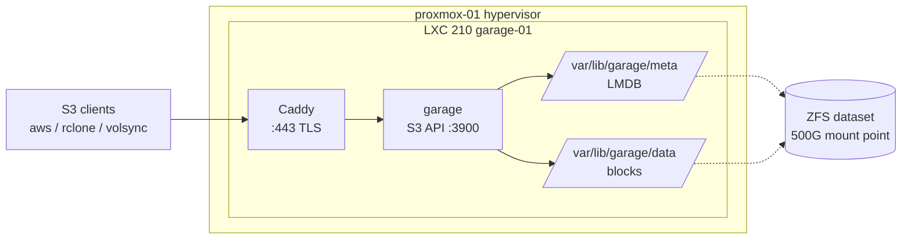

# Garage S3

[Garage](https://garagehq.deuxfleurs.fr/) is a self-hosted, S3-compatible object store. It runs
**outside** the Kubernetes cluster, in its own LXC container on the `proxmox-01` hypervisor, so it
can serve as a backup target that does not depend on the cluster it backs up.

## Architecture



Why an LXC container rather than a VM: Garage is a single static binary with no kernel
requirements, so a VM would only add a guest kernel and a virtual disk layer between it and the ZFS
pool. The data volume is a plain ZFS dataset the host can snapshot and replicate directly.

| | |
|---|---|
| Container | LXC `210` / `garage-01` on `proxmox-01` |
| Address | `garage-01.servers.local` (VLAN 20, DHCP) |
| S3 endpoint | `:3900` (plain HTTP, in-VLAN) |
| Region | `garage` |
| Data | `/var/lib/garage` -- dedicated 500G ZFS mount point |
| Version | pinned in `ansible/roles/garage/defaults/main.yaml` |

## Ownership split

Two layers own this service, and the boundary matters when changing it:

- **`terraform/proxmox/ct_garage.tf`** creates the container shell -- CPU/memory, the 16G rootfs, the
  500G `/var/lib/garage` mount point, the NIC, and the injected SSH key. Nothing inside the guest.
- **`ansible/roles/garage`** owns everything inside the guest -- the binary, config, systemd unit,
  and the one-time cluster bootstrap.

## Provisioning

Terraform creates the container:

```sh
AWS_PROFILE=wibrow-tf just tf::apply-proxmox
```

CI applies this automatically on merge to `main` (`.github/workflows/terraform-proxmox.yaml`), so in
practice the container appears once the change lands.

Pin the DHCP lease with a UniFi reservation using the MAC:

```sh
terraform output garage_mac_address
```

!!! warning "Container features need `root@pam`"
    Proxmox only permits `root@pam` -- the literal login, **not** an API token derived from it -- to
    change LXC feature flags other than `nesting`. The `bpg/proxmox` provider always sends the whole
    feature map (`fuse`, `keyctl`, `mknod`, `nesting`), so applying `features { nesting = true }`
    fails with `HTTP 403 changing feature flags (except nesting) is only allowed for root@pam`.

    Set it once on the host instead, after which Terraform reconciles to a no-op:

    ```sh
    pct set 210 -features nesting=1
    ```

    `nesting` is required because Debian 13 ships systemd 257, which wants user namespaces inside the
    guest (`WARN: Systemd 257 detected. You may need to enable nesting`).

## Bootstrap

```sh
just ansible ping-garage     # SSH reachability
just ansible check-garage    # dry-run + diff
just ansible deploy-garage   # apply
```

The role is idempotent and does the following:

1. Installs the pinned, sha256-verified static musl binary to `/usr/local/bin/garage`.
2. Creates the `garage` system user and the `meta`/`data` directories under the mount point.
3. Templates `/etc/garage.toml` and the `garage.service` systemd unit, then enables and starts it.
4. **On a fresh cluster only** -- assigns this node a layout role and applies layout version 1.
5. Ensures the buckets in `garage_buckets` and keys in `garage_keys` exist, each key granted
   read/write/owner on its buckets.

Step 4 is guarded on the layout being empty, so re-runs never disturb an existing layout.

### Secrets

`rpc_secret` and the admin API `admin_token` are SOPS-encrypted in
`ansible/roles/garage/vars/secrets.sops.yaml` with the repo age key. Rotate them by editing that file
with `sops` and re-deploying.

!!! note "S3 keys are not in git"
    Garage stores S3 access keys durably in its own metadata, so they are deliberately **not** kept in
    this repo. Read a secret back on the host at any time -- see [Managing keys](#managing-keys).

## Using the bucket

Get the credentials from the host:

```sh
ssh root@garage-01.servers.local \
  'GARAGE_CONFIG_FILE=/etc/garage.toml garage key info --show-secret garage-admin'
```

Configure an `aws` CLI profile:

```sh
aws configure set aws_access_key_id     <ACCESS_KEY_ID>  --profile garage
aws configure set aws_secret_access_key <SECRET>         --profile garage
aws configure set region                garage           --profile garage
aws configure set s3.addressing_style   path             --profile garage
```

Read and write:

```sh
aws --profile garage --endpoint-url http://garage-01.servers.local:3900 \
  s3 cp ./file.txt s3://garage/

aws --profile garage --endpoint-url http://garage-01.servers.local:3900 \
  s3 ls s3://garage/
```

To drop the repeated flag, add an `endpoint_url` to the profile in `~/.aws/config` (supported by AWS
CLI v2):

```ini title="~/.aws/config"
[profile garage]
region = garage
endpoint_url = http://garage-01.servers.local:3900
s3 =
    addressing_style = path
```

!!! warning "Path-style addressing is required"
    The config sets `root_domain = ".s3.garage.wibrow.dev"`, which would enable vhost-style bucket
    URLs (`<bucket>.s3.garage.wibrow.dev`) -- but no DNS exists for it. Without
    `addressing_style = path`, clients build vhost-style URLs that fail to resolve.

Verify a write landed from the Garage side -- `Objects` should increment:

```sh
ssh root@garage-01.servers.local \
  'GARAGE_CONFIG_FILE=/etc/garage.toml garage bucket info garage'
```

## TLS

Garage does not terminate TLS itself -- upstream expects a reverse proxy in front. The `garage-tls`
role puts **Caddy** on `:443` in front of the S3 API and serves `https://s3.wibrow.dev`.

```sh
just ansible check-garage-tls    # dry-run
just ansible deploy-garage-tls   # apply
```

Certificates come from **certbot** using the Let's Encrypt **DNS-01** challenge, not Caddy's own
ACME. Two reasons:

- `s3.wibrow.dev` resolves to an RFC1918 address, so HTTP-01 can never reach this host.
- Debian's packaged Caddy has no Cloudflare DNS module, and the custom-build download URL serves a
  rolling artifact -- pinning a checksum against it would break the role every time Caddy publishes a
  release.

certbot installs its own renewal timer; a deploy hook reloads Caddy after each renewal.

Plain HTTP on `:3900` is intentionally left listening for in-VLAN clients that do not want TLS.

### Prerequisites

DNS-01 needs a Cloudflare API token on the host, scoped to **Zone → DNS → Edit** for `wibrow.dev`.
Store it once, SOPS-encrypted, where the `community.sops` vars plugin picks it up for every host:

```sh
cat <<'EOF' > ansible/inventory/group_vars/all.sops.yaml
cloudflare_api_token: "<token>"
EOF
sops -e -i ansible/inventory/group_vars/all.sops.yaml
```

An `A` record for `s3.wibrow.dev` must point at the container's VLAN-20 address, **unproxied**
(grey cloud) -- this endpoint is internal-only, and Cloudflare cannot proxy to a private address.

### Using the TLS endpoint

```sh
aws --profile garage --endpoint-url https://s3.wibrow.dev s3 ls s3://garage/
```

## Proxmox host certificate

The hypervisor's own web UI serves a self-signed certificate, which is why
`PROXMOX_VE_INSECURE = "true"` exists in the root `mise.toml`. Proxmox VE has a built-in ACME client
that can replace it, configured by the same `proxmox` role and the same Cloudflare token:

```yaml title="ansible/roles/proxmox/defaults/main.yaml"
proxmox_acme_enabled: true
proxmox_acme_domain: proxmox-01.wibrow.dev
```

```sh
just ansible deploy-proxmox-01
```

It is **opt-in** (`proxmox_acme_enabled: false` by default) so it never fires unexpectedly on an
unrelated run. Let's Encrypt cannot issue for `.servers.local`, so the host needs a name in a real
zone with an `A` record pointing at its VLAN-20 address. PVE's daily timer renews it.

!!! warning "Change the endpoint only after verifying the certificate"
    Terraform reaches Proxmox at `PROXMOX_VE_ENDPOINT`. Only after confirming the new certificate
    serves correctly should you repoint that variable at the ACME domain and drop
    `PROXMOX_VE_INSECURE` -- getting it wrong breaks every `terraform/proxmox` plan and apply,
    including CI.

## Operations

Every management command needs the config for its `rpc_secret`, so either export it or run as root
where `/etc/garage.toml` is the default path:

```sh
export GARAGE_CONFIG_FILE=/etc/garage.toml
```

### Health and layout

```sh
garage status         # nodes, capacity, version
garage layout show    # current layout and version
garage stats          # storage and request statistics
```

### Managing buckets

```sh
garage bucket list
garage bucket create <name>
garage bucket info <name>
garage bucket delete <name>        # must be empty
```

### Managing keys

```sh
garage key list
garage key create <name>
garage key info --show-secret <name>
garage bucket allow --read --write --owner <bucket> --key <name>
garage bucket deny  --read --write --owner <bucket> --key <name>
```

Prefer adding buckets and keys to `garage_buckets` / `garage_keys` in the role defaults rather than
creating them by hand, so they are reproducible.

### Upgrading

Bump `garage_version` **and** the matching entry in `garage_checksums` in
`ansible/roles/garage/defaults/main.yaml`, then re-deploy. Get the checksum by downloading the release
asset and hashing it:

```sh
curl -fsSL https://garagehq.deuxfleurs.fr/_releases/v<VERSION>/x86_64-unknown-linux-musl/garage \
  | shasum -a 256
```

Check the [release notes](https://git.deuxfleurs.fr/Deuxfleurs/garage/releases) for migration steps
before crossing a major version.

## Redundancy

!!! danger "Single node -- no redundancy today"
    `replication_factor = 1`. There is exactly one copy of every object, on one disk, in one
    container. A lost dataset means lost data. Treat Garage as **not yet durable** and keep anything
    irreplaceable somewhere else as well.

A second replica on the Synology NAS is planned. Garage wants an odd number of nodes for metadata
quorum, so a third node (or a lightweight tiebreaker) belongs in the plan before relying on it.

Raising `replication_factor` is **not** a config-only change -- the additional nodes must join and
the layout must be recomputed first. When a second node joins, `rpc_public_addr` must also change
from `127.0.0.1:3901` to the node's real VLAN-20 address so peers can dial it, and every node must
share the same `rpc_secret`.

## Troubleshooting

**Service will not start**

```sh
systemctl status garage
journalctl -u garage -n 100 --no-pager
```

**`Permission denied (publickey)` when deploying**

The container's root `authorized_keys` holds whichever key ran the Terraform apply. Because CI runs
on the self-hosted runner, that is the runner's key, not yours. `var.ssh_public_keys` is supplied
from the age-encrypted `TF_VAR_ssh_public_keys` in the root `mise.toml`, but `ct_garage.tf` ignores
changes to `initialization[0].user_account`, so **changing it does not re-key an existing container**.
Add the key directly instead:

```sh
pct exec 210 -- bash -c 'install -d -m700 /root/.ssh && \
  echo "<your-public-key>" >> /root/.ssh/authorized_keys'
```

Do not "fix" this by recreating the container -- a fresh create re-sends the full feature map and
hits the same `root@pam` 403 described above.

**`Forbidden: Garage does not support anonymous access yet`**

This is the healthy response to an unauthenticated request; it confirms the API is up. Reaching it
with `curl` is a quick liveness check:

```sh
curl -s http://garage-01.servers.local:3900/garage
```

**Client errors mentioning a bucket-prefixed hostname**

The client is using vhost-style addressing. Set `addressing_style = path`.

## Reference

- [Garage documentation](https://garagehq.deuxfleurs.fr/documentation/)
- `terraform/proxmox/ct_garage.tf` -- container definition
- `ansible/roles/garage/` -- install and bootstrap
- `ansible/README.md` -- role usage
