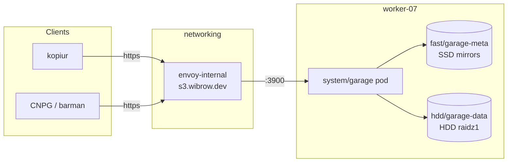

# Garage S3

[Garage](https://garagehq.deuxfleurs.fr) is the cluster's self-hosted S3 store and the only
backend for both backup tiers: every kopiur snapshot and all CNPG base backups and WAL archiving.
It runs in-cluster as `system/garage`, a single pod pinned to worker-07, on that node's ZFS pools.
Until 2026-09-28 it ran in an LXC on the proxmox-01 hypervisor; see
[the migration](../infrastructure/proxmox-01-migration.md).

## Architecture


```mermaid
flowchart LR
    subgraph clients[Clients]
        KOP[kopiur]
        CNPG[CNPG / barman]
    end
    subgraph gw[networking]
        ENV[envoy-internal<br/>s3.wibrow.dev]
    end
    subgraph w7[worker-07]
        G[system/garage pod]
        META[(fast/garage-meta<br/>SSD mirrors)]
        DATA[(hdd/garage-data<br/>HDD raidz1)]
    end
    KOP -->|https| ENV
    CNPG -->|https| ENV
    ENV -->|:3900| G
    G --> META
    G --> DATA
```

| | |
|---|---|
| Workload | `kubernetes/apps/pitower/system/garage/` (app-template, `dxflrs/garage`), namespace `system` |
| Node | worker-07 only (`nodeSelector`), `Recreate` strategy |
| Metadata | LMDB on `fast/garage-meta` (SSD mirrors), hostPath `/var/mnt/garage/meta/meta` |
| Data | Blocks on `hdd/garage-data` (4x 10K SAS raidz1), hostPath `/var/mnt/garage/data/blocks` |
| Endpoint | `https://s3.wibrow.dev` through `envoy-internal` (TLS from cert-manager) |
| In-cluster | `garage.system.svc.cluster.local` - `:3900` S3, `:3902` web, `:3903` admin/metrics |
| Region | `garage` |
| Replication | `replication_factor = 1` (see [Redundancy](#redundancy)) |

The pod mounts **subdirectories** of the two datasets (`meta/`, `blocks/`), not the dataset
roots. If a pool failed to import, ZFS can leave an empty mountpoint directory behind, and Garage
would happily initialise a brand-new, empty node there. With `hostPathType: Directory` on a
subdirectory that only exists inside the mounted dataset, the pod waits instead.

Files are owned by uid/gid `1000`, which the pod runs as.

## Configuration and secrets

`garage.toml` is a ConfigMap in the app directory. Secrets come in as environment variables from
Infisical via the `garage` ExternalSecret:

| Variable | Infisical path |
|---|---|
| `GARAGE_RPC_SECRET` | `/system/garage/RPC_SECRET` |
| `GARAGE_ADMIN_TOKEN` | `/system/garage/ADMIN_TOKEN` |
| `GARAGE_METRICS_TOKEN` | `/monitoring/garage/METRICS_TOKEN` |

The metrics token is shared with Prometheus (`monitoring/garage` reads the same key), so the two can
never drift. Rotating either token is: set a new value in Infisical, then either wait for the
ExternalSecret refresh or force it with a `force-sync` annotation; Reloader restarts the pod.

The node's identity (`node_key`) and cluster layout live in the metadata directory. Keep that
directory and the node comes back as the same node with the same layout.

!!! note "S3 keys are not in git"
    Garage stores access keys in its own metadata. Read one back with `garage key info
    --show-secret <name>` (see [Operations](#operations)).

## Buckets and keys

| Bucket | Key (owner) | Used by |
|---|---|---|
| `kopiur` | `kopiur` | kopiur ClusterRepository `garage` (app PVC snapshots) |
| `cnpg` | `cnpg` | CNPG ObjectStore `garage` (base backups and WAL) |
| `garage` | `garage-admin` | Ad-hoc use |

Each key is scoped to its bucket and cannot create others.

## Using it from a workstation

```sh
kubectl -n system exec deploy/garage -- /garage key info --show-secret garage-admin
```

```ini title="~/.aws/config"
[profile garage]
region = garage
endpoint_url = https://s3.wibrow.dev
s3 =
    addressing_style = path
```

```sh
aws --profile garage s3 ls s3://garage/
```

!!! warning "Path-style addressing is required"
    `root_domain = ".s3.garage.wibrow.dev"` enables vhost-style bucket URLs, but no DNS exists for
    them. Without `addressing_style = path`, clients build hostnames that do not resolve.

`s3.wibrow.dev` resolves to the internal gateway (`internal.wibrow.dev`, an RFC1918 address), so
it only works from the LAN, the cluster, or the tailnet. It is deliberately not reachable from the
internet. The public Cloudflare record is managed by external-dns from the HTTPRoute.

## Operations

The CLI is in the container and talks to the local node over RPC:

```sh
g() { kubectl -n system exec deploy/garage -- /garage "$@"; }
g status             # node ID, capacity, version
g layout show
g stats              # tables, block manager, resync queue and errors
g bucket list
g bucket info kopiur
g key list
```

Add buckets and keys with `g bucket create`, `g key create` and `g bucket allow --read --write
--owner <bucket> --key <name>`.

### Upgrading

Bump the image tag in `values.yaml`. Read the
[release notes](https://git.deuxfleurs.fr/Deuxfleurs/garage/releases) before crossing a major
version; Garage migrates its metadata on first start.

### Monitoring

`monitoring/garage` holds a `ScrapeConfig` for `/metrics` on `:3903` (bearer: the metrics token)
and alert rules. Blackbox probes check `:3900`/`:3902` in-cluster and `https://s3.wibrow.dev`
end to end.

### Disk health

The pools are scrubbed monthly by `system/zfs-scrub`, which fails its Job if `zpool status -x`
reports anything but healthy.

## Redundancy

!!! danger "Single node, one copy"
    `replication_factor = 1`: one copy of every object, on one node. ZFS raidz1 protects against a
    single disk failure, not against losing worker-07. Anything irreplaceable needs a copy somewhere
    else too.

A second replica (on the Synology, or off-site over a VPN) is planned. Garage wants an odd number of
nodes for metadata quorum. Raising `replication_factor` needs the new nodes joined and the layout
recomputed first, and `rpc_public_addr` changed from `127.0.0.1:3901` to an address peers can dial.

## Troubleshooting

**Pod stuck in `ContainerCreating` with a hostPath error**

A dataset is not mounted. Check the pools on worker-07 (the `zfs` extension imports them at boot):
`talosctl -n 10.20.10.7 service ext-zfs-service` and `talosctl -n 10.20.10.7 logs ext-zfs-service`.

**`Forbidden: Garage does not support anonymous access yet` (HTTP 403)**

The healthy answer to an unauthenticated request - a quick liveness check:
`curl -s https://s3.wibrow.dev/`.

**Client errors mentioning a bucket-prefixed hostname**

The client is using vhost-style addressing. Set `addressing_style = path`.

## Reference

- [Garage documentation](https://garagehq.deuxfleurs.fr/documentation/)
- `kubernetes/apps/pitower/system/garage/` - workload
- `kubernetes/apps/pitower/monitoring/garage/` - scrape config and alerts
- [ZFS on worker-07](../infrastructure/proxmox-01-migration.md#after)
